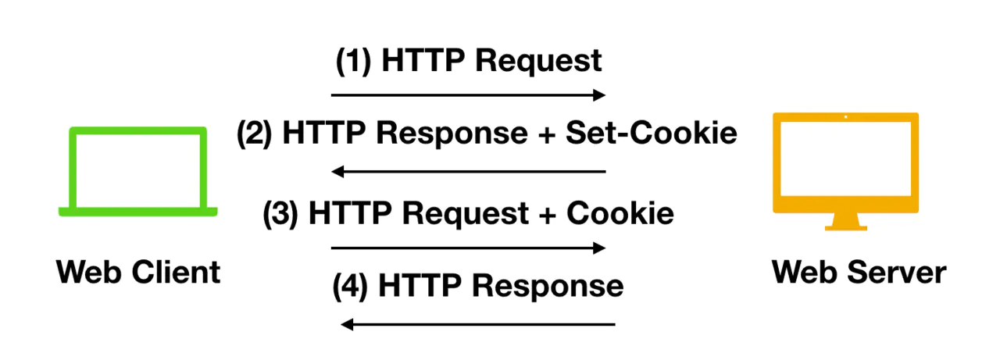

# XML

## 基本介绍

1.概念：Extensible Markup Language 可扩展标记语言

* 可扩展：标签都是自定义的

* 功能
	* 存储数据
		1. 配置文件
		2. 在网络中传输
* xml与html的区别
	1. xml标签都是自定义的，html标签是预定义。
	2. xml的语法严格，html语法松散
	3. xml是存储数据的，html是展示数据

2.基本语法：

1. xml文档的后缀名 .xml
2. xml第一行必须定义为文档声明
3. xml文档中有且仅有一个根标签
4. 属性值必须使用引号(单双都可)引起来
5. 标签必须正确关闭
6. xml标签名称区分大小写

3.组成部分

* 文档声明
  * 格式：<?xml 属性列表 ?>
  * 属性列表：
    * version：版本号**1.0**，必须的属性
    * encoding：编码方式。告知解析引擎当前文档使用的字符集，默认值：ISO-8859-1
    * standalone：是否独立
      * 取值：
      * yes：不依赖其他文件
      * no：依赖其他文件
* 标签：标签名称自定义的
  * 规则：
    * 名称可以包含字母、数字以及其他的字符 
    * 名称不能以数字或者标点符号开始 
    * 名称不能以字母 xml（或者 XML、Xml 等等）开始 
    * 名称不能包含空格 
* 文本：
  * CDATA区：在该区域中的数据会被原样展示
    * 格式：  <![CDATA[ 数据 ]]>

## 约束

作为xml文档的书写规则

* 分类：

  * DTD：一种简单的约束技术

    ```dtd
    <!ELEMENT students (student*) >
    <!ELEMENT student (name,age,sex)>
    <!ELEMENT name (#PCDATA)>
    <!ELEMENT age (#PCDATA)>
    <!ELEMENT sex (#PCDATA)>
    <!ATTLIST student number ID #REQUIRED>
    ```

    * 引入dtd文档到xml文档中

      * 内部dtd：将约束规则定义在xml文档中

      * 外部dtd：将约束的规则定义在外部的dtd文件中

        * 本地：<!DOCTYPE 根标签名 SYSTEM "dtd文件的位置">

        *  网络：<!DOCTYPE 根标签名 PUBLIC "dtd文件名字" "dtd文件的位置URL">

  * Schema:一种复杂的约束技术

    * 引入：
      1.填写xml文档的根元素
      2.引入xsi前缀.  xmlns:xsi="http://www.w3.org/2001/XMLSchema-instance"
      3.引入xsd文件命名空间.  xsi:schemaLocation="http://www.itcast.cn/xml  student.xsd"
      4.为每一个xsd约束声明一个前缀,作为标识  xmlns="http://www.itcast.cn/xml" 

      ```scheme
      <students   xmlns:xsi="http://www.w3.org/2001/XMLSchema-instance"
      			xmlns="http://www.itcast.cn/xml"
      			xsi:schemaLocation="http://www.itcast.cn/xml  student.xsd"
      >
      ```

## 解析

操作xml文档，将文档中的数据读取到内存中
 * 操作xml文档
     1. 解析(读取)：将文档中的数据读取到内存中
     2. 写入：将内存中的数据保存到xml文档中。持久化的存储

* 解析xml的方式：
	1. DOM：将标记语言文档一次性加载进内存，在内存中形成一颗dom树
		* 优点：操作方便，可以对文档进行CRUD的所有操作
		* 缺点：占内存
	2. SAX：逐行读取，基于事件驱动的。
		* 优点：不占内存。
		* 缺点：只能读取，不能增删改
* xml常见的解析器：
  1. JAXP：sun公司提供的解析器，支持dom和sax两种思想
  2. DOM4J：一款非常优秀的解析器
  3. Jsoup：jsoup 是一款Java 的HTML解析器，可直接解析某个URL地址、HTML文本内容。它提供了一套非常省力的API，可通过DOM，CSS以及类似于jQuery的操作方法来取出和操作数据。
  4. PULL：Android操作系统内置的解析器，sax方式的。

## Jsoup

* 入门步骤：
     1. 导入jar包
     2. 获取Document对象
     3. 获取对应的标签Element对象
     4. 获取数据

* 对象的使用：

     1. Jsoup：工具类，可以解析html或xml文档，返回Document
        * parse(File in, String charsetName)：解析xml或html文件的
        * parse(String html)：解析xml或html字符串
        * parse(URL url, int timeoutMillis)：通过网络路径获取指定的html或xml的文档对象

     2. Document：文档对象。代表内存中的dom树，可以来获取Element对象
        * getElementById(String id)：根据id属性值获取唯一的element对象
        * getElementsByTag(String tagName)：根据标签名称获取元素对象集合
        * getElementsByAttribute(String key)：根据属性名称获取元素对象集合
        * getElementsByAttributeValue(String key, String value)：根据对应的属性名和属性值获取元素对象集合

     3. Elements：元素Element对象的集合。可以当做 ArrayList<Element>来使用

       4. 获取子元素对象，Element：元素对象
          * getElementById(String id)：根据id属性值获取唯一的element对象
          * getElementsByTag(String tagName)：根据标签名称获取元素对象集合
          * getElementsByAttribute(String key)：根据属性名称获取元素对象集合
          * getElementsByAttributeValue(String key, String value)：根据对应的属性名和属性值获取元素对象集合

          * 获取属性值
              * String attr(String key)：根据属性名称获取属性值
                3. 获取文本内容
              * String text():获取文本内容
              * String html():获取标签体的所有内容(包括子标签的字符串内容)

     5. Node：节点对象

        * 是Document和Element的父类

*  快捷查询方式：

       		1. selector:选择器
        	* 使用的方法：Elements	select(String cssQuery)
                 	* 语法：参考Selector类中定义的语法
     	 		2.  XPath：XPath即为XML路径语言，它是一种用来确定XML（标准通用标记语言的子集）文档中某部分位置的语言

# Servlet

概念：运行在服务器端的小程序

* Servlet就是一个接口，定义了Java类被浏览器访问到(Tomcat识别)的规则
* 将来我们自定义一个类，实现Servlet接口，复写方法

## 执行原理

* 当服务器接收到客户端浏览器的请求后，会解析请求URL路径，获取访问的Servlet的资源路径
* 查找web.xml文件，是否有对应的<url-pattern>标签体内容
* 如果有，则在找到对应的<servlet-class>全类名
* tomacat会将字节码文件加载进内存，并且创建其对象
* 调用方法

## 生命周期

1. 被创建：执行init方法，只执行一次

   1. 默认情况下，第一次访问时，Servlet被创建

   2. 可以在web.xml里<servlet>标签里配置创建时机

      1. 第一次访问时创建

         ```
         <load-on-startup>的值为负数
         ```

      2. 在服务器启动时创建

         ```
         <load-on-startup>的值为0或正数
         ```

      3. Servlet的init方法，只执行一次，说明Servlet在内存中只存在一个对象，Servlet是单例的

2. 提供服务：执行service方法，执行多次

   1. 每次访问Servlet时，Service方法都会被调用一次

3. 被销毁：执行destroy方法，只执行一次

   1. Servlet被销毁时执行。服务器关闭，Servlet被销毁

## 注解

在类上使用注解进行配置

* @WebServlet("/资源路径")

## Servlet体系

Servlet(接口)---->GenericServlet(抽象类)---->HttpServlet(抽象类)

* GenericServlet：将Servlet接口中其他方法做了默认空实现，只将service()方法作为抽象
* HttpServlet：对http协议的一种封装，简化操作
  * 定义类继承HttpServlet
  * 复写doGet()/doPost()方法

# HTTP

* 基于TCP/IP的高级协议
* 默认端口号：80
* 基于请求/响应模型的：一次请求对应一次响应
* 无状态的：每次请求之间相互独立，不能交互数据

## 请求消息数据格式

1. 请求行

   ```
   请求方式  		请求url  			协议/版本
   GET/POST	   地址			   HTTP/1.1
   ```

2. 请求头：客户端浏览器告诉服务器一些信息

   * 格式：*请求头名称：请求头值*

   * User-Agent：浏览器告诉服务器，我访问你使用的浏览器版本信息
   * Referer：告诉服务器，当前请求从哪里来
     	作用：1.放盗链
       		 2.统计工作
   
3. 请求空行

   1. 空行，用于分割POST请求头和请求体的

4. 请求体(正文)

   1. 封装POST请求消息的请求参数

## 响应消息数据格式

1. 响应行

   ```
   协议/版本			响应状态码		状态码描述
   HTTP/1.1		    200				ok
   ```

   响应状态码：服务器告诉客户端浏览器本次请求和响应的一个状态

2. 响应头

   * 格式：*响应头名称：响应头值*
   * Content-Type：服务器告诉客户端本次响应体数据格式以及编码格式
   * Content-disposition：服务器告诉客户端以什么格式打开响应数据
     * in-line：默认值，在当前页面内打开
     * attachment;filename-xxx：以附件形式打开响应体

3. 响应空行

4. 响应体：传输的数据

# Request

**request和response对象是由服务器创建的**

* 获取请求消息数据
  * 获取请求行数据
    * 获取请求方法：*String getMethod()*
    * 获取虚拟目录：*String  getContextPath()*
    * 获取Servlet路径：*String getServletPath()*
    * 获取GET方式请求参数：*String getQueryString()*
    * 获取请求URL：*StringBuffer getRequestURL()*
    * 获取协议及版本：*String getProtocol()*
    * 获取客户机的IP地址：*String getRemoteAddr()*
  * 获取请求头数据
    * 通过请求头的名称获取请求的值：*String getHeader()*
    * 获取所有请求头名称：*Enumeration<String> getHeaderNames()*
  * 获取请求体数据
    * 获取字符输入流：*BufferedReader getReader()*
    * 获取字节输入流：*ServletInputStream getInputStream()*

* 其他功能
  * 获取请求参数通用方式：
    * 根据参数名称获取参数值：*String getParameter(String name)*
    * 根据参数名称获取参数值的数组：*String[] getParameterValues(String name)*
    * 获取所有请求的参数名称：*Enumeration<String> getParameterNames()*
    * 获取所有参数的map集合：*Map<String,String[]> getParameterMap()*
  * 请求转发：一种在服务器内部的资源跳转方式
    * 通过request对象获取请求转发器对象：*RequestDispatcher getRequestDispatcher(String path)*
    * 使用*RequestDispatcher对象来进行转发：forward(ServletRequest,ServletRespinse response)*
    * 特点：
      * 浏览器地址栏路径不发生变化
      * 只能转发当前服务器内部资源中
      * 转发是一次请求
  * 共享数据
    * 域对象：一个有作用范围的对象，可以在范围内共享数据
    * request域：代表一次请求的范围，一般用于请求转发的多个资源中共享数据
    * 方法：
      * 存储数据：*void setAttribute(String name,Object obj)*
      * 通过键获取值：*Object getAttribute(String name)*
      * 通过键移除键值对：*void removeAttribute(String name)*
  * 编码格式设置：
    * request.setCharacterEncoding("utf-8");

# BeanUtils工具类

简化数据封装

* JavaBean：标准的Java类
  * 类必须被public修饰
  * 必须提供空参构造器
  * 成员变量必须使用private修饰
  * 提供公共setter和getter方法
* 常用方法：
  * 将map集合的键值对信息，封装到对应的JavaBean对象中：*populate(Object obj,Map map)*
  * 设置数据：*setProperty()*
  * 获取数据:*getProperty()*

# Response

* 设置响应消息
  * 设置响应行
    * 设置状态码：*setStatus(int sc)*
  * 设置响应头:*setHeader(String name,String value)*
  * 设置响应体：
    * 获取输出流
      * 字符输出流：*PrintWriter getWriter()*
      * 字节输出流：*ServletOutputStream getOutputStream()*
    * 乱码解决：获取流之前设置
      * *resp.setContentType("text/html;charset=utf-8")*
    * 使用输出流，将数据输出到客户端浏览器
* 重定向：
  * 资源跳转的方式：*resp.sendRedirect()*
  * 特点：
    * 地址栏发生变化
    * 重定向可以访问其他站点(服务器)的资源
    * 重定向是两次请求，不能使用request对象来共享数据
* 路径写法：
  * 相对路径：通过相对路径不可以确定唯一资源
    * 规则：找到当前资源和目标资源之间的相对位置关系
      * ./：当前目录
      * ../：后退一级目录
  * 绝对路径：通过绝对路径可以确定唯一资源
    * 规则：
      * 给客户端浏览器使用：需要加虚拟目录(项目的访问路径)
        * 虚拟目录动态获取：request.getContextPaath()
      * 给服务器使用：不需要加虚拟目录

# ServletContext

* 概念：代表整个web应用，可以和程序的容器(服务器)来通信

* 获取：
  * 通过request对象获取
    * request.getServletContext()
  * 通过HttpServlet获取
    * this.getSetvletContext()

* 功能
  * 获取MIME类型
    * 在互联网通信过程中定义的一种文件数据类型
    * 获取：*String grtMineType(String file)*：file是文件后缀名
  * 域对象：共享数据
    * 范围：所有用户所有请求的数据
    * 方法：
      * 存储数据：*void setAttribute(String name,Object obj)*
      * 通过键获取值：*Object getAttribute(String name)*
      * 通过键移除键值对：*void removeAttribute(String name)*
  * 获取文件的真实(服务器)路径
    * 方法：*String getRealPath(String path)*

# 会话技术

HTTP 协议是一种`无状态协议`，即每次服务端接收到客户端的请求时，都是一个全新的请求，服务器并不知道客户端的历史请求记录；Session 和 Cookie 的主要目的就是为了弥补 HTTP 的无状态特性

## Cookie

* 概念：HTTP 协议中的 Cookie 包括 `Web Cookie` 和`浏览器 Cookie`，它是服务器发送到 Web 浏览器的一小块数据。服务器发送到浏览器的 Cookie，浏览器会进行存储，并与下一个请求一起发送到服务器。通常，它用于判断两个请求是否来自于同一个浏览器，例如用户保持登录状态。
* 步骤：
  * 创建Cookie对象，绑定数据
    * *new Cookie(String name,String value)*
  * 发送Cookie对象
    * *response.addCookie(Cookie cookie)*
  * 获取Cookie，拿到数据
    * *Cookie[] request.getCookies()*
* 实现原理：
  * 基础响应头*set-cookie*和请求头*cookie*实现
* 其他：
  * 发送多个Cookie
    * 创建多个Cookie对象，使用response调用多次addCookie方法
  * 存活时间
    * 默认情况下，当浏览器关闭后，Cookie数据被销毁
    * 持久化存储：*cookie.setMaxAge(int seconds)*
      * 整数：将Cookie数据写到硬盘的文件中。持久化存储。secods数值表示存活时间，时间过后Cookie文件自动失效
      * 负数：默认值
      * 零：手动删除Cookie数据
  * 同一个服务器下部署多个项目Cookie共享
    * 默认情况下Cookie不能共享
    * 设置Cookie的获取范围：*cookie.setPath(String path)*
      * 默认情况下，设置当前虚拟目录
      * 共享将path设置为**/**
  * 不同服务器Cookie共享
    * *cookie.setDomain(String path)*：如果一级域名相同，多个服务器之间cookie可以共享

## Session

* 概念：客户端请求服务端，服务端会为这次请求开辟一块`内存空间`，这个对象便是 Session 对象，存储结构为 `ConcurrentHashMap`。Session 弥补了 HTTP 无状态特性，服务器可以利用 Session 存储客户端在同一个会话期间的一些操作记录

* 步骤：

  * 获取session对象
    * HttpSession session =new request.getSession()
  * 存储数据：
    * session.setAttribute(String name,Object value)
  * 获取数据：
    * session.getAttribute(String name)

* 实现原理：

  * 服务器第一次接收到请求时，开辟了一块 Session 空间（创建了Session对象），同时生成一个 sessionId ，并通过响应头的 **Set-Cookie：JSESSIONID=XXXXXXX **命令，向客户端发送要求设置 Cookie 的响应； 客户端收到响应后，在本机客户端设置了一个 **JSESSIONID=XXXXXXX **的 Cookie 信息，该 Cookie 的过期时间为浏览器会话结束

    

* 其他：

  * 当客户端关闭，服务器不关闭，两次获取的session对象

    * 默认不相同
    * 创建Cookie,键为:**JSESSIONID**，值为**session.getId()**,设置存活时间，持久化

  * 客户端不关闭，服务器关闭，两次获取的session对象

    * 不是同一个，但要确保数据不会丢失。Tomcat自动完成以下工作：
      * session的钝化：
        * 在服务器正常关闭之前，将session对象序列化到硬盘中
      * session的活化：
        * 在服务器启动后，将session文件转化为内存的session对象

  * 存活时间

    * 服务器关闭

    * session对象调用**invalidate()**自杀

    * session默认失效时间为30分钟

      * 选择性配置修改

        ```
        <session-config>
        	<session-timeout>30</session-timeout>
        </session-config>
        ```

# JSP

* JSP脚本：定义Java代码的方式：
  * <%	%>：Servlet中的service中定义方式一样
  * <%!   %>：在jsp转换后的Java类的成员变量
  * <%=  %>：输出到页面
* 指令：用于配置JSP页面，导入资源文件
  * 格式：`<%指令名称 属性名1=属性值1 属性名2=属性值2 ...%>`
  * 分类：
    * page：配置JSP页面
      * contentType：设置响应体的mime类型以及字符集，等同于response.setContentTypr()
      * import：导包
      * errorPage：当前页面发生异常后，会自动跳转到指定的错误页面
      * isErrorPage：标识当前是否为错误页面
        * true：是，可以使用内置对象execption
        * false：否，默认值。不可以使用内置对象exception
    * include：页面包含的。导入页面的资源文件
    * taglib：导入资源
* 注释：
  * html注释：
    * <!--	-->：只能注释html代码片段
  * jsp注释：
    * <%--	--%>：可以注释所有
* JSP九个内置对象
  * PageContext    pageContext：当前页面共享数据，还可以获取其他八个内置对象
  * HttpServletRequest    request：一次请求访问的多个资源(转发)
  * HttpSession    session：一次会话的多个请求间
  * ServletContext    application：所有用户间共享数据
  * HttpServletResponse    response：响应对象
  * Object    page：当前页面(Servlet)的对象
  * JsWriter    out：字符输出流对象，response.getWriter()优先于它
  * ServletConfig    config：Servlet的配置对象
  * Throwable    exception：异常对象

# EL表达式

* 概念：Expression Language 表达式语言
* 语法：${表达式}
* 忽略el表达式：
  * 设置jsp中page指令中：isElIgnored="true"，忽略所有
  * 表达式前加“\，忽略当前el表达式
* 运算：
  * 算数运算符：+	-	*	/(div)	%(mod)
  * 比较运算符：>    <    >=    <=    ==    !=
  * 逻辑运算符：&&(and)    ||(or)    !(not)
  * 空运算符：empty     not empty
    * 用于判断字符串、集合、数组对象是否为null并且长度是否为0
* 获取值
  * el表达式只能从域对象中获取值
  * 语法：
    * ${域名称.键名}：从指定域中获取指定键的值
      * pageScope
      * requestScope
      * sessionScope
      * applicationScope
    * ${键名}：依次从最小的域中查找是否有该对应的值，直到找到为之
* 获取对象、List集合、Map集合的值
  * 对象：${域名称.键名.属性名}
    * 属性名为对象的getter方法
  * List集合：${域名称.键名[索引]}
  * Map集合：
    * ${域名称.键名.key名称}
    * ${域名称.键名.["key名称"]}
* 隐式对象
  * el表达式有11个隐式对象
    * pageContext：获取jsp其他八个内置对象
    * ${pageContext.request.contextPath}：动态获取虚拟目录

# JSTL标签

* 概念：JavaServer Pages Tag Library	JSP标准标签库

* 步骤：

  * 导入jstl相关jar包

  * 引入标签库：

    * ```jsp
      <%@taglib prefix="c" uri="http://java.sun.com/jsp/jstl/core" %>
      ```

* 常用的JSTL标签

  * if

    * ```jsp
      <c:if test=""></c:if>
      ```

    * test为必须属性，接受boolean表达式

      * 如果表达式为true，则显示if标签体内容，如果为false，则不显示标签体内容
      * 一般情况下，test属性值会结合el表达式一起使用

  * choose

    * ```
      <c:choose>
              <c:when test=""></c:when>
              <c:otherwise></c:otherwise></c:choose>
      ```

  * foreach

    * ```
      <c:forEach begin="1" end="10" var="i" step="1" varStatus="s">
              ${i} ${s.index} ${s.count}<br></c:forEach>
      ```

    * begin：开始值

    * end：结束值

    * items：容器对象

    * var：临时变量

    * step：步长

    * varStatus：

      * index：容器中元素的索引，从0开始
      * count：循环次数，从1开始

# Filter

* 概念：当访问服务器的资源时，过滤器可以将请求拦截下来，完成一些特殊的功能
  * 登录验证、统一编码处理、敏感字符过滤。。。
* 步骤
  * 定义一个类，实现接口Filter
  * 复写方法

## 执行流程

* 执行过滤器
* 执行放行后资源
* 回来执行过滤器放行下面的代码

## 生命周期

* init：在服务器启动后，会创建Filter对象，然后调用init方法。只执行一次。用于加载资源
* doFilter：每次请求被拦截资源时，会执行。执行多次
* destroy：在服务器关闭后，Filter对象被销毁。如果服务器是正常关闭，则会执行destroy方法。只执行一次。用于释放资源

## 过滤器配置

* 拦截路径配置：@WebFilter()
  * 具体资源路径：/名称	只有访问该名称资源时，过滤器才会执行
  * 拦截目录：/目录/*     访问/目录下的所有资源时，过滤器都会被执行
  * 后缀名拦截：*.jsp      访问所有后缀名为jsp资源时，过滤器都会被执行
  * 拦截所有资源：/*        访问所有资源时，过滤器都会被执行
* 拦截方式配置：资源被访问的方式
  * 注解配置：
    * 设置dispatcherTypes属性
      * REQUEST：默认值。浏览器直接请求资源
      * FORWARD：转发访问资源
      * INCLUDE：包含访问资源
      * ERROR：错误跳转资源
      * ASYNC：异步访问资源
  * web.xml配置
    * 设置<dispatcher></dispatcher>

## 过滤器链

* 执行顺序：如果有两个过滤器：

  ```
  1.过滤器1
  2.过滤器2
  3.资源执行
  4.过滤器2
  5.过滤器1
  ```

* 执行先后
  * 注解配置：按照类名的字符串比较规则比较，值小的先执行
  * web.xml配置：<filter-mapping>谁定义在上边，谁先执行

# Listener

* ServletContextListener：监听ServletContext对象的创建和销毁
  * void contextDestroyed(ServletContextEvent sce)：ServletContext对象被销毁之前会调用该方法
  * void contextInitialized(ServletContextEvent sce)：ServletContext对象创建后会调用该方法
* 注解：@WebListener

# Ajax

* 概念： ASynchronous JavaScript And XML	异步的JavaScript 和 XML
* 异步和同步：客户端和服务器端相互通信的基础上
  * 同步：客户端必须等待服务器端的响应。在等待的期间客户端不能做其他操作。
  * 异步：客户端不需要等待服务器端的响应。在服务器处理请求的过程中，客户端可以进行其他的操作。

## JQuery实现方式

1. $.ajax({键值对});

   ```js
   $.ajax({
       url:"" , //请求路径
       type:"POST/GET" , //请求方式
       data:{"username":"jack","age":23},//请求参数
       success:function (data) {//响应成功后的回调函数
           alert(data);
       },
       error:function () {//表示如果请求响应出现错误，会执行的回调函数
           alert("出错啦...")
       },
       dataType:"text"//设置接受到的响应数据的格式
   });
   ```

2. $.get()：发送get请求
			* 语法：$.get(url, [data], [callback], [type])
				* 参数：
		* url：请求路径
		* data：请求参数
		* callback：回调函数
		* type：响应结果的类型

3. $.post()：发送post请求

     * 语法：$.post(url, [data], [callback], [type])
     * 参数：
       * url：请求路径
       * data：请求参数
       * callback：回调函数
       * type：响应结果的类型

# Json

* json数据是由键值对构成的
  			* 键用引号(单双都行)引起来，也可以不使用引号
        			* 值得取值类型：
     
           1. 数字（整数或浮点数）
           2. 字符串（在双引号中）
           3. 逻辑值（true 或 false）
           4. 数组（在方括号中）	
           5. 对象（在花括号中） 
           6. null
  * 数据由逗号分隔：多个键值对由逗号分隔
    
    * 花括号保存对象：使用{}定义json 格式
  * 方括号保存数组：[]
  
* 获取数据：
  1. json对象.键名
  2. json对象["键名"]
  3. 数组对象[索引]
  4. 遍历

## JSON数据和Java对象的相互转换

1. **Java对象转换JSON**

   * 使用步骤：

     1. 导入jackson的相关jar包
     2. 创建Jackson核心对象 ObjectMapper
     3. 调用ObjectMapper的相关方法进行转换

   * 转换方法：

     1. writeValue(参数1，obj)
        * 参数1：
          * File：将obj对象转换为JSON字符串，并保存到指定的文件中
          * Writer：将obj对象转换为JSON字符串，并将json数据填充到字符输出流中
          * OutputStream：将obj对象转换为JSON字符串，并将json数据填充到字节输出流中
          * 参数2：obj对象

     2. writeValueAsString(obj)：将对象转为json字符串

      * 属性注解：

           * @JsonIgnore：排除属性。
           * @JsonFormat：属性值得格式化
                * @JsonFormat(pattern = "yyyy-MM-dd")

      * 复杂java对象转换

           * List：数组
           * Map：对象格式一致

   2. **JSON转为Java对象**

      * 使用步骤：
        1. 导入jackson的相关jar包
        2. 创建Jackson核心对象 ObjectMapper
        3. 调用ObjectMapper的相关方法进行转换
      * 转换方法：
        1. readValue(json字符串数据,Class)
   3. **JSON转JavaScript**
      1. JSON.parse()
   4. **JavaScript转JSON**
      1. JSON.stringify()

# Redis

* 概念： redis是一款高性能的NOSQL系列的非关系型数据库

## NOSQL和关系型数据库比较

* 优点：
  * 成本：nosql数据库简单易部署，基本都是开源软件，不需要像使用oracle那样花费大量成本购买使用，相比关系型数据库价格便宜。
  * 查询速度：nosql数据库将数据存储于缓存之中，关系型数据库将数据存储在硬盘中，自然查询速度远不及nosql数据库。
  * 存储数据的格式：nosql的存储格式是key,value形式、文档形式、图片形式等等，所以可以存储基础类型以及对象或者是集合等各种格式，而数据库则只支持基础类型。
  * 扩展性：关系型数据库有类似join这样的多表查询机制的限制导致扩展很艰难。
* 缺点：
  * 维护的工具和资料有限，因为nosql是属于新的技术，不能和关系型数据库10几年的技术同日而语。
  * 不提供对sql的支持，如果不支持sql这样的工业标准，将产生一定用户的学习和使用成本。
  * 不提供关系型数据库对事务的处理。

### 非关系型数据库的优势

* 性能NOSQL是基于键值对的，可以想象成表中的主键和值的对应关系，而且不需要经过SQL层的解析，所以性能非常高。
* 可扩展性同样也是因为基于键值对，数据之间没有耦合性，所以非常容易水平扩展。

### 关系型数据库的优势

* 复杂查询可以用SQL语句方便的在一个表以及多个表之间做非常复杂的数据查询。
* 事务支持使得对于安全性能很高的数据访问要求得以实现。对于这两类数据库，对方的优势就是自己的弱势，反之亦然。

### 互补关系

* 关系型数据库与NoSQL数据库并非对立而是互补的关系，即通常情况下使用关系型数据库，在适合使用NoSQL的时候使用NoSQL数据库，让NoSQL数据库对关系型数据库的不足进行弥补。一般会将数据存储在关系型数据库中，在nosql数据库中备份存储关系型数据库的数据

## 命令操作

1. redis的数据结构：

   * redis存储的是：key,value格式的数据，其中key都是字符串，value有5种不同的数据结构
     * value的数据结构：
       1. 字符串类型 string
       2. 哈希类型 hash ： map格式 
       3.  列表类型 list ： linkedlist格式。支持重复元素
       4. 集合类型 set  ： 不允许重复元素
       5.  有序集合类型 sortedset：不允许重复元素，且元素有顺序
   * 字符串类型 string
     * 存储： set key value
     *  获取： get key
     *  删除： del key
   * 哈希类型 hash
     *  存储： hset key field value
     *  获取：
       * hget key field: 获取指定的field对应的值
       * hgetall key：获取所有的field和value
     * 删除： hdel key field
   * 列表类型 list:可以添加一个元素到列表的头部（左边）或者尾部（右边）
     * 添加：
       * lpush key value: 将元素加入列表左表
       * rpush key value:将元素加入列表右边
     * 获取：lrange key start end ：范围获取
     * 删除：
       * lpop key： 删除列表最左边的元素，并将元素返回
       * rpop key： 删除列表最右边的元素，并将元素返回
   * 集合类型 set ： 不允许重复元素
     *  存储：sadd key value
     *  获取：smembers key:获取set集合中所有元素
     *  判断：sismember key value:判断值是否存在
     * 删除：srem key value:删除set集合中的某个元素
   * 有序集合类型 sortedset：不允许重复元素，且元素有顺序.每个元素都会关联一个double类型的分数。redis正是通过分数来为集合中的成员进行从小到大的排序
     * 存储：zadd key score value
     * 获取：zrange key start end [withscores]
     * 删除：zrem key value
   * 通用命令
     * keys * : 查询所有的键
     * type key ： 获取键对应的value的类型
     * del key：删除指定的key value

2. 持久化

   * redis持久化机制：

     *  RDB：默认方式，不需要进行配置，默认就使用这种机制，在一定的间隔时间中，检测key的变化情况，然后持久化数据

       * 编辑redis.windwos.conf文件

         ```
         #   after 900 sec (15 min) if at least 1 key changed
         save 900 1
         #   after 300 sec (5 min) if at least 10 keys changed
         save 300 10
         #   after 60 sec if at least 10000 keys changed
         save 60 10000
         ```

       * 在文件目录下打开cmd窗口，重新启动redis服务器，并指定配置文件名称

         ```
         redis-server.exe redis.windows.conf
         ```

     * AOF：日志记录的方式，可以记录每一条命令的操作。可以每一次命令操作后，持久化数据

       * 编辑redis.windwos.conf文件

         ```
         appendonly no（关闭aof） --> appendonly yes （开启aof）
         				
         # appendfsync always ： 每一次操作都进行持久化
         # appendfsync everysec ： 每隔一秒进行一次持久化
         # appendfsync no	 ： 不进行持久化
         ```

## Java客户端 Jedis

* 一款java操作redis数据库的工具
* 步骤
  * 导入jar包： **jedis-2.7.0.jar**   
  * 创建对象：Jedis jedis = new Jedis("localhost",6379)

## Jedis连接池： JedisPool

* 导入jar包：**commons-pool2-2.3.jar**

* 创建jedis.properties配置

  ```properties
  #最大活动对象数     
  redis.pool.maxTotal=1000    
  #最大能够保持idel状态的对象数      
  redis.pool.maxIdle=100  
  #最小能够保持idel状态的对象数   
  redis.pool.minIdle=50    
  #当池内没有返回对象时，最大等待时间    
  redis.pool.maxWaitMillis=10000    
  #当调用borrow Object方法时，是否进行有效性检查    
  redis.pool.testOnBorrow=true    
  #当调用return Object方法时，是否进行有效性检查    
  redis.pool.testOnReturn=true  
  #“空闲链接”检测线程，检测的周期，毫秒数。如果为负值，表示不运行“检测线程”。默认为-1.  
  redis.pool.timeBetweenEvictionRunsMillis=30000  
  #向调用者输出“链接”对象时，是否检测它的空闲超时；  
  redis.pool.testWhileIdle=true  
  # 对于“空闲链接”检测线程而言，每次检测的链接资源的个数。默认为3.  
  redis.pool.numTestsPerEvictionRun=50  
  #redis服务器的IP    
  redis.ip=127.0.0.1 
  #redis服务器的Port    
  redis1.port=6379
  ```

```java
public class JedisPoolUtils {
    private static JedisPool jp;

    static {
        //读取配置文件
        InputStream is = JedisPoolUtils.class.getClassLoader().getResourceAsStream("jedis.properties");
        //创建Properties
        Properties pro = new Properties();
        try {
            pro.load(is);
        } catch (IOException e) {
            e.printStackTrace();
        }
        //创建JedisPoolConfig对象
        JedisPoolConfig jpc = new JedisPoolConfig();
        //获取数据，设置到JedisPoolConfig中
        jpc.setMaxTotal(Integer.parseInt(pro.getProperty("redis.pool.maxTotal")));
        jpc.setMaxIdle(Integer.parseInt(pro.getProperty("redis.pool.maxIdle")));

        //初始化JedisPool
        jp = new JedisPool(jpc, pro.getProperty("redis.ip"), Integer.parseInt(pro.getProperty("redis1.port")));
    }

    //获取连接方法
    public static Jedis getJedis() {
        return jp.getResource();
    }
}
```


