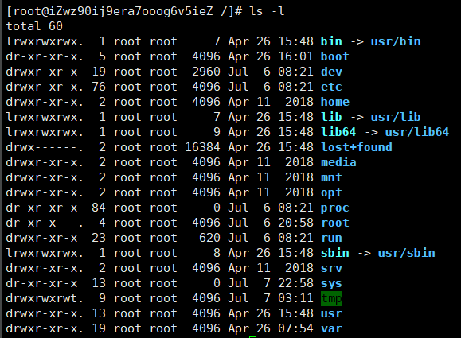
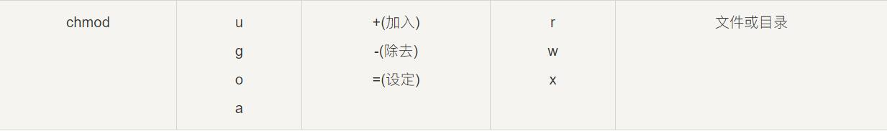
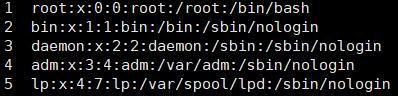

# 简介

* Linux 内核最初只是由芬兰人林纳斯·托瓦兹（Linus Torvalds）在赫尔辛基大学上学时出于个人爱好而编写的。
* Linux 是一套免费使用和自由传播的类 Unix 操作系统，是一个基于 POSIX（可移植操作系统接口） 和 UNIX 的多用户、多任务、支持多线程和多 CPU 的操作系统。
* Linux 能运行主要的 UNIX 工具软件、应用程序和网络协议。它支持 32 位和 64 位硬件。Linux 继承了 Unix 以网络为核心的设计思想，是一个性能稳定的多用户网络操作系统。

## 发行版本


## 系统启动过程

* Linux启动分为5个阶段：
  * 内核的引导。
  * 运行 init。
  * 系统初始化。
  * 建立终端 。
  * 用户登录系统。

## 关机

* 关机指令为：shutdown

  ```shell
  sync # 将数据由内存同步到硬盘中。
  
  shutdown # 关机指令，你可以man shutdown 来看一下帮助文档。例如你可以运行如下命令关机：
  
  shutdown –h 10 # 这个命令告诉大家，计算机将在10分钟后关机
  
  shutdown –h now # 立马关机
  
  shutdown –h 20:25 # 系统会在今天20:25关机
  
  shutdown –h +10 # 十分钟后关机
  
  shutdown –r now # 系统立马重启
  
  shutdown –r +10 # 系统十分钟后重启
  
  reboot # 就是重启，等同于 shutdown –r now
  
  halt # 关闭系统，等同于shutdown –h now 和 poweroff
  ```

* **不管是重启系统还是关闭系统，首先要运行 sync 命令，把内存中的数据写到磁盘中**

# 系统目录结构

* 在 Linux 或 Unix 操作系统中，所有的文件和目录都被组织成以一个根节点开始的倒置的树状结构。文件系统的最顶层是由根目录开始的，系统使用 **/** 来表示根目录。在根目录之下的既可以是目录，也可以是文件，而每一个目录中又可以包含子目录文件。如此反复就可以构成一个庞大的文件系统
* 在Linux文件系统中有两个特殊的目录，一个用户所在的工作目录，也叫当前目录，可以使用一个点` .` 来表示；另一个是当前目录的上一级目录，也叫父目录，可以使用两个点 ``..`` 来表示。


|      文件       |                             说明                             |
| :-------------: | :----------------------------------------------------------: |
|    **/bin**     |     bin是Binary的缩写, 这个目录存放着最经常使用的命令。      |
|    **/boot**    | 这里存放的是启动Linux时使用的一些核心文件，包括一些连接文件以及镜像文件。 |
|    **/dev**     | dev是Device(设备)的缩写, 该目录下存放的是Linux的外部设备，在Linux中访问设备的方式和访问文件的方式是相同的。 |
|    **/etc**     |   这个目录用来存放所有的系统管理所需要的配置文件和子目录。   |
|    **/home**    | 用户的主目录，在Linux中，每个用户都有一个自己的目录，一般该目录名是以用户的账号命名的。 |
|    **/lib**     | 这个目录里存放着系统最基本的动态连接共享库，其作用类似于Windows里的DLL文件。几乎所有的应用程序都需要用到这些共享库。 |
| **/lost+found** | 这个目录一般情况下是空的，当系统非法关机后，这里就存放了一些文件。 |
|   **/media**    | linux 系统会自动识别一些设备，例如U盘、光驱等等，当识别后，linux会把识别的设备挂载到这个目录下。 |
|    **/mnt**     | 系统提供该目录是为了让用户临时挂载别的文件系统的，我们可以将光驱挂载在/mnt/上，然后进入该目录就可以查看光驱里的内容了。 |
|    **/opt**     | 这是给主机额外安装软件所摆放的目录。比如你安装一个ORACLE数据库则就可以放到这个目录下。默认是空的。 |
|    **/proc**    | 这个目录是一个虚拟的目录，它是系统内存的映射，我们可以通过直接访问这个目录来获取系统信息。 |
|    **/root**    |      该目录为系统管理员，也称作超级权限者的用户主目录。      |
|    **/run**     | 是一个临时文件系统，存储系统启动以来的信息。当系统重启时，这个目录下的文件应该被删掉或清除。如果你的系统上有 /var/run 目录，应该让它指向 run。 |
|    **/sbin**    | s就是Super User的意思，这里存放的是系统管理员使用的系统管理程序。 |
|    **/srv**     |          该目录存放一些服务启动之后需要提取的数据。          |
|    **/sys**     | 该目录下安装了2.6内核中新出现的一个文件系统 sysfs，sysfs文件系统集成了下面3种文件系统的信息：针对进程信息的proc文件系统、针对设备的devfs文件系统以及针对伪终端的devpts文件系统。该文件系统是内核设备树的一个直观反映。 |
|    **/tmp**     | 当一个内核对象被创建的时候，对应的文件和目录也在内核对象子系统中被创建。这个目录是用来存放一些临时文件的。 |
|    **/usr**     | 这是一个非常重要的目录，用户的很多应用程序和文件都放在这个目录下，类似于windows下的program files目录。 |
|  **/usr/bin**   |                   系统用户使用的应用程序。                   |
|  **/usr/sbin**  |       超级用户使用的比较高级的管理程序和系统守护程序。       |
|  **/usr/src**   |                  内核源代码默认的放置目录。                  |
|    **/var**     | 这个目录中存放着在不断扩充着的东西，我们习惯将那些经常被修改的目录放在这个目录下。包括各种日志文件。 |

# 文件基本属性

* Linux系统是一种典型的多用户系统，不同的用户处于不同的地位，拥有不同的权限。为了保护系统的安全性，Linux系统对不同的用户访问同一文件（包括目录文件）的权限做了不同的规定


> ==使用`ll`或者`ls –l`命令来显示一个文件的属性以及文件所属的用户和组==



* 在Linux中第一个字符代表这个文件是目录、文件或链接文件

  * **当为[ d ]则是目录**
  * **当为[ - ]则是文件；**
  * **若是[ l ]则表示为链接文档(link file)；**
  * **若是[ b ]则表示为装置文件里面的可供储存的接口设备(可随机存取装置)；**
  * **若是[ c ]则表示为装置文件里面的串行端口设备，例如键盘、鼠标(一次性读取装置)。**

* 接下来的字符中，**以三个为一组，且均为『rwx』 的三个参数的组合。其中，[ r ]代表可读(read)、[ w ]代表可写(write)、[ x ]代表可执行(execute)。 要注意的是，这三个权限的位置不会改变，如果没有权限，就会出现减号[ - ]而已。**

* 每个文件的属性由左边第一部分的10个字符来确定（如下图）。

  

  * 第0位确定文件类型，第1-3位确定属主（该文件的所有者）拥有该文件的权限。第4-6位确定属组（所有者的同组用户）拥有该文件的权限，第7-9位确定其他用户拥有该文件的权限。

## 文件属主和属组

* 对于文件来说，它都有一个特定的所有者，也就是对该文件具有所有权的用户。
* 同时，在Linux系统中，**用户是按组分类的，一个用户属于一个或多个组**。
* **文件所有者以外的用户又可以分为文件所有者的同组用户和其他用户**。
* 因此，Linux系统按文件所有者、文件所有者同组用户和其他用户来规定了不同的文件访问权限。
* 对于 root 用户来说，一般情况下，文件的权限对其不起作用

## 更改文件属性

> ==chgrp：更改文件属组==

* 语法：

  ```bash
  chgrp [-R] 属组名 文件名
  ```

* 参数选项
  
  * -R：递归更改文件属组，就是在更改某个目录文件的属组时，如果加上-R的参数，那么该目录下的所有文件的属组都会更改。

>  ==chown：更改文件属主，也可以同时更改文件属组==

* 语法

  ```
  chown [–R] 属主名 文件名
  chown [-R] 属主名：属组名 文件名
  ```

> ==chmod：更改文件9个属性==

* Linux文件属性有两种设置方法，一种是数字，一种是符号。

* Linux文件的基本权限有九个，分别是owner/group/others三种身份各有自己的read/write/execute权限。

  > **数字修改**

  * 文件的权限字符为：『-rwxrwxrwx』， 这九个权限是三个三个一组的！可以使用数字来代表各个权限，各权限的分数对照表如下：

    * r：4
    * w：2
    * x：1
    * -：0

  * 每种身份(owner/group/others)各自的三个权限(r/w/x)分数是需要累加的,例如当权限为： [-rwxrwx---] 分数则是：

    * owner = rwx = 4+2+1 = 7
    * group = rwx = 4+2+1 = 7
    * others= --- = 0+0+0 = 0

  * 语法

    ```
    chmod [-R] xyz 文件或目录
    ```

  * 选项与参数

    * xyz : 就是上面提到的数字(770)类型的权限属性，为 rwx 属性数值的相加
    * -R : 进行递归(recursive)的持续变更，亦即连同次目录下的所有文件都会变更

  > **字母修改**

  * 三种身份权限(owner/group/others)，我们就可以使用 **u, g, o** 来代表三种身份的权限

  * 此外， **a** 则代表 **all**，即全部的身份。读写的权限可以写成 **r, w, x**，也就是可以使用下图的方式来看：

    

  * 如果我们需要将文件权限设置为 **-rwxr-xr--** ，可以使用 **chmod u=rwx,g=rx,o=r 文件名** 来设定

## 文件隐藏属性

> ==修改文件(目录)隐藏属性==

* 语法

  ```
  chattr [+-=] [属性] 文件或目录名
  ```

  * \+ 表示给文件或目录添加属性，- 表示移除文件或目录拥有的某些属性，= 表示给文件或目录设定一些属性
  * 属性说明：
    * i：
      * 如果对文件设置 i 属性，那么不允许对文件进行删除、改名，也不能添加和修改数据；
      * 如果对目录设置 i 属性，那么只能修改目录下文件中的数据，但不允许建立和删除文件；
    * a：
      * 如果对文件设置 a 属性，那么只能在文件中増加数据，但是不能删除和修改数据；
      * 如果对目录设置 a 属性，那么只允许在目录中建立和修改文件，但是不允许删除文件；
    * u：设置此属性的文件或目录，在删除时，其内容会被保存，以保证后期能够恢复，常用来防止意外删除文件或目录
    * s：和 u 相反，删除文件或目录时，会被彻底删除（直接从硬盘上删除，然后用 0 填充所占用的区域），不可恢复

>==查看文件(目录)隐藏属性==

* 语法

  ```
  lsattr [选项] 文件或目录名
  ```

  * 选项说明：
    * -a：后面不带文件或目录名，表示显示所有文件和目录（包括隐藏文件和目录）
    * -d：如果目标是目录，只会列出目录本身的隐藏属性，而不会列出所含文件或子目录的隐藏属性信息
    * -R：和 -d 恰好相反，作用于目录时，会连同子目录的隐藏信息数据也一并显示出来

# 文件与目录管理

```
绿色文件---------- 可执行文件，可执行的程序 

红色文件-----------压缩文件或者包文件

蓝色文件----------目录    

白色文件----------普通，如文本文件，配置文件，源码文件等 

浅蓝色文件----------链接文件，主要是使用ln命令建立的文件

红色闪烁----------表示链接的文件有问题

黄色文件----------表示设备文件

灰色文件----------表示其它文件
```

## 处理目录的常用命令

> ==ls (列出目录)==

* 语法

  ```
  ls -[adl] 目录名称
  ```

  * 选项与参数：
    * **-a ：全部的文件，连同隐藏文件( 开头为 . 的文件) 一起列出来**
    * **-d ：仅列出目录本身，而不是列出目录内的文件数据**
    * **-l ：长数据串列出，包含文件的属性与权限等等数据**

> ==cd (切换目录)==

* 语法

  ```
  cd [相对路径或绝对路径]
  ```

> ==pwd (显示目前所在的目录)==

* 语法

  ```
  pwd [-P]
  ```

  * 选项与参数：
    * **-P** ：显示出确实的路径，而非使用连结 (link) 路径。

> ==mkdir (创建新目录)==

* 语法

  ```
  mkdir [-m xxx] 目录名称
  mkdir [-p] 目录名称
  ```

  * 选项与参数：
    * **-m ：配置文件的权限,直接配置，不需要看默认权限 (umask) 的脸色**
    * **-p ：帮助你直接将所需要的目录(包含上一级目录)递归创建起来！**

> ==rmdir (删除空的目录)==

* 语法

  ```
  rmdir [-p] 目录名称
  ```

  * 选项与参数：
    * **-p ：连同上一级『空的』目录也一起删除**
  * 注意：
    * **rmdir 仅能删除空的目录**

> ==cp (复制文件或目录)==

* 语法

  ```
  cp [-adfilprsu] 来源档(source) 目标档(destination)
  ```

  * 选项与参数：
    * **-a：**相当于 -pdr 的意思
    * **-d：**若来源档为连结档的属性(link file)，则复制连结档属性而非文件本身；
    * **-f：**为强制(force)的意思，若目标文件已经存在且无法开启，则移除后再尝试一次；
    * **-i：若目标档(destination)已经存在时，在覆盖时会先询问动作的进行**;
    * **-l：**进行硬式连结(hard link)的连结档创建，而非复制文件本身；
    * **-p：连同文件的属性一起复制过去，而非使用默认属性(备份常用)**；
    * **-r：递归持续复制，用于目录的复制行为**；
    * **-s：**复制成为符号连结档 (symbolic link)，亦即『捷径』文件；
    * **-u：**若 destination 比 source 旧才升级 destination 

> ==rm (移除文件或目录)==

* 语法

  ```
  rm [-fir] 文件或目录
  ```

  * 选项与参数：
    * -f ：就是 force 的意思，忽略不存在的文件，不会出现警告信息；
    * -i ：互动模式，在删除前会询问使用者是否动作
    * **-r ：递归删除！最常用在目录的删除！这是非常危险的选项！！！**

> ==mv (移动文件与目录，或修改名称)==

* 语法

  ```
  mv [-fiu] 来源档(source) 目标档(destination)
  mv 旧名称 新名称
  ```
    * 选项与参数：
      * -f ：force 强制的意思，如果目标文件已经存在，不会询问而直接覆盖；
      * -i ：若目标文件 (destination) 已经存在时，就会询问是否覆盖！
      * -u ：若目标文件已经存在，且 source 比较新，才会升级 (update)

## 文件内容查看

> ==cat (由第一行开始显示文件内容)==

* 语法

  ```
  cat [-AbEnTv] 文件名
  ```

  * 选项与参数：
    * **-A ：相当于 -vET 的整合选项，可列出一些特殊字符而不是空白而已；**
    * -b ：列出行号，仅针对非空白行做行号显示，空白行不标行号！
    * -E ：将结尾的断行字节 $ 显示出来；
    * **-n ：列印出行号，连同空白行也会有行号，与 -b 的选项不同；**
    * -T ：将 [tab] 按键以 ^I 显示出来；
    * -v ：列出一些看不出来的特殊字符

> ==tac (文件内容从最后一行开始显示)==

* 语法

  ```
  tac 文件名
  ```

> ==nl (显示行号)==

* 语法

  ```
  nl [-bnw] 文件名
  ```

  * 选项与参数：
    * -b ：指定行号指定的方式，主要有两种：
      -b a ：表示不论是否为空行，也同样列出行号(类似 cat -n)；
      -b t ：如果有空行，空的那一行不要列出行号(默认值)；
    * -n ：列出行号表示的方法，主要有三种：
      -n ln ：行号在荧幕的最左方显示；
      -n rn ：行号在自己栏位的最右方显示，且不加 0 ；
      -n rz ：行号在自己栏位的最右方显示，且加 0 ；
    * -w ：行号栏位的占用的位数。

> ==more (翻动查看文件)==

* 语法

  ```
  more 文件名
  ```

  * 在more运行时可以输入的命令有：：
    * 空白键 (space)：代表向下翻一页；
    * Enter     ：代表向下翻『一行』；
    * /字串     ：代表在这个显示的内容当中，向下搜寻『字串』这个关键字；
    * :f      ：立刻显示出档名以及目前显示的行数；
    * q       ：代表立刻离开 more ，不再显示该文件内容。
    * b 或 [ctrl]-b ：代表往回翻页，不过这动作只对文件有用，对管线无用。

> ==less (一页一页翻动查看文件)==

* 语法

  ```
  less 文件名
  ```

* 在less运行时可以输入的命令有：
    * 空白键(space)：向下翻动一页；
    * [pagedown]：向下翻动一页；
    * [pageup] ：向上翻动一页；
    * /字串   ：向下搜寻『字串』的功能；
    * ?字串   ：向上搜寻『字串』的功能；
    * n     ：重复前一个搜寻 (与 / 或 ? 有关！)
    * N     ：反向的重复前一个搜寻 (与 / 或 ? 有关！)
    * q     ：离开 less 这个程序；

>==head (取出文件前面几行)==

* 语法

  ```
  head [-n number] 文件名 
  ```

  * 选项与参数：
    * -n ：后面接数字，代表显示几行的意思
  * 默认的情况中，显示前面 10 行

> ==tail (取出文件后面几行)==

* 语法

  ```
  tail [-n number] 文件名 
  ```

  * 选项与参数：
    * -n ：后面接数字，代表显示几行的意思

## 文本处理

> ==grep (匹配文件内容)==

* 语法

  ```
  grep [选项] 模式 文件名
  ```

  * 选项说明：
    * **-c：仅列出文件中包含模式的行数(统计)**
    * -i：忽略模式中的字母大小写
    *  -l：列出带有匹配行的文件名
    * **-n：在每一行的最前面列出行号**
    * -v：列出没有匹配模式的行
    * -w：把表达式当做一个完整的单字符来搜寻，忽略那些部分匹配的行
  * **这里的模式，要么是字符（串），要么是正则表达式**
    * c*：将匹配 0 个（即空白）或多个字符 c（c 为任一字符）
    * .：将匹配任何一个字符，且只能是一个字符
    * [xyz]：匹配方括号中的任意一个字符
    * [^xyz]：匹配除方括号中字符外的所有字符
    * ^：锁定行的开头
    * $：锁定行的结尾
  * **注意，如果是搜索多个文件，grep 命令的搜索结果只显示文件中发现匹配模式的文件名；而如果搜索单个文件，grep 命令的结果将显示每一个包含匹配模式的行**

> ==sed (流编辑模式)==

* sed 命令，它采用的是流编辑模式，最明显的特点是，在 sed 处理数据之前，需要预先提供一组规则，sed 会按照此规则来编辑数据

* sed 会根据脚本命令来处理文本文件中的数据，这些命令要么从命令行中输入，要么存储在一个文本文件中，此命令执行数据的

* 顺序如下：

  1. 每次仅读取一行内容；
  2. 根据提供的规则命令匹配并修改数据。注意，sed 默认不会直接修改源文件数据，而是会将数据复制到缓冲区中，修改也仅限于缓冲区中的数据；
  3. 将执行结果输出

  * 当一行数据匹配完成后，它会继续读取下一行数据，并重复这个过程，直到将文件中所有数据处理完毕

* 语法

  ```
  sed [选项] '[脚本命令]' 文件名
  ```

  * 选项说明
    * -e 脚本命令： 该选项会将其后跟的脚本命令添加到已有的命令中
    * -f 脚本命令 文件：该选项会将其后文件中的脚本命令添加到已有的命令中
    * -n：默认情况下，sed 会在所有的脚本指定执行完毕后，会自动输出处理后的内容，而该选项会屏蔽启动输出，需使用 print 命令来完成输出
    * -i：此选项会直接修改源文件，要慎用

* ==sed脚本命令==

  > **sed s 替换文本**

  ```
  [address]s/pattern/replacement/flags
  ```

  * 其中，address 表示指定要操作的具体行，pattern 指的是需要替换的内容，replacement 指的是要替换的新内容
  * flags说明：
    * n：1~512 之间的数字，表示指定要替换的字符串出现第几次时才进行替换，例如，一行中有 3 个 A，但用户只想替换第二个 A，这是就用到这个标记
    * g：对数据中所有匹配到的内容进行替换，如果没有 g，则只会在第一次匹配成功时做替换操作。例如，一行数据中有 3 个 A，则只会替换第一个 A
    * p： 会打印与替换命令中指定的模式匹配的行。此标记通常与 -n 选项一起使用
    * w file：将缓冲区中的内容写到指定的 file 文件中
    * &：用正则表达式匹配的内容进行替换
    * \n：匹配第 n 个子串，该子串之前在 pattern 中用 \(\) 指定
    * \： 转义（转义替换部分包含：&、\ 等）

  > **sed d 删除行**

  ```
  [address]d
  ```

  > **sed a/i 插入**

  ```
  [address]a（或 i）\新文本内容
  ```

  * a 命令表示在指定行的后面附加一行
  * i 命令表示在指定行的前面插入一行

  > **sed c 将指定行中的所有内容，替换成该选项后面的字符串**

  ```
  [address]c\用于替换的新文本
  ```

  > **sed y 转换命令是唯一可以处理单个字符的 sed 脚本命令**

  ```
  [address]y/inchars/outchars/
  ```

  * 转换命令会对 inchars 和 outchars 值进行一对一的映射，即 inchars 中的第一个字符会被转换为 outchars 中的第一个字符，第二个字符会被转换成 outchars 中的第二个字符...这个映射过程会一直持续到处理完指定字符。如果 inchars 和 outchars 的长度不同，则 sed 会产生一条错误消息。

  >**sed p 搜索符号条件的行，并输出该行的内容**

  ```
  [address]p
  ```

  * 用 -n 选项和 p 命令配合使用，我们可以禁止输出其他行，只打印包含匹配文本模式的行

  > **sed w 将文本中指定行的内容写入文件中**

  ```
  [address]w filename
  ```

  > **sed r 将一个独立文件的数据插入到当前数据流的指定位置**

  ```
  [address]r filename
  ```

> ==awk==

* 语法

  ```
  awk [选项] '脚本命令' 文件名
  ```

  * 选项说明：
    * -F fs：指定以 fs 作为输入行的分隔符，awk 命令默认分隔符为空格或制表符
    * -f file：从脚本文件中读取 awk 脚本指令，以取代直接在命令行中输入指令
    * -v var=val：在执行处理过程之前，设置一个变量 var，并给其设备初始值为 val

* awk 的强大之处在于脚本命令，它由 2 部分组成，分别为匹配规则和执行命令

  ```
  '匹配规则{执行命令}'
  ```

  * 这里的匹配规则，和 sed 命令中的 address 部分作用相同，用来指定脚本命令可以作用到文本内容中的具体行，可以使用字符串或者正则表达式指定。另外需要注意的是，**整个脚本命令是用单引号（''）括起，而其中的执行命令部分需要用大括号（{}）括起来**。
  * 在 awk 程序执行时，如果没有指定执行命令，则默认会把匹配的行输出；如果不指定匹配规则，则默认匹配文本中所有的行

## 链接概念

Linux 链接分两种，一种被称为硬链接（Hard Link），另一种被称为符号链接（Symbolic Link）。

* 硬连接

  * 硬连接指通过索引节点来进行连接。在 Linux 的文件系统中，保存在磁盘分区中的文件不管是什么类型都给它分配一个编号，称为索引节点号(Inode Index)。在 Linux 中，多个文件名指向同一索引节点是存在的。比如：A 是 B 的硬链接（A 和 B 都是文件名），则 A 的目录项中的 inode 节点号与 B 的目录项中的 inode 节点号相同，即一个 inode 节点对应两个不同的文件名，两个文件名指向同一个文件，A 和 B 对文件系统来说是完全平等的。删除其中任何一个都不会影响另外一个的访问。
  * 硬连接的作用是允许一个文件拥有多个有效路径名，这样用户就可以建立硬连接到重要文件，以防止“误删”的功能。其原因如上所述，因为对应该目录的索引节点有一个以上的连接。只删除一个连接并不影响索引节点本身和其它的连接，只有当最后一个连接被删除后，文件的数据块及目录的连接才会被释放。也就是说，文件真正删除的条件是与之相关的所有硬连接文件均被删除。

* 软连接

  * 另外一种连接称之为符号连接（Symbolic Link），也叫软连接。软链接文件有类似于 Windows 的快捷方式。它实际上是一个特殊的文件。在符号连接中，文件实际上是一个文本文件，其中包含的有另一文件的位置信息。比如：A 是 B 的软链接（A 和 B 都是文件名），A 的目录项中的 inode 节点号与 B 的目录项中的 inode 节点号不相同，A 和 B 指向的是两个不同的 inode，继而指向两块不同的数据块。但是 A 的数据块中存放的只是 B 的路径名（可以根据这个找到 B 的目录项）。A 和 B 之间是“主从”关系，如果 B 被删除了，A 仍然存在（因为两个是不同的文件），但指向的是一个无效的链接。

* 语法

  * 硬连接
  
    ```
    ln 文件名A 文件名B
    ```
  
    * 软连接
  
      ```
      ln -s 文件名A 文件名B
      ```

# 打包和压缩

* Linux 系统中，最常用的归档（打包）命令就是 tar，该命令可以将许多文件一起保存到一个单独的磁带或磁盘中进行归档。不仅如此，该命令还可以从归档文件中还原所需文件，也就是打包的反过程，称为解打包
* 使用 tar 命令归档的包通常称为 tar 包（tar 包文件都是以“.tar”结尾的）

> ==tar命令做打包操作==

* 语法

  ```
  tar [选项] 源文件或目录
  ```

  * 选项说明：
    * **-c：将多个文件或目录进行打包。**
    * -A：追加 tar 文件到归档文件。
    * **-f：指定包的文件名**
    * **-v：显示打包文件过程**

> ==tar命令做解打包操作==

* 语法

  ```
  tar [选项] 压缩包
  ```

  * 选项说明：
    * **-x：对 tar 包做解打包操作**
    * **-f：指定要解压的 tar 包的包名**
    * **-t：只查看 tar 包中有哪些文件或目录，不对 tar 包做解打包操作**
    * **-C 目录：指定解打包位置**
    * **-v：显示解打包的具体过程**

> ==tar命令做打包压缩（解压缩解打包）操作==

* 语法

  ```
  tar [选项] 压缩包 源文件或目录
  ```

  * 选项说明：
    * **-z：压缩和解压缩 ".tar.gz" 格式** 
    * **-j：压缩和解压缩 ".tar.bz2"格式**

> ==压缩.zip格式操作==

* 语法

  ```
  zip [选项] 压缩包名 源文件或源目录列表
  ```

  * 选项说明：
    * **-r：递归压缩目录，及将制定目录下的所有文件以及子目录全部压缩**
    * **-m：将文件压缩之后，删除原始文件，相当于把文件移到压缩文件中**
    * **-v：显示详细的压缩过程信息**
    * -q：在压缩的时候不显示命令的执行过程
    * -压缩级别：压缩级别是从 1~9 的数字，-1 代表压缩速度更快，-9 代表压缩效果更好
    * -u：更新压缩文件，即往压缩文件中添加新文件

> ==解压.zip格式操作==

* 语法

  ```
  unzip [选项] 压缩包名
  ```

  * 选项说明：
    * **-d 目录名：将压缩文件解压到指定目录下**
    * -n：解压时并不覆盖已经存在的文件
    * -o：解压时覆盖已经存在的文件，并且无需用户确认
    * **-v：查看压缩文件的详细信息，包括压缩文件中包含的文件大小、文件名以及压缩比等，但并不做解压操作**
    * -t：测试压缩文件有无损坏，但并不解压
    * **-x 文件列表：解压文件，但不包含文件列表中指定的文件**

> ==压缩.gz格式操作==

* 语法

  ```
  gzip [选项] 源文件
  ```

  * 命令中的源文件，当进行压缩操作时，指的是普通文件；当进行解压缩操作时，指的是压缩文件
  * 选项说明：
    * -c：将压缩数据输出到标准输出中，并保留源文件
    * **-d：对压缩文件进行解压缩**
    * **-r：递归压缩指定目录下以及子目录下的所有文件**
    * -v：对于每个压缩和解压缩的文件，显示相应的文件名和压缩比
    * -l：对每一个压缩文件，显示以下字段：
      - 压缩文件的大小；
      - 未压缩文件的大小；
      - 压缩比；
      - 未压缩文件的名称
    * -数字：用于指定压缩等级，-1 压缩等级最低，压缩比最差；-9 压缩比最高。默认压缩比是 -6

> ==解压.gz格式操作==

* 语法

  ```
  gunzip [选项] 文件
  ```

  * 选项说明：
    * -r：递归处理，解压缩指定目录下以及子目录下的所有文件
    * -c：把解压缩后的文件输出到标准输出设备
    * -f：强制解压缩文件，不理会文件是否已存在等情况
    * -l：列出压缩文件内容
    * -v：显示命令执行过程
    * -t：测试压缩文件是否正常，但不对其做解压缩操作

> ==压缩.bz2格式操作==

* 语法

  ```
  bzip2 [选项] 源文件
  ```

  * 选项说明：
    * **-d：执行解压缩，此时该选项后的源文件应为标记有 .bz2 后缀的压缩包文件**
    * **-k：bzip2 在压缩或解压缩任务完成后，会删除原始文件，若要保留原始文件，可使用此选项**
    * -f：bzip2 在压缩或解压缩时，若输出文件与现有文件同名，默认不会覆盖现有文件，若使用此选项，则会强制覆盖现有文件
    * -t：测试压缩包文件的完整性
    * -v：压缩或解压缩文件时，显示详细信息
    * -数字：用于指定压缩等级，-1 压缩等级最低，压缩比最差；-9 压缩比最高

> ==解压.bz2格式操作==

- 语法

  ```
  bunzip2 [选项] 源文件
  ```

  - 选项说明：
    - -k：解压缩后，默认会删除原来的压缩文件。若要保留压缩文件，需使用此参数
    - -f：解压缩时，若输出的文件与现有文件同名时，默认不会覆盖现有的文件。若要覆盖，可使用此选项
    - -v：显示命令执行过程
    - -L：列出压缩文件内容

# 用户和用户组管理

* Linux系统是一个多用户多任务的分时操作系统，任何一个要使用系统资源的用户，都必须首先向系统管理员申请一个账号，然后以这个账号的身份进入系统。

* 用户的账号一方面可以帮助系统管理员对使用系统的用户进行跟踪，并控制他们对系统资源的访问；另一方面也可以帮助用户组织文件，并为用户提供安全性保护。

* 每个用户账号都拥有一个唯一的用户名和各自的口令

## 用户账号的管理

> ==useradd (添加账号)==

* 语法

  ```
  useradd 选项 用户名
  ```

  * 选项说明：
    * -c：comment 指定一段注释性描述。
    * -d 目录：指定用户主目录，如果此目录不存在，则同时使用-m选项，可以创建主目录。
    * -g 用户组：指定用户所属的用户组。
    * -G 用户组：用户组 指定用户所属的附加组。
    * -s Shell文件：指定用户的登录Shell。
    * -u 用户号：指定用户的用户号，如果同时有-o选项，则可以重复使用其他用户的标识号。

> ==userdel (删除账号)==

* 语法

  ```
  userdel [-r] 用户名
  ```

  * 参数说明：
    * -r：把用户的主目录一起删除

> ==usermod (修改账号)==

* 语法

  ```
  usermod 选项 用户名
  ```

  * 选项说明：
    * -c comment 指定一段注释性描述。
    * -d 目录 指定用户主目录，如果此目录不存在，则同时使用-m选项，可以创建主目录。
    * -g 用户组 指定用户所属的用户组。
    * -G 用户组，用户组 指定用户所属的附加组。
    * -s Shell文件 指定用户的登录Shell。
    * -u 用户号 指定用户的用户号，如果同时有-o选项，则可以重复使用其他用户的标识号。

> ==passwd (用户口令管理)==

* 用户账号刚创建时没有口令，但是被系统锁定，无法使用，必须为其指定口令后才可以使用，即使是指定空口令。
* 超级用户可以为自己和其他用户指定口令，普通用户只能用它修改自己的口令

* 语法

  ```
  passwd 选项 用户名
  ```

  * 选项说明：
    * -l 锁定口令，即禁用账号。
    * -u 口令解锁。
    * -d 使账号无口令。
    * -f 强迫用户下次登录时修改口令。

## 用户组的管理

> ==groupadd (增加用户组)==

* 语法

  ```
  groupadd 选项 用户组
  ```

  * 选项说明：
    * -g GID 指定新用户组的组标识号（GID）。
    * -o 一般与-g选项同时使用，表示新用户组的GID可以与系统已有用户组的GID相同。

> ==groupdel (删除用户组)==

* 语法

  ```
  groupdel 用户组
  ```

> ==groupmod 修改用户组==

* 语法

  ```
  groupmod 选项 用户组
  ```

  * 选项说明：
    * -g GID 为用户组指定新的组标识号。
    * -o 与-g选项同时使用，用户组的新GID可以与系统已有用户组的GID相同。
    * -n 新用户组 将用户组的名字改为新名字

> ==newgrp (切换用户组)==

* 如果一个用户同时属于多个用户组，那么用户可以在用户组之间切换，以便具有其他用户组的权限

* 语法

  ```
  newgrp 目的用户组
  ```

  * **前提条件是目标用户组确实是该用户的主组或附加组**

## 与用户账号有关的系统文件

* 完成用户管理的工作有许多种方法，但是每一种方法实际上都是对有关的系统文件进行修改。
* 与用户和用户组相关的信息都存放在一些系统文件中，这些文件包括/etc/passwd, /etc/shadow, /etc/group等

> **/etc/passwd文件是用户管理信息**

* Linux系统中的每个用户都在/etc/passwd文件中有一个对应的记录行，它记录了这个用户的一些基本属性

  

* /etc/passwd中一行记录对应着一个用户，每行记录又被冒号(:)分隔为7个字段

  ```
  用户名:口令:用户标识号:组标识号:注释性描述:主目录:登录Shell
  ```

  * "用户名"是代表用户账号的字符串
    * 通常长度不超过8个字符，并且由大小写字母和/或数字组成。登录名中不能有冒号(:)，因为冒号在这里是分隔符。
    * 为了兼容起见，登录名中最好不要包含点字符(.)，并且不使用连字符(-)和加号(+)打头
  * “口令”一些系统中，存放着加密后的用户口令字
    * 虽然这个字段存放的只是用户口令的加密串，不是明文，但是由于/etc/passwd文件对所有用户都可读，所以这仍是一个安全隐患。因此，现在许多Linux 系统（如SVR4）都使用了shadow技术，把真正的加密后的用户口令字存放到/etc/shadow文件中，而在/etc/passwd文件的口令字段中只存放一个特殊的字符，例如“x”或者“*”
    * 由于/etc/passwd文件是所有用户都可读的，如果用户的密码太简单或规律比较明显的话，一台普通的计算机就能够很容易地将它破解，因此对安全性要求较高的**Linux系统都把加密后的口令字分离出来，单独存放在一个文件中，这个文件是/etc/shadow文件。 有超级用户才拥有该文件读权限，这就保证了用户密码的安全性**
  * “用户标识号”是一个整数，系统内部用它来标识用户
    * 一般情况下它与用户名是一一对应的。如果几个用户名对应的用户标识号是一样的，系统内部将把它们视为同一个用户，但是它们可以有不同的口令、不同的主目录以及不同的登录Shell等。
    * 通常用户标识号的取值范围是0～65 535。0是超级用户root的标识号，1～99由系统保留，作为管理账号，普通用户的标识号从100开始。在Linux系统中，这个界限是500
  * “组标识号”字段记录的是用户所属的用户组
    * 它对应着/etc/group文件中的一条记录
  * “注释性描述”字段记录着用户的一些个人情况
    * 例如用户的真实姓名、电话、地址等，这个字段并没有什么实际的用途。在不同的Linux 系统中，这个字段的格式并没有统一。在许多Linux系统中，这个字段存放的是一段任意的注释性描述文字，用做finger命令的输出
  * “主目录”，也就是用户的起始工作目录
    * 它是用户在登录到系统之后所处的目录。在大多数系统中，各用户的主目录都被组织在同一个特定的目录下，而用户主目录的名称就是该用户的登录名。各用户对自己的主目录有读、写、执行（搜索）权限，其他用户对此目录的访问权限则根据具体情况设置
  * 用户登录后，要启动一个进程，负责将用户的操作传给内核，这个进程是用户登录到系统后运行的命令解释器或某个特定的程序，即Shell
    * Shell是用户与Linux系统之间的接口。Linux的Shell有许多种，每种都有不同的特点。常用的有sh(Bourne Shell), csh(C Shell), ksh(Korn Shell), tcsh(TENEX/TOPS-20 type C Shell), bash(Bourne Again Shell)等。
    * 系统管理员可以根据系统情况和用户习惯为用户指定某个Shell。如果不指定Shell，那么系统使用sh为默认的登录Shell，即这个字段的值为/bin/sh。
    * 用户的登录Shell也可以指定为某个特定的程序（此程序不是一个命令解释器）。
    * 利用这一特点，我们可以限制用户只能运行指定的应用程序，在该应用程序运行结束后，用户就自动退出了系统。有些Linux 系统要求只有那些在系统中登记了的程序才能出现在这个字段中

> **系统中有一类用户称为伪用户（pseudo users）**

* 这些用户在/etc/passwd文件中也占有一条记录，但是不能登录，因为它们的登录Shell为空。它们的存在主要是方便系统管理，满足相应的系统进程对文件属主的要求

  ```
  bin 拥有可执行的用户命令文件 
  sys 拥有系统文件 
  adm 拥有帐户文件 
  uucp UUCP使用 
  lp lp或lpd子系统使用 
  nobody NFS使用
  ```

> **/etc/shadow中记录着用户加密后的口令**

* /etc/shadow中的记录行与/etc/passwd中的一一对应，它由pwconv命令根据/etc/passwd中的数据自动产生

* 它的文件格式与/etc/passwd类似，由若干个字段组成，字段之间用":"隔开

  ```
  登录名:加密口令:最后一次修改时间:最小时间间隔:最大时间间隔:警告时间:不活动时间:失效时间:标志
  ```

  * "登录名"是与/etc/passwd文件中的登录名相一致的用户账号
  * "口令"字段存放的是加密后的用户口令字，长度为13个字符。如果为空，则对应用户没有口令，登录时不需要口令；如果含有不属于集合 { ./0-9A-Za-z }中的字符，则对应的用户不能登录
  * "最后一次修改时间"表示的是从某个时刻起，到用户最后一次修改口令时的天数。时间起点对不同的系统可能不一样。例如在SCO Linux 中，这个时间起点是1970年1月1日
  * "最小时间间隔"指的是两次修改口令之间所需的最小天数
  * "最大时间间隔"指的是口令保持有效的最大天数
  * "警告时间"字段表示的是从系统开始警告用户到用户密码正式失效之间的天数
  * "不活动时间"表示的是用户没有登录活动但账号仍能保持有效的最大天数
  * "失效时间"字段给出的是一个绝对的天数，如果使用了这个字段，那么就给出相应账号的生存期。期满后，该账号就不再是一个合法的账号，也就不能再用来登录了

> **用户组的所有信息都存放在/etc/group文件中**

* 将用户分组是Linux 系统中对用户进行管理及控制访问权限的一种手段

* 每个用户都属于某个用户组；一个组中可以有多个用户，一个用户也可以属于不同的组

* 当一个用户同时是多个组中的成员时，在/etc/passwd文件中记录的是用户所属的主组，也就是登录时所属的默认组，而其他组称为附加组

* 用户要访问属于附加组的文件时，必须首先使用newgrp命令使自己成为所要访问的组中的成员

* 此文件的格式也类似于/etc/passwd文件，由冒号(:)隔开若干个字段

  ```
  组名:口令:组标识号:组内用户列表
  ```

  * "组名"是用户组的名称，由字母或数字构成。与/etc/passwd中的登录名一样，组名不应重复
  * "口令"字段存放的是用户组加密后的口令字。一般Linux 系统的用户组都没有口令，即这个字段一般为空，或者是*
  * "组标识号"与用户标识号类似，也是一个整数，被系统内部用来标识组
  * "组内用户列表"是属于这个组的所有用户的列表/b]，不同用户之间用逗号(,)分隔。这个用户组可能是用户的主组，也可能是附加组

# 磁盘管理

> ==df (检查文件系统的磁盘空间占用情况)==

* 可以利用该命令来获取**硬盘被占用了多少空间，目前还剩下多少空间等信息**

* 语法

  ```
  df [-ahikHTm] [目录或文件名]
  ```

  * 选项与参数：
    * -a ：列出所有的文件系统，包括系统特有的 /proc 等文件系统；
    * -k ：以 KBytes 的容量显示各文件系统；
    * -m ：以 MBytes 的容量显示各文件系统；
    * -h ：以人们较易阅读的 GBytes, MBytes, KBytes 等格式自行显示；
    * -H ：以 M=1000K 取代 M=1024K 的进位方式；
    * -T ：显示文件系统类型, 连同该 partition 的 filesystem 名称 (例如 ext3) 也列出；
    * -i ：不用硬盘容量，而以 inode 的数量来显示

> ==du (查看使用空间)==

* 与df命令不同的是Linux **du命令是对文件和目录磁盘使用的空间的查看**

* 语法

  ```
  du [-ahskm] 文件或目录名称
  ```

  * 选项与参数：
    * -a ：列出所有的文件与目录容量，因为默认仅统计目录底下的文件量而已。
    * -h ：以人们较易读的容量格式 (G/M) 显示；
    * -s ：列出总量而已，而不列出每个各别的目录占用容量；
    * -S ：不包括子目录下的总计，与 -s 有点差别。
    * -k ：以 KBytes 列出容量显示；
    * -m ：以 MBytes 列出容量显示；

> ==fdisk (磁盘分区表操作工具)==

* 语法

  ```
  fdisk [-l] 装置名称
  ```

  * 选项与参数：
    * -l ：输出后面接的装置所有的分区内容。若仅有 fdisk -l 时， 则系统将会把整个系统内能够搜寻到的装置的分区均列出来

> ==mkfs (磁盘格式化)==

* 语法

  ```
  mkfs [-t 文件系统格式] 装置文件名
  ```

  * 选项与参数：
    * -t ：可以接文件系统格式，例如 ext3, ext2, vfat 等(系统有支持才会生效)

> ==fsck (磁盘检验)==

* 语法

  ```
  fsck [-t 文件系统] [-ACay] 装置名称
  ```

  * 选项与参数：
    * -t : 给定档案系统的型式，若在 /etc/fstab 中已有定义或 kernel 本身已支援的则不需加上此参数
    * -s : 依序一个一个地执行 fsck 的指令来检查
    * -A : 对/etc/fstab 中所有列出来的 分区（partition）做检查
    * -C : 显示完整的检查进度
    * -d : 打印出 e2fsck 的 debug 结果
    * -p : 同时有 -A 条件时，同时有多个 fsck 的检查一起执行
    * -R : 同时有 -A 条件时，省略 / 不检查
    * -V : 详细显示模式
    * -a : 如果检查有错则自动修复
    * -r : 如果检查有错则由使用者回答是否修复
    * -y : 选项指定检测每个文件是自动输入yes，在不确定那些是不正常的时候，可以执行 # fsck -y 全部检查修复

> ==mount (磁盘挂载)==

* 语法

  ```
  mount 装置文件名  挂载点
  ```

> ==umount (磁盘卸载)==

* 语法

  ```
  umount [-fn] 装置文件名或挂载点
  ```

  * 选项与参数：
    * -f ：强制卸除！可用在类似网络文件系统 (NFS) 无法读取到的情况下；
    * -n ：不升级 /etc/mtab 情况下卸除。

# Vim编辑器


## 基本使用

* 基本上 vi/vim 共分为三种模式，分别是**命令模式（Command mode）**，**输入模式（Insert mode）**和**底线命令模式（Last line mode）**。 

### 命令模式：

* 用户刚刚启动 vi/vim，便进入了命令模式。此状态下敲击键盘动作会被Vim识别为命令，而非输入字符。
  - **i** 切换到输入模式，以输入字符。
  - **x** 删除当前光标所在处的字符。
  - **:** 切换到底线命令模式，以在最底一行输入命令。

### 输入模式：

在命令模式下按下i就进入了输入模式。在输入模式中，可以使用以下按键：

- **字符按键以及Shift组合**，输入字符
- **ENTER**，回车键，换行
- **BACK SPACE**，退格键，删除光标前一个字符
- **DEL**，删除键，删除光标后一个字符
- **方向键**，在文本中移动光标
- **HOME**/**END**，移动光标到行首/行尾
- **Page Up**/**Page Down**，上/下翻页
- **Insert**，切换光标为输入/替换模式，光标将变成竖线/下划线
- **ESC**，退出输入模式，切换到命令模式

### 底线命令模式：

在命令模式下按下:（英文冒号）就进入了底线命令模式。

- :q 退出程序
- :w 保存文件

按ESC键可随时退出底线命令模式

---


---

## Vim按键说明

> ==移动光标==

|        操作        |                             说明                             |
| :----------------: | :----------------------------------------------------------: |
| h 或 向左箭头键(←) |                     光标向左移动一个字符                     |
| j 或 向下箭头键(↓) |                     光标向下移动一个字符                     |
| k 或 向上箭头键(↑) |                     光标向上移动一个字符                     |
| l 或 向右箭头键(→) |                     光标向右移动一个字符                     |
|    [Ctrl] + [f]    |         屏幕『向下』移动一页，相当于 [Page Down]按键         |
|    [Ctrl] + [b]    |         屏幕『向上』移动一页，相当于 [Page Up] 按键          |
|    [Ctrl] + [d]    |                     屏幕『向下』移动半页                     |
|    [Ctrl] + [u]    |                     屏幕『向上』移动半页                     |
|         +          |                  光标移动到非空格符的下一行                  |
|         -          |                  光标移动到非空格符的上一行                  |
|    **n<space>**    | **那个 n 表示『数字』，例如 20 。按下数字后再按空格键，光标会向右移动这一行的 n 个字符。** |
|  0 或功能键[Home]  |      这是数字『 0 』：移动到这一行的最前面字符处 (常用)      |
|  $ 或功能键[End]   |               移动到这一行的最后面字符处(常用)               |
|         H          |         光标移动到这个屏幕的最上方那一行的第一个字符         |
|         M          |          光标移动到这个屏幕的中央那一行的第一个字符          |
|         L          |         光标移动到这个屏幕的最下方那一行的第一个字符         |
|       **G**        |                 **移动到这个档案的最后一行**                 |
|         nG         |             n 为数字。移动到这个档案的第 n 行。              |
|         gg         |              移动到这个档案的第一行，相当于 1G               |
|    **n<Enter>**    |               **n 为数字。光标向下移动 n 行**                |

> ==搜索替换==

|                     操作                     |                             说明                             |
| :------------------------------------------: | :----------------------------------------------------------: |
|                  **/word**                   |         **向光标之下寻找一个名称为 word 的字符串。**         |
|                    ?word                     |        向光标之上寻找一个字符串名称为 word 的字符串。        |
|                      n                       |        这个 n 是英文按键。代表重复前一个搜寻的动作。         |
|                      N                       | 这个 N 是英文按键。与 n 刚好相反，为『反向』进行前一个搜寻动作。 |
|          **:n1,n2s/word1/word2/g**           | **n1 与 n2 为数字。在第 n1 与 n2 行之间寻找 word1 这个字符串，并将该字符串取代为 word2** |
| **:1,$s/word1/word2/g 或 :%s/word1/word2/g** | **从第一行到最后一行寻找 word1 字符串，并将该字符串取代为 word2 ！(常用)** |
|  :1,$s/word1/word2/gc 或 :%s/word1/word2/gc  | 从第一行到最后一行寻找 word1 字符串，并将该字符串取代为 word2 ！且在取代前显示提示字符给用户确认 (confirm) 是否需要取代！ |

> ==删除、复制粘贴==

|   操作   |                             说明                             |
| :------: | :----------------------------------------------------------: |
|   x, X   | 在一行字当中，x 为向后删除一个字符 (相当于 [del] 按键)， X 为向前删除一个字符(相当于 [backspace] 亦即是退格键) |
|  **nx**  |             **n 为数字，连续向后删除 n 个字符**              |
|  **dd**  |                  **删除游标所在的那一整行**                  |
|   ndd    |              n 为数字。删除光标所在的向下 n 行               |
|   d1G    |                删除光标所在到第一行的所有数据                |
|    dG    |               删除光标所在到最后一行的所有数据               |
|    d$    |             删除游标所在处，到该行的最后一个字符             |
|    d0    |   那个是数字的 0 ，删除游标所在处，到该行的最前面一个字符    |
|  **yy**  |                   **复制游标所在的那一行**                   |
|   nyy    |              n 为数字。复制光标所在的向下 n 行               |
|   y1G    |               复制游标所在行到第一行的所有数据               |
|    yG    |              复制游标所在行到最后一行的所有数据              |
|    y0    |          复制光标所在的那个字符到该行行首的所有数据          |
|    y$    |          复制光标所在的那个字符到该行行尾的所有数据          |
| **p, P** | **p 为将已复制的数据在光标下一行贴上，P 则为贴在游标上一行** |
|    J     |            将光标所在行与下一行的数据结合成同一行            |
|  **nc**  |                   **重复向下删除n行数据**                    |
|  **u**   |              **撤销最近一次对文本做的修改操作**              |
| [Ctrl]+r |                  恢复最近一次所做的撤销操作                  |
|    .     | 这就是小数点！意思是重复前一个动作的意思。 如果你想要重复删除、重复贴上等等动作，按下小数点『.』就好了 |

> ==指令行的储存、离开等指令==

|        操作         |                             说明                             |
| :-----------------: | :----------------------------------------------------------: |
|       **:w**        |                **将编辑的数据写入硬盘档案中**                |
|         :w!         | 若文件属性为『只读』时，强制写入该档案。不过，到底能不能写入， 还是跟你对该档案的档案权限有关 |
|       **:q**        |                         **离开 vi**                          |
|       **:q!**       | **若曾修改过档案，又不想储存，使用 ! 为强制离开不储存档案**  |
|       **:wq**       |         **储存后离开，若为 :wq! 则为强制储存后离开**         |
|       **ZZ**        | **这是大写的 Z 喔！若档案没有更动，则不储存离开，若档案已经被更动过，则储存后离开** |
|    :w [filename]    |         将编辑的数据储存成另一个档案（类似另存新档）         |
|    :r [filename]    | 在编辑的数据中，读入另一个档案的数据。亦即将 『filename』 这个档案内容加到游标所在行后面 |
| :n1,n2 w [filename] |          将 n1 到 n2 的内容储存成 filename 这个档案          |
|     :! command      | 暂时离开 vi 到指令行模式下执行 command 的显示结果！例如 『:! ls /home』即可在 vi 当中察看 /home 底下以 ls 输出的档案信息 |

> 显示行号与不显示

|    操作     |                          说明                          |
| :---------: | :----------------------------------------------------: |
| **:set nu** | **显示行号，设定之后，会在每一行的前缀显示该行的行号** |
|  :set nonu  |              与 set nu 相反，为取消行号！              |

> 注释

|          操作          |         说明         |
| :--------------------: | :------------------: |
| **:n1,n2s/^/注释符/g** | **批量注释从n1到n2** |
| **:n1,n2s/^注释符//g** |     **取消注释**     |

# 软件安装

## 软件包

>  **Linux下的软件包可细分为两种，分别是源码包和二进制包**

* 源码包：
  * 源码包就是一大堆源代码程序，是由程序员按照特定的格式和语法编写出来的
* 二进制包：
  * 源码包经过成功编译之后产生的包
  * 二进制包是 Linux 下默认的软件安装包，因此二进制包又被称为默认安装软件包
  * 目前主要有以下 2 大主流的二进制包管理系统：
    * RPM 包管理系统：功能强大，安装、升级、査询和卸载非常简单方便，因此很多 Linux 发行版都默认使用此机制作为软件安装的管理方式，例如 Fedora、CentOS、SuSE 等
    * DPKG 包管理系统：由 Debian Linux 所开发的包管理机制，通过 DPKG 包，Debian Linux 就可以进行软件包管理，主要应用在 Debian 和 Ubuntu 中

## RPM包

* RPM 二进制包的命名需遵守统一的命名规则，用户通过名称就可以直接获取这类包的版本、适用平台等信息

* RPM 二进制包命名的一般格式如下:

  ```
  包名-版本号-发布次数-发行商-Linux平台-适合的硬件平台-包扩展名
  ```

* rpm：RPM 包的扩展名，表明这是编译好的二进制包，可以使用 rpm 命令直接安装。此外，还有以 src.rpm 作为扩展名的 RPM 包，这表明是源代码包，需要安装生成源码，然后对其编译并生成 rpm 格式的包，最后才能使用 rpm 命令进行安装

* RPM包默认安装路径

  |    安装路径     |            含义            |
  | :-------------: | :------------------------: |
  |      /etc/      |      配置文件安装目录      |
  |    /usr/bin/    |    可执行的命令安装目录    |
  |    /usr/lib/    | 程序所使用的函数库保存位置 |
  | /usr/share/doc/ | 基本的软件使用手册保存位置 |
  | /usr/share/man/ |      帮助文件保存位置      |

### RPM包的安装

* 语法：

  ```
  rpm -ivh 包全名
  ```

  * 注意一定是包全名。涉及到包全名的命令，一定要注意路径，可能软件包在光盘中，因此需提前做好设备的挂载工作
  * 参数说明：
    * -i：安装（install）
    * -v：显示更详细的信息（verbose）
    * -h：打印 #，显示安装进度（hash）
  * 其他安装要求：
    * -nodeps：不检测依赖性安装。软件安装时会检测依赖性，确定所需的底层软件是否安装，如果没有安装则会报错。如果不管依赖性，想强制安装，则可以使用这个选项。注意，这样不检测依赖性安装的软件基本上是不能使用的，所以不建议这样做。
    * -replacefiles：替换文件安装。如果要安装软件包，但是包中的部分文件已经存在，那么在正常安装时会报"某个文件已经存在"的错误，从而导致软件无法安装。使用这个选项可以忽略这个报错而覆盖安装。
    * -replacepkgs：替换软件包安装。如果软件包已经安装，那么此选项可以把软件包重复安装一遍。
    * -force：强制安装。不管是否已经安装，都重新安装。也就是 -replacefiles 和 -replacepkgs 的综合。
    * -test：测试安装。不会实际安装，只是检测一下依赖性。
    * -prefix：指定安装路径。为安装软件指定安装路径，而不使用默认安装路径。

* 启动服务：

  ```
  service 服务名 start|stop|restart|status
  ```

  * 参数说明：
    * start：启动服务；
    * stop：停止服务；
    * restart：重启服务；
    * status: 查看服务状态；

### RPM包的升级

* 语法：

  ```
  rpm -Uvh 包全名
  rpm -Fvh 包全名
  ```

  * 参数说明：
    * -U（大写）选项的含义是：如果该软件没安装过则直接安装；若没安装则升级至最新版本
    * -F（大写）选项的含义是：如果该软件没有安装，则不会安装，必须安装有较低版本才能升级

### RPM包的卸载

* ==RPM 软件包的卸载要考虑包之间的依赖性==

* 语法：

  ```
  rpm -e 包名
  ```

### 查询RPM操作

* 语法：

  ```
  rpm 选项 查询对象
  ```

  * 选项说明：
    * -q 包名：查询软件包是否安装
    * **-qa：查询系统中所有安装的软件包**
    * -qi 包名：查询软件包的详细信息
    * -qip 包全名：查询未安装包的详细信息
    * -ql 包名：查询软件包的文件列表
    * -qf 系统文件名：查询系统文件属于那个RPM包
    * -qR 包名：查询软件包的依赖关系

## yum安装

* yum，全称“Yellow dog Updater, Modified”，是一个专门为了解决包的依赖关系而存在的软件包管理器

* 语法

  ```
  yum [options] [command] [package ...]
  ```

  * **options：**可选，选项包括-h（帮助），-y（当安装过程提示选择全部为"yes"），-q（不显示安装的过程）等等。
  * **command：**要进行的操作。
  * **package**操作的对象

### 基本命令

* ==查询命令==：

  * `yum list`：查询所有已安装和可安装的软件包
  * `yum list 包名`：查询执行软件包的安装情况
  * `yum search 关键字`：从 yum 源服务器上查找与关键字相关的所有软件包
  * `yum info 包名`：查询执行软件包的详细信息

* ==安装命令==：

  ```
  yum -y install 包名
  ```

  * install：表示安装软件包。
  * -y：自动回答 yes。如果不加 -y，那么每个安装的软件都需要手工回答 yes

* ==升级命令==

  * `yum -y update`：升级所有软件包。不过考虑到服务器强调稳定性，因此该命令并不常用
  * `yum -y update 包名`：升级特定的软件包

* ==卸载命令==

  * 使用 yum 卸载软件包时，会同时卸载所有与该包有依赖关系的其他软件包，即便有依赖包属于系统运行必备文件，也会被 yum 无情卸载，带来的直接后果就是使系统崩溃。除非你能确定卸载此包以及它的所有依赖包不会对系统产生影响，否则不要使用 yum 卸载软件包
  * `yum remove 包名`：卸载指定软件包名

### 管理软件组

* 查看软件组
  * `yum grouplist`
* 查询软件组包含的软件
  * `yum groupinfo 软件组名`
* 安装软件组
  * `yum groupinstall 软件组名`
* 卸载软件组
  * `yum groupremove 软件组名`

### 常用命令

- 列出所有可更新的软件清单命令：yum check-update
- 更新所有软件命令：yum update
- 仅安装指定的软件命令：yum install <package_name>
- 仅更新指定的软件命令：yum update <package_name>
- 列出所有可安裝的软件清单命令：yum list
- 删除软件包命令：yum remove <package_name>
- 查找软件包 命令：yum search <keyword>
- 清除缓存命令:
  - yum clean packages: 清除缓存目录下的软件包
  - yum clean headers: 清除缓存目录下的 headers
  - yum clean oldheaders: 清除缓存目录下旧的 headers
  - yum clean, yum clean all (= yum clean packages; yum clean oldheaders) :清除缓存目录下的软件包及旧的headers

## 源码包安装、卸载、升级

> **安装**

1. 下载源码包

   * **Linux 系统中用于保存源代码的位置主要有 2 个，分别是 "/usr/src" 和 "/usr/local/src"，其中 "/usr/src" 用来保存内核源代码，"/usr/local/src" 用来保存用户下载的源代码**

2. 解压源码包

3. 进入解压文件中

4. ./configure 软件配置与检查

   ```
    ./configure --prefix=/usr/local/软件名称
   ```

5. make 编译

   ```
   make
   ```

6. 安装软件

   ```
   make install
   ```

> **卸载**

* 源码包的卸载，只需要找到软件的安装位置，直接删除所在目录即可，不会遗留任何垃圾文件。需要注意的是，在删除软件之前，应先将软件停止服务

  ```
  rm -rf /usr/local/软件名称
  ```

## wget

* 语法：

  ```
  wget [选项] URL
  ```

  * 选项说明：

    * -O 文件名：下载并以不同的文件名保存
    * –limit-rate=300k：限速下载
    *  -c：断点续传,重新启动下载中断的文件
    * -b：后台下载

  * 查看下载进度

    ```
    tail -f wget-log
    ```

# 系统管理

> **ps (查看系统中所有运行进程的详细信息)**

* 语法:

  ```
  ps 选项
  ```

  * 选项说明：
    * a：显示一个终端的所有进程，除会话引线外；
    * u：显示进程的归属用户及内存的使用情况；
    * x：显示没有控制终端的进程；
    * -l：长格式显示更加详细的信息；
    * -e：显示所有进程；
  * 常用命令：
    * "ps aux" 可以查看系统中所有的进程；
    * "ps -le" 可以查看系统中所有的进程，而且还能看到进程的父进程的 PID 和进程优先级；
    * "ps -l" 只能看到当前 Shell 产生的进程

> **top (动态地持续监听进程地运行状态)**

* 语法：

  ```
  top [选项]
  ```

  * 选项说明：
    * -d 秒数：指定 top 命令每隔几秒更新。默认是 3 秒；
    * -b：使用批处理模式输出。一般和"-n"选项合用，用于把 top 命令重定向到文件中；
    * -n 次数：指定 top 命令执行的次数。一般和"-"选项合用；
    * -p 进程PID：仅查看指定 ID 的进程；
    * -s：使 top 命令在安全模式中运行，避免在交互模式中出现错误；
    * -u 用户名：只监听某个用户的进程
  * 交互操作：
    * ? 或 h：显示交互模式的帮助；
    * P：按照 CPU 的使用率排序，默认就是此选项；
    * M：按照内存的使用率排序；
    * N：按照 PID 排序；
    * T：按照 CPU 的累积运算时间排序，也就是按照 TIME+ 项排序；
    * k：按照 PID 给予某个进程一个信号。一般用于中止某个进程，信号 9 是强制中止的信号；
    * r：按照 PID 给某个进程重设优先级（Nice）值；
    * q：退出 top 命令；

> **pstree (树形结构显示程序和进程之间的关系)**

* 语法：

  ```
  pstree [选项] [PID或用户名]
  ```

  * 选项说明：
    * -a：显示启动每个进程对应的完整指令，包括启动进程的路径、参数等
    * -c：不使用精简法显示进程信息，即显示的进程中包含子进程和父进程
    * -n：根据进程 PID 号来排序输出，默认是以程序名排序输出的
    * -p：显示进程的 PID
    * -u：显示进程对应的用户名称

## 进程优先级

* PRI值是由内核动态调整的，用户不能直接修改

  ```
  PRI (最终值) = PRI (原始值) + NI
  ```

* 修改 NI 值时有几个注意事项：
  * NI 范围是 -20~19。
  * 普通用户调整 NI 值的范围是 0~19，而且只能调整自己的进程。
  * 普通用户只能调高 NI 值，而不能降低。如原本 NI 值为 0，则只能调整为大于 0。
  * 只有 root 用户才能设定进程 NI 值为负值，而且可以调整任何用户的进程

> **nice (给要启动的进程赋予 NI 值，但是不能修改已运行进程的 NI 值)**

* 语法：

  ```
  nice [-n NI值] 启动命令
  ```

  * -n NI值：给命令赋予 NI 值，该值的范围为 -20~19

> **renice (可以在进程运行时修改其 NI 值，从而调整优先级)**

* 语法：

  ```
  renice [优先级] PID
  ```

  * 注意，此命令中使用的是进程的 PID 号，因此常与 ps 等命令配合使用

> **kill (杀死进程)**

* 语法：

  ```
  kill [信号] PID
  ```

  * 信号说明：
    * -0：程序退出时收到该信息
    * -1：挂掉电话线或终端连接的挂起信号，这个信号也会造成某些进程在没有终止的情况下重新初始化
    * -2：表示结束进程，但并不是强制性的，常用的 "Ctrl+C" 组合键发出就是一个 kill -2 的信号
    * -3：退出
    * -9：杀死进程，即强制结束进程
    * -11：段错误
    * -15：正常结束进程，是 kill 命令的默认信号

> **killall (也是用于关闭进程的一个命令，但和 kill 不同的是，killall 命令不再依靠 PID 来杀死单个进程，而是通过程序的进程名来杀死一类进程)**

* 语法：

  ```
  killall [选项] [信号] 进程名
  ```

  * 注意，此命令的信号类型同 kill 命令一样
  * 选项说明：
    * -i：交互式，询问是否要杀死某个进程；
    * -I：忽略进程名的大小写；

# 系统服务

> netstat (查询系统中已启动的服务)

* 语法：

  ```
  netstat 选项
  ```

  * 选项说明：
    * -a：列出系统中所有网络连接，包括已经连接的网络服务、监听的网络服务和 Socket 套接字；
    * -t：列出 TCP 数据；
    * -u：列出 UDF 数据；
    * -l：列出正在监听的网络服务（不包含已经连接的网络服务）；
    * -n：用端口号来显示而不用服务名；
    * -p：列出该服务的进程 ID (PID)；

# 日志管理

* ==/var/目录是用来保存系统动态数据的目录，/var/log/ 目录就是系统日志文件的保存位置==

  |     日志文件      |                             说明                             |
  | :---------------: | :----------------------------------------------------------: |
  |   /var/log/cron   |                 记录与系统定时任务相关的曰志                 |
  |  /var/log/cups/   |                      记录打印信息的曰志                      |
  |  /var/log/dmesg   | 记录了系统在开机时内核自检的信总。也可以使用dmesg命令直接查看内核自检信息 |
  |   /var/log/btmp   | 记录错误登陆的日志。这个文件是二进制文件，不能直接用Vi查看，而要使用lastb命令查看 |
  | /var/log/lasllog  | 记录系统中所有用户最后一次的登录时间的曰志。这个文件也是二进制文件.不能直接用Vi 查看。而要使用lastlog命令查看 |
  |  /var/Iog/mailog  |                      记录邮件信息的曰志                      |
  | /var/log/messages | 它是核心系统日志文件，其中包含了系统启动时的引导信息，以及系统运行时的其他状态消息。I/O 错误、网络错误和其他系统错误都会记录到此文件中。其他信息，比如某个人的身份切换为 root，已经用户自定义安装软件的日志，也会在这里列出 |
  |  /var/log/secure  | 记录验证和授权方面的倍息，只要涉及账户和密码的程序都会记录，比如系统的登录、ssh的登录、su切换用户，sudo授权，甚至添加用户和修改用户密码都会记录在这个日志文件中 |
  |   /var/log/wtmp   | 永久记录所有用户的登陆、注销信息，同时记录系统的后动、重启、关机事件。同样，这个文件也是二进制文件.不能直接用Vi查看，而要使用last命令查看 |
  |   /var/tun/ulmp   | 记录当前已经登录的用户的信息。这个文件会随着用户的登录和注销而不断变化，只记录当前登录用户的信息。同样，这个文件不能直接用Vi查看，而要使用w、who、users等命令查看 |

  

