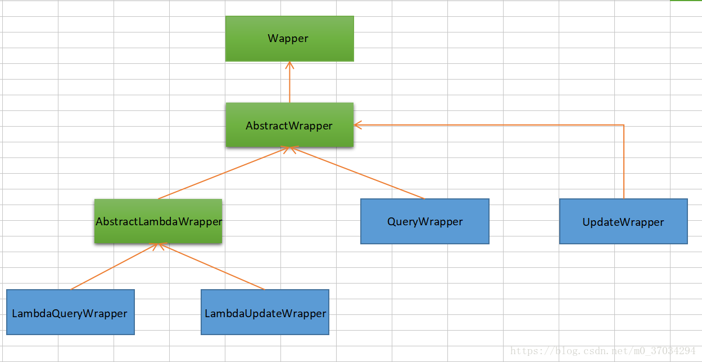
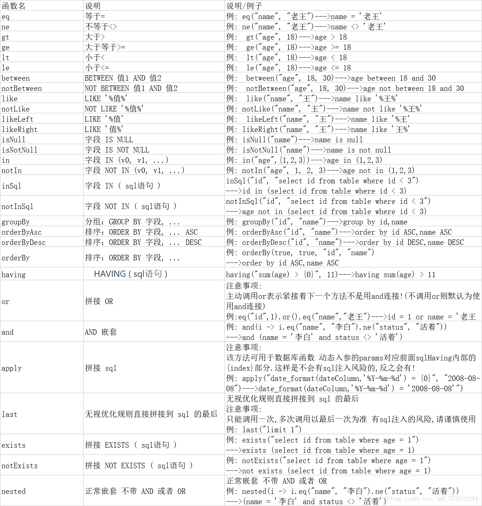

# 简介

MyBatis-Plus（简称 MP）是一个 MyBatis 的增强工具，在 MyBatis 的基础上只做增强不做改变，为简化开发、提高效率而生

# 特性

- **无侵入**：只做增强不做改变，引入它不会对现有工程产生影响，如丝般顺滑
- **损耗小**：启动即会自动注入基本 CURD，性能基本无损耗，直接面向对象操作
- **强大的 CRUD 操作**：内置通用 Mapper、通用 Service，仅仅通过少量配置即可实现单表大部分 CRUD 操作，更有强大的条件构造器，满足各类使用需求
- **支持 Lambda 形式调用**：通过 Lambda 表达式，方便的编写各类查询条件，无需再担心字段写错
- **支持主键自动生成**：支持多达 4 种主键策略（内含分布式唯一 ID 生成器 - Sequence），可自由配置，完美解决主键问题
- **支持 ActiveRecord 模式**：支持 ActiveRecord 形式调用，实体类只需继承 Model 类即可进行强大的 CRUD 操作
- **支持自定义全局通用操作**：支持全局通用方法注入（ Write once, use anywhere ）
- **内置代码生成器**：采用代码或者 Maven 插件可快速生成 Mapper 、 Model 、 Service 、 Controller 层代码，支持模板引擎，更有超多自定义配置等您来使用
- **内置分页插件**：基于 MyBatis 物理分页，开发者无需关心具体操作，配置好插件之后，写分页等同于普通 List 查询
- **分页插件支持多种数据库**：支持 MySQL、MariaDB、Oracle、DB2、H2、HSQL、SQLite、Postgre、SQLServer 等多种数据库
- **内置性能分析插件**：可输出 Sql 语句以及其执行时间，建议开发测试时启用该功能，能快速揪出慢查询
- **内置全局拦截插件**：提供全表 delete 、 update 操作智能分析阻断，也可自定义拦截规则，预防误操作

# 框架结构


# 入门

* 添加依赖

  ```xml
  <dependency>
      <groupId>com.baomidou</groupId>
      <artifactId>mybatis-plus-boot-starter</artifactId>
      <version>3.3.2</version>
  </dependency>
  ```

* 连接数据库

  ```properties
  spring.datasource.url=jdbc:mysql:///mybatis_plus?serverTimezone=UTC
  spring.datasource.username=root
  spring.datasource.password=123456
  ```

* 实体类

  ```java
  @Data
  @AllArgsConstructor
  @NoArgsConstructor
  public class User {
      private long id;
      private String name;
      private long age;
      private String email;
  }
  ```

* Mapper接口：**继承BaseMapper<User>**

  ```java
  @Repository
  @Mapper
  public interface UserMapper extends BaseMapper<User> {
  }
  ```

# 主键自增

* 实体类添加注解

  ```java
  //对应数据库中的主键
  @TableId(type = IdType.AUTO)
  private Integer id;
  ```

* 数据库设置主键自增

# 自动填充

* 数据库添加字段

  ```
  createTime datetime
  updateTime datetime
  ```

* 实体类添加注解

  ```java
  //字段添加填充内容
  @TableField(fill = FieldFill.INSERT)
  private Date createTime;
  @TableField(fill = FieldFill.INSERT_UPDATE)
  private Date updateTime;
  ```

* 注册自动填充策略

  ```java
  @Component
  public class MyMetaObjectHandler implements MetaObjectHandler {
      @Override
      public void insertFill(MetaObject metaObject) {
          this.strictInsertFill(metaObject, "createTime", Date.class, new Date());
          this.strictInsertFill(metaObject, "updateTime", Date.class, new Date());
  
      }
  
      @Override
      public void updateFill(MetaObject metaObject) {
          this.strictInsertFill(metaObject, "updateTime", Date.class, new Date());
      }
  }
  ```

# 乐观锁

* 意图：
  
* 当要更新一条记录的时候，希望这条记录没有被别人更新
  
* 乐观锁实现方式：
  * 取出记录时，获取当前version
  * 更新时，带上这个version
  * 执行更新时， set version = newVersion where version = oldVersion
  * 如果version不对，就更新失败

* 数据库添加字段

  ```
  version 默认为1
  ```

* 实体类添加注解

  ```java
  @Version
  private Integer version;
  ```

* 注册配置

  ```java
  @Configuration
  public class MyBatisPlusConfig {
  
      @Bean
      public OptimisticLockerInterceptor optimisticLockerInterceptor() {
          return new OptimisticLockerInterceptor();
      }
  }
  ```

# 分页插件

* 注册配置

  ```java
  @Bean
  public PaginationInterceptor paginationInterceptor() {
      PaginationInterceptor paginationInterceptor = new PaginationInterceptor();
      // 设置请求的页面大于最大页后操作， true调回到首页，false 继续请求  默认false
      // paginationInterceptor.setOverflow(false);
      // 设置最大单页限制数量，默认 500 条，-1 不受限制
      // paginationInterceptor.setLimit(500);
      // 开启 count 的 join 优化,只针对部分 left join
      paginationInterceptor.setCountSqlParser(new JsqlParserCountOptimize(true));
      return paginationInterceptor;
  }
  ```

* 测试

  ```java
  @Test
  void test8(){
      //参数一：当前页。参数二：页面大小
      Page<User> userPage = userMapper.selectPage(new Page<User>(2, 5), null);
      System.out.println(userPage);
  }
  ```

# 逻辑删除

* 数据库添加字段

  ```
  deleted 默认为 0
  ```

* 实体类添加注解

  ```java
  @TableLogic
  private Integer deleted;
  ```

* 插件配置

  ```properties
  # 配置逻辑删除
  mybatis-plus.global-config.db-config.logic-delete-value=1
  mybatis-plus.global-config.db-config.logic-not-delete-value=0
  ```


# 条件构造器





# 代码自动生成器

* AutoGenerator 是 MyBatis-Plus 的代码生成器，通过 AutoGenerator 可以快速生成 Entity、Mapper、Mapper XML、Service、Controller 等各个模块的代码，极大的提升了开发效率

* 导入依赖

  ```xml
  <dependency>
      <groupId>com.baomidou</groupId>
      <artifactId>mybatis-plus-generator</artifactId>
      <version>3.3.2</version>
  </dependency>
  ```

* 具体实现

  ```java
  public class MyGenerator {
      public static void main(String[] args) {
          //代码生成器
          AutoGenerator generator = new AutoGenerator();
          //System.getProperty("user.dir") 获取当前项目路径
          String projectPath=System.getProperty("user.dir");
  
          //全局配置
          GlobalConfig globalConfig = new GlobalConfig();
          //生成文件的输出目录
          globalConfig.setOutputDir(projectPath + "/src/main/java");
          //是否打开输出目录
          globalConfig.setOpen(false);
          //生成Swagger2
          globalConfig.setSwagger2(true);
          //是否覆盖已有文件
          globalConfig.setFileOverride(true);
          //主键策略
          globalConfig.setIdType(IdType.AUTO);
          //设置结果集映射
          globalConfig.setBaseResultMap(true);
          //设置公共字段映射
          globalConfig.setBaseColumnList(true);
          //设置实体类命名方式
          globalConfig.setEntityName("%s");
          //设置Mapper命名方式
          globalConfig.setMapperName("%sMapper");
          //设置Mapper.xml命名方式
          globalConfig.setXmlName("%sMapper");
          //设置Service命名方式
          globalConfig.setServiceName("%sService");
          //设置ServiceImpl命名方式
          globalConfig.setServiceImplName("%sServiceImpl");
          //设置Controller命名方式
          globalConfig.setControllerName("%sController");
          //添加全局配置到代码生成器中
          generator.setGlobalConfig(globalConfig);
  
          //数据源配置
          DataSourceConfig dataSourceConfig = new DataSourceConfig();
          //设置数据库类型
          dataSourceConfig.setDbType(DbType.MYSQL);
          //设置驱动连接的URL
          dataSourceConfig.setUrl("jdbc:mysql:///jkx_system?serverTimezone=UTC");
          //设置驱动名称
          dataSourceConfig.setDriverName("com.mysql.cj.jdbc.Driver");
          //设置数据库连接用户名
          dataSourceConfig.setUsername("root");
          //设置数据库连接密码
          dataSourceConfig.setPassword("leixuesong");
          //添加数据源配置到代码生成器中
          generator.setDataSource(dataSourceConfig);
  
          //数据库表配置
          StrategyConfig strategyConfig = new StrategyConfig();
          //设置是否大写命名
          strategyConfig.setCapitalMode(true);
          //设置表名是否使用下划线
          strategyConfig.setNaming(NamingStrategy.underline_to_camel);
          //设置字段名是否使用下划线
          strategyConfig.setColumnNaming(NamingStrategy.underline_to_camel);
          //是否使用Lombok优化代码
          strategyConfig.setEntityLombokModel(true);
          //controller类是否直接返回json
          strategyConfig.setRestControllerStyle(true);
          //设置需要生成的表名
          strategyConfig.setInclude("student_info");
          //设置实体类字段注解
          strategyConfig.setEntityTableFieldAnnotationEnable(true);
          /*//设置乐观锁属性名称
          strategyConfig.setVersionFieldName("version");
          //设置逻辑删除属性名称
          strategyConfig.setLogicDeleteFieldName("deleted");
          //设置表填充字段
          ArrayList<TableFill> tableFills = new ArrayList<>();
          TableFill createTime = new TableFill("createTime", FieldFill.INSERT);
          TableFill updateTime = new TableFill("updateTime", FieldFill.INSERT_UPDATE);
          tableFills.add(createTime);
          tableFills.add(updateTime);
          strategyConfig.setTableFillList(tableFills);*/
          //添加策略配置到代码生成器中
          generator.setStrategy(strategyConfig);
  
          //包名配置
          PackageConfig packageConfig = new PackageConfig();
          HashMap<String, String> map = new HashMap<>();
          map.put(ConstVal.ENTITY_PATH,projectPath+"/src/main/java/com/demo/entity/");
          map.put(ConstVal.MAPPER_PATH,projectPath+"/src/main/java/com/demo/mapper");
          map.put(ConstVal.XML_PATH,projectPath+"/src/main/resources/mapper/");
          map.put(ConstVal.SERVICE_PATH,projectPath+"/src/main/java/com/demo/service");
          map.put(ConstVal.SERVICE_IMPL_PATH,projectPath+"/src/main/java/com/demo/service/impl");
          map.put(ConstVal.CONTROLLER_PATH,projectPath+"/src/main/java/com/demo/controller");
          packageConfig.setPathInfo(map);
          //设置父包名
          packageConfig.setParent("com.demo");
          //设置Entity包名
          packageConfig.setEntity("entity");
          //设置Mapper包名
          packageConfig.setMapper("mapper");
          //设置Service包名
          packageConfig.setService("service");
          //设置Service Impl包名
          packageConfig.setServiceImpl("service.impl");
          //设置Controller包名
          packageConfig.setController("controller");
  
          //添加包名配置到代码生成器中
          generator.setPackageInfo(packageConfig);
  
          //执行代码生成器
          generator.execute();
      }
  }
  ```

  