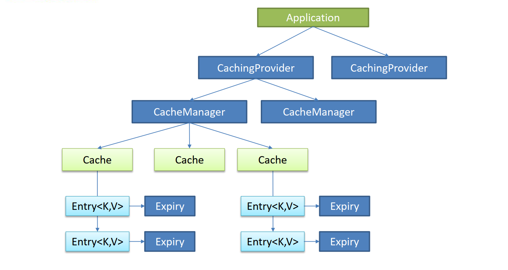
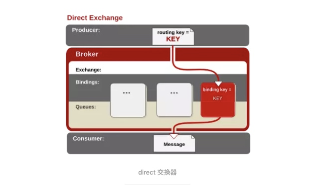
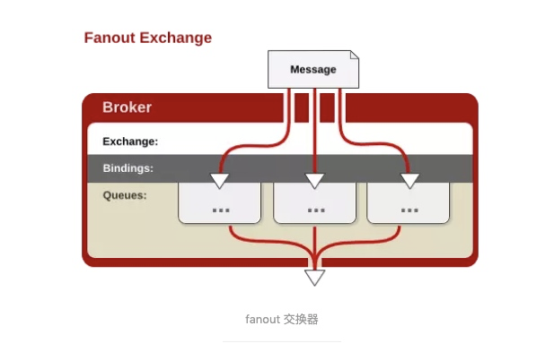
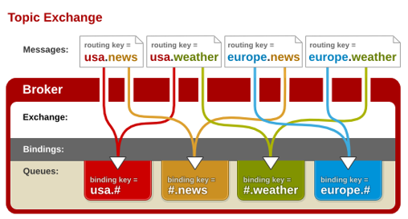

# 简介

* Spring Boot 以**约定大于配置的核心思想**

- 为所有Spring开发者更快的入门
- **开箱即用**，提供各种默认配置来简化项目配置
- 内嵌式容器简化Web项目
- 没有冗余代码生成和XML配置的要求

## 微服务简介

* 微服务架构风格，就像是把一个单独的应用程序开发为一套小服务，每个小服务运行在自己的进程中，并使用轻量级机制通信，通常是 HTTP API。这些服务围绕业务能力来构建，并通过完全自动化部署机制来独立部署。这些服务使用不同的编程语言书写，以及不同数据存储技术，并保持最低限度的集中式管理

## 启动器

* **spring-boot-starter-**：spring-boot场景启动器；帮我们导入了web模块正常运行所依赖的组件；
  * Spring Boot将所有的功能场景都抽取出来，做成一个个的starters（启动器），只需要在项目里面引入这些starter相关场景的所有依赖都会导入进来。要用什么功能就导入什么场景的启动器

## 启动类

* @**SpringBootApplication**:    Spring Boot应用标注在某个类上说明这个类是SpringBoot的主配置类，SpringBoot运行这个类的main方法来启动SpringBoot应用；
  * **@SpringBootConfiguration**：Spring Boot的配置类；
  * **@EnableAutoConfiguration**：开启自动配置功能
    * @**AutoConfigurationPackage**：获取项目主程序启动类所在根目录，从而指定后序组件扫描器要扫描的包位置
      * 将主配置类（@SpringBootApplication标注的类）的所在包及下面所有子包里面的所有组件扫描到Spring容器
    * @**Import**(AutoConfigurationPackages.Registrar.class)：给容器中导入一些组件
      1. 利用getAutoConfigurationEntry(annotationMetadata);给容器中批量导入一些组件 
      2. 调用List<String> configurations = getCandidateConfigurations(annotationMetadata, attributes)获取到所有需要导入到容器中的配置类 
      3. 利用工厂加载 Map<String, List<String>> loadSpringFactories(@Nullable ClassLoader classLoader)；得到所有的组件 
      4. 从META-INF/spring.factories位置来加载一个文件
  * **@ComponentScan**：组件包扫描器，用于将指定包中的注解类自动装配到Spring的Bean容器中

# 配置文件

* SpringBoot使用一个全局的配置文件，配置文件名是固定的；
  * application.properties
  * application.yml
* 配置文件的作用：修改SpringBoot自动配置的默认值；SpringBoot在底层都自动配置好的

## YMAL语法

* 基本语法

  * k:(空格)v：表示一对键值对（空格必须有)
  * 以**空格**的缩进来控制层级关系；只要是左对齐的一列数据，都是同一个层级的
  * 属性和值也是大小写敏感

* 值的写法

  * 普通的值（数字，字符串，布尔）

    * k: v：直接写
    * 字符串默认不用加上单引号或者双引号
      * ""：双引号；不会转义字符串里面的特殊字符；特殊字符会作为本身想表示的意思
      * ''：单引号；会转义特殊字符，特殊字符最终只是一个普通的字符串数据

  * 对象、Map（属性和值）（键值对）

    * k: v：在下一行来写对象的属性和值的关系；注意缩进

    * ```yaml
      friends:
      		lastName: zhangsan
      		age: 20
      ```

    * ```yaml
      friends: {lastName: zhangsan,age: 18}
      ```

  * 数组（List、Set）

    * 用- 值表示数组中的一个元素

    * ```yaml
      pets:
       - cat
       - dog
       - pig
      ```

    * ```yaml
      pets: [cat,dog,pig]
      ```

## 配置文件值注入

* properties/yml文件配置属性值

  ```properties
  person.last-name=雷雪松
  person.age=21
  person.birth=1998/9/5
  person.boss=true
  person.dog.name=tom
  person.dog.age=2
  person.maps.k1=123
  person.maps.k2=456
  person.lists=7,8,9
  ```

* Bean类

  ```java
  @Component
  @ConfigurationProperties(prefix = "person")
  public class Person {
      private String lastName;
      private Integer age;
      private Boolean boss;
      private Date birth;
      private Map<String, Object> maps;
      private List<Object> lists;
      private Dog dog;
  }
  
  @ConfigurationProperties：告诉SpringBoot将本类中的所有属性和配置文件中相关的配置进行绑定；
  prefix = "person"：配置文件中哪个下面的所有属性进行一一映射
  ```

* pom.xml导入依赖增加提示功能

  ```xml
  <!--导入配置文件处理器，配置文件进行绑定就会有提示-->
  <dependency>
      <groupId>org.springframework.boot</groupId>
      <artifactId>spring-boot-configuration-processor</artifactId>
      <optional>true</optional>
  </dependency>
  ```

* **@Value获取值和@ConfigurationProperties获取值比较**

|                      | @ConfigurationProperties | @Value     |
| -------------------- | ------------------------ | ---------- |
| 功能                 | 批量注入配置文件中的属性 | 一个个指定 |
| 松散绑定（松散语法） | 支持                     | 不支持     |
| SpEL                 | 不支持                   | 支持       |
| JSR303数据校验       | 支持                     | 不支持     |
| 复杂类型封装         | 支持                     | 不支持     |

* @**PropertySource**：加载指定的配置文件；

  * ```java
    @PropertySource(value = {"classpath:person.properties"})
    ```

* @**ImportResource**：

  * 导入Spring的配置文件，让配置文件里面的内容生效；

* SpringBoot推荐给容器中添加组件的方式；推荐使用全注解的方式

  * 配置类**@Configuration**------>Spring配置文件

  * 使用**@Bean**给容器中添加组件

    * ```java
      @Configuration
      public class MyAppConfig {
          //将方法的返回值添加到容器中；容器中这个组件默认的id就是方法名
          @Bean
          public HelloService helloService02(){
              System.out.println("配置类@Bean给容器中添加组件了...");
              return new HelloService();
          }
      }
      ```

## 随机数

```java
${random.value}、${random.int}、${random.long}
${random.int(10)}、${random.int[1024,65536]}
```

## 占位符

* 占位符获取之前配置的值，如果没有可以是用:指定默认值

## JSR303数据校验

* @Validated  放在类上来进行数据校验

```xml
<dependency>
	<groupId>org.springframework.boot</groupId>
	<artifactId>spring-boot-starter-validation</artifactId>
</dependency>
```

* 常见参数

  ```java
  @NotNull(message="名字不能为空")
  private String userName;
  @Max(value=120,message="年龄最大不能超过120")
  private int age;
  @Email(message="邮箱格式错误")
  private String email;
  
  空检查
  @Null       验证对象是否为null
  @NotNull    验证对象是否不为null, 无法查检长度为0的字符串
  @NotBlank   检查约束字符串是不是Null还有被Trim的长度是否大于0,只对字符串,且会去掉前后空格.
  @NotEmpty   检查约束元素是否为NULL或者是EMPTY.
      
  Booelan检查
  @AssertTrue     验证 Boolean 对象是否为 true  
  @AssertFalse    验证 Boolean 对象是否为 false  
      
  长度检查
  @Size(min=, max=) 验证对象（Array,Collection,Map,String）长度是否在给定的范围之内  
  @Length(min=, max=) string is between min and max included.
  
  日期检查
  @Past       验证 Date 和 Calendar 对象是否在当前时间之前  
  @Future     验证 Date 和 Calendar 对象是否在当前时间之后  
  @Pattern    验证 String 对象是否符合正则表达式的规则
  ```

## Profile

* 多Profile文件

  * 主配置文件编写的时候，文件名可以是   application-{profile}.properties/yml
  * 默认使用application.properties的配置

* 激活指定profile

  * 在默认配置文件中指定  spring.profiles.active=dev

* yml支持多文档块方式

  ```yml
  server:
    port: 8081
  spring:
    profiles:
      active: prod #指定使用哪一个环境
  ---
  server:
    port: 8083
  spring:
    profiles: dev
  ---
  server:
    port: 8084
  spring:
    profiles: prod  #指定属于环境名称
  ```

## 配置文件加载位置

* springboot 启动会扫描以下位置的application.properties或者application.yml文件作为Spring boot的默认配置文件

  * –file:./config/
  * –file:./
  * –classpath:/config/
  * –classpath:/

  **优先级由高到底，高优先级的配置会覆盖低优先级的配置；SpringBoot会从这四个位置全部加载主配置文件；互补配置；**

* 还可以通过spring.config.location来改变默认的配置文件位置
  * **项目打包好以后，使用命令行参数的形式，启动项目的时候来指定配置文件的新位置；指定配置文件和默认加载的这些配置文件共同起作用形成互补配置；**
  * `java -jar 项目名.jar--spring.config.location=路径`

## 外部配置加载顺序

**1.命令行参数**

`java -jar 项目名.jar --server.port=8087  --server.context-path=/abc`

`多个配置用空格分开； --配置项=值`

2.来自java:comp/env的JNDI属性

3.Java系统属性（System.getProperties()）

4.操作系统环境变量

5.RandomValuePropertySource配置的random.*属性值

**6.jar包外部的application-{profile}.properties或application.yml(带spring.profile)配置文件**

**7.jar包内部的application-{profile}.properties或application.yml(带spring.profile)配置文件**

**8.jar包外部的application.properties或application.yml(不带spring.profile)配置文件**

**9.jar包内部的application.properties或application.yml(不带spring.profile)配置文件**

10.@Configuration注解类上的@PropertySource

11.通过SpringApplication.setDefaultProperties指定的默认属性

## 自动配置原理

* Spring Boot启动的时候会通过@EnableAutoConfiguration注解找到META-INF/spring.factories配置文件中的所有自动配置类，并对其进行加载，而这些自动配置类都是以AutoConfiguration结尾来命名的，它实际上就是一个JavaConfig形式的Spring容器配置类，它能通过以Properties结尾命名的类中取得在全局配置文件中配置的属性如：server.port，而XxxxProperties类是通过@ConfigurationProperties注解与全局配置文件中对应的属性进行绑定的。
  * XxxxProperties类的含义是：封装配置文件中相关属性；
  * XxxxAutoConfiguration类的含义是：自动配置类，目的是给容器中添加组件。

---

* @Conditional派生注解

  * 作用：必须是@Conditional指定的条件成立，才给容器中添加组件，配置配里面的所有内容才生效

    | @Conditional扩展注解            | 作用（判断是否满足当前指定条件）                 |
    | ------------------------------- | ------------------------------------------------ |
    | @ConditionalOnJava              | 系统的java版本是否符合要求                       |
    | @ConditionalOnBean              | 容器中存在指定Bean；                             |
    | @ConditionalOnMissingBean       | 容器中不存在指定Bean；                           |
    | @ConditionalOnExpression        | 满足SpEL表达式指定                               |
    | @ConditionalOnClass             | 系统中有指定的类                                 |
    | @ConditionalOnMissingClass      | 系统中没有指定的类                               |
    | @ConditionalOnSingleCandidate   | 容器中只有一个指定的Bean，或者这个Bean是首选Bean |
    | @ConditionalOnProperty          | 系统中指定的属性是否有指定的值                   |
    | @ConditionalOnResource          | 类路径下是否存在指定资源文件                     |
    | @ConditionalOnWebApplication    | 当前是web环境                                    |
    | @ConditionalOnNotWebApplication | 当前不是web环境                                  |
    | @ConditionalOnJndi              | JNDI存在指定项                                   |

* 通过启用**debug=true属性；来让控制台打印自动配置报告**，这样我们就可以很方便的知道哪些自动配置类生效；

  * **Positive matches:（自动配置类启用的：正匹配）**
  * **Negative matches:（没有启动，没有匹配成功的自动配置类：负匹配）**
  * **Unconditional classes: （没有条件的类）**

# 日志

* 日志统一到slf4j
  * 将系统中其他日志框架先排除出去
  * 用中间包来替换原有的日志框架
  * 导入slf4j其他的实现

## SpringBoot日志

* 使用

  ```java
  Logger logger = LoggerFactory.getLogger(getClass());
      logger.trace("这是trace日志...");
      logger.debug("这是debug日志...");
      logger.info("这是info日志...");
      logger.warn("这是warn日志...");
      logger.error("这是error日志...");
  //日志级别：由低到高   trace<debug<info<warn<error
  //SpringBoot默认给我们使用的是info级别的，没有指定级别的就用SpringBoot默认规定的级别；root级别
  ```

* 日志输出格式

  ```
  日志输出格式：
  		%d表示日期时间，
  		%thread表示线程名，
  		%-5level：级别从左显示5个字符宽度
  		%logger{50} 表示logger名字最长50个字符，否则按照句点分割。 
  		%msg：日志消息，
  		%n是换行符
      -->
      %d{yyyy-MM-dd HH:mm:ss.SSS} [%thread] %-5level %logger{50} - %msg%n
  ```

* 修改日志默认设置

  ```properties
  # 设置日志级别
  logging.level.包名=级别
  # 设置日志输出文本路径
  logging.file.path=路径
  # 控制台输出的日志格式
  logging.pattern.console=格式代码
  # 指定文件中日志输出的格式
  logging.pattern.file=格式代码
  ```

* 指定配置

  * 给类路径下放上每个日志框架自己的配置文件即可；SpringBoot就不使用他默认配置

    | Logging System          | Customization                                                |
    | ----------------------- | ------------------------------------------------------------ |
    | Logback                 | `logback-spring.xml`, `logback-spring.groovy`, `logback.xml` or `logback.groovy` |
    | Log4j2                  | `log4j2-spring.xml` or `log4j2.xml`                          |
    | JDK (Java Util Logging) | `logging.properties`                                         |

  * logback.xml：直接就被日志框架识别了；

  * **logback-spring.xml**：日志框架就不直接加载日志的配置项，由SpringBoot解析日志配置，可以使用SpringBoot的高级Profile功能

    ```xml
    <springProfile name="staging">
      	可以指定某段配置只在某个环境下生效
    </springProfile>
    ```

* 切换日志框架

  ```xml
  <dependency>
      <groupId>org.springframework.boot</groupId>
      <artifactId>spring-boot-starter-web</artifactId>
      <exclusions>
          <exclusion>
              <artifactId>spring-boot-starter-logging</artifactId>
              <groupId>org.springframework.boot</groupId>
          </exclusion>
      </exclusions>
  </dependency>
  
  <dependency>
      <groupId>org.springframework.boot</groupId>
      <artifactId>spring-boot-starter-log4j2</artifactId>
  </dependency>
  ```
  * 导入log4j2.xml文件

    ```xml
    <?xml version="1.0" encoding="UTF-8"?>
    <Configuration status="WARN">
        <Appenders>
            <Console name="Console" target="SYSTEM_OUT">
                <PatternLayout pattern="%d{HH:mm:ss.SSS} [%t] %-5level %logger{36} - %msg%n"/>
            </Console>
        </Appenders>
        <Loggers>
            <Root level="info">
                <AppenderRef ref="Console"/>
            </Root>
        </Loggers>
    </Configuration>
    ```

# Web开发

## 静态资源

* **Webjars**：以jar包的方式引入静态资源
  
  * 所有 /webjars/** ，都去 **classpath:/META-INF/resources/webjars/ 找资源**
  
  * 隐藏版本号依赖
  
    ```xml
    <dependency>
        <groupId>org.webjars</groupId>
        <artifactId>webjars-locator-core</artifactId>
    </dependency>
    ```
  
* "/**" 访问当前项目的任何资源，都去（静态资源的文件夹）找映射

  ```
  "classpath:/META-INF/resources/"
  "classpath:/resources/"
  "classpath:/static/"
  "classpath:/public/" 
  ```

  * **请求进来，先去找Controller看能不能处理。不能处理的所有请求又都交给静态资源处理器。静态资源也找不到则响应404页面**

* > 修改访问静态资源路径
  >
  > **spring.mvc.static-path-pattern= /res/********
  >
  > 修改静态资源存放路径
  >
  > **spring.resources.static-locations=[classpath:/xxx/]**

* 欢迎页：静态资源文件夹下的所有index.html页面；被"/**"映射

* 图标：所有的 **/favicon.ico  都是在静态资源文件下找

## RESTFul风格

* Rest风格支持（*使用**HTTP**请求方式动词来表示对资源的操作*）

  * *以前：/getUser*  *获取用户*    */deleteUser* *删除用户*   */editUser*  *修改用户*      */saveUser* *保存用户*

  * *现在： /user*    *GET-获取用户*    *DELETE-删除用户*     *PUT-修改用户*      *POST-保存用户*

  * **核心Filter：HiddenHttpMethodFilter**
    * 用法： 表单为post请求；添加隐藏域`<input name="_method" type="hidden" value="PUT/DELETE">`
    * SpringBoot中手动开启`spring.mvc.hiddenmethod.filter.enabled=true`

## 模板引擎

### Thymeleaf

* 导入依赖

  ```xml
  <dependency>
      <groupId>org.springframework.boot</groupId>
      <artifactId>spring-boot-starter-thymeleaf</artifactId>
  </dependency>
  ```

* 导入thymeleaf的名称空间

  ```html
  <html lang="en" xmlns:th="http://www.thymeleaf.org">
  ```

* 语法规则

  * th：任意html属性；来替换原生属性的值

  * 表达式

    * ${...}：获取变量值；OGNL；

      * 1.获取对象的属性、调用方法

      * 2.使用内置的基本对象

        ```properties
        #ctx
        #vars
        #locale
        #request
        #response
        #session
        #servletContext
        ```

      * 3.内置的一些工具对象

        ```properties
        #execInfo
        #messages
        #uris
        #conversions
        #dates
        #calendars
        #numbers
        #strings
        #objects
        #bools
        #arrays
        #lists
        #sets
        #maps
        #aggregates
        #ids
        ```

    * *{...}：选择表达式：和${ } 在功能上是一样(配合 th:object="${session.user})

    * #{...}：获取国际化内容

    * @{...}：定义URL

    * ~{...}：片段引用表达式

    * 其他操作

      ```properties
      Literals（字面量）
          Text literals: 'one text' , 'Another one!' ,…
          Number literals: 0 , 34 , 3.0 , 12.3 ,…
          Boolean literals: true , false
          Null literal: null
          Literal tokens: one , sometext , main ,…
      Text operations:（文本操作）
          String concatenation: +
          Literal substitutions: |The name is ${name}|
      Arithmetic operations:（数学运算）
          Binary operators: + , - , * , / , %
          Minus sign (unary operator): -
      Boolean operations:（布尔运算）
          Binary operators: and , or
          Boolean negation (unary operator): ! , not
      Comparisons and equality:（比较运算）
          Comparators: > , < , >= , <= ( gt , lt , ge , le )
          Equality operators: == , != ( eq , ne )
      Conditional operators:条件运算（三元运算符）
          If-then: (if) ? (then)
          If-then-else: (if) ? (then) : (else)
          Default: (value) ?: (defaultvalue)
      Special tokens:
          No-Operation: _ 
      ```

### thymeleaf公共页面元素抽取

* 抽取公共片段

  ```html
  <div th:fragment="片段名">
  	内容
  </div>
  
  <div id="选择器名">
  	内容
  </div>
  ```

* 引入公共片段

  ```html
  <div th:insert="~{模板名 :: 片段名}"></div>
  
  <div th:insert="~{模板名 :: #选择器名}"></div>
  ```

  ```html
  ~{templatename::selector}：模板名::选择器
  
  ~{templatename::fragmentname}:模板名::片段名
  ```

* 三种引入公共片段的th属性

  * **th:insert**：将公共片段整个插入到声明引入的元素中
  * **th:replace**：将声明引入的元素替换为公共片段
  * **th:include**：将被引入的片段的内容包含进这个标签中

## SpringMVC自动配置

* **WebMvcAutoConfiguration**
  * Inclusion of `ContentNegotiatingViewResolver` and `BeanNameViewResolver` beans.
    - 自动配置了ViewResolver（视图解析器：根据方法的返回值得到视图对象（View），视图对象决定如何渲染（转发、重定向））
    - ContentNegotiatingViewResolver：组合所有的视图解析器的；
  * Support for serving static resources, including support for WebJars (see below).
    * 静态资源文件夹路径,webjars
  * Static `index.html` support.
    *  静态首页访问
  * Custom `Favicon` support (see below).  
    * favicon.ico
  * 自动注册了 of `Converter`, `GenericConverter`, `Formatter` beans.

    - Converter：转换器；  public String hello(User user)：类型转换使用Converter
    - `Formatter`  格式化器；  2017.12.17===Date；
  * Support for `HttpMessageConverters` (see below).
    - HttpMessageConverter：SpringMVC用来转换Http请求和响应的；

    - `HttpMessageConverters` 是从容器中确定；获取所有的HttpMessageConverter；
  * Automatic registration of `MessageCodesResolver` (see below).
    * 定义错误代码生成规则
  * Automatic use of a `ConfigurableWebBindingInitializer` bean (see below).

## 扩展SpringMVC

* If you want to keep Spring Boot MVC features and you want to add additional MVC configuration (interceptors, formatters, view controllers, and other features), you can add your own `@Configuration` class of type `WebMvcConfigurer` but without `@EnableWebMvc`. If you wish to provide custom instances of RequestMappingHandlerMapping, RequestMappingHandlerAdapter, or ExceptionHandlerExceptionResolver, you can declare a WebMvcRegistrationsAdapter instance to provide such components.

  ```java
  @Configuration
  public class MyMvcConfig implements WebMvcConfigurer {
      @Override
      public void addViewControllers(ViewControllerRegistry registry) {
          registry.addViewController("/lei").setViewName("test");
      }
  }
  ```

## 全面接管SpringMVC

* **需要在配置类中添加@EnableWebMvc即可,SpringBoot的Web自动配置都失效**

* If you want to take complete control of Spring MVC, you can add your own `@Configuration` annotated with `@EnableWebMvc`.

## 国际化

* 编写国际化配置文件

  ```xml
  login.properties
  login_en_US.properties
  login_zh_CN.properties
  ```

* 配置国际化文件

  ```properties
  spring.messages.basename=i18n.login
  ```

* 从页面获取值

  ```html
  th:href="@{/index.html(l='zh_CN')}
  th:href="@{/index.html(l='en_US')}
  ```

* 编写国际化类

  ```java
  public class MyLocaleResolver implements LocaleResolver {
      @Override
      public Locale resolveLocale(HttpServletRequest httpServletRequest) {
          String language = httpServletRequest.getParameter("l");
          Locale locale = Locale.getDefault();
          if (!StringUtils.isEmpty(language)) {
              String[] split = language.split("_");
              locale= new Locale(split[0], split[1]);
          }
          return locale;
      }
  
      @Override
      public void setLocale(HttpServletRequest httpServletRequest, HttpServletResponse httpServletResponse, Locale locale) {
  
      }
  }
  ```

* 将编写的类注册进Spring容器

  ```java
  @Bean
  public LocaleResolver localeResolver(){
      return new MyLocaleResolver();
  }
  ```

* 页面获取国际化值

  ```html
  th:text="#{login.xxx}"
  ```

## 拦截器

* 拦截器编写

  ```java
  public class LoginHandlerInterceptor implements HandlerInterceptor {
      @Override
      public boolean preHandle(HttpServletRequest request, HttpServletResponse response, Object handler) throws Exception {
          Object loginUser = request.getSession().getAttribute("loginUser");
          if (loginUser == null) {
              request.setAttribute("msg", "没有权限，请先登录");
              request.getRequestDispatcher("/index.html").forward(request, response);
              return false;
          } else {
              return true;
          }
      }
  }
  ```

* 注册拦截器

  ```java
  @Override
  public void addInterceptors(InterceptorRegistry registry) {
      registry.addInterceptor(new LoginHandlerInterceptor()).addPathPatterns("/**").excludePathPatterns("/index.html","/","/user/login","/css/**","/js/**","/img/**");
  }
  ```

## 错误处理机制

* **有模板引擎的情况下，error/状态码;** 【将错误页面命名为  *错误状态码.html* 放在模板引擎文件夹里面的 **error文件夹下**】，发生此状态码的错误就会来到  对应的页面；
* 使用4xx和5xx作为错误页面的文件名来匹配这种类型的所有错误，精确优先（优先寻找精确的状态码.html）；
* 没有模板引擎（模板引擎找不到这个错误页面），静态资源文件夹下找
* 以上都没有错误页面，就是默认来到SpringBoot默认的错误提示页面；
* 页面能获取的信息
  * timestamp：时间戳
  * status：状态码
  * error：错误提示
  * exception：异常对象
  * message：异常消息
  * errors：JSR303数据校验的错误

## 配置嵌入式Servlet容器

* SpringBoot默认使用Tomcat作为嵌入式的Servlet容器

* 定制和修改Servlet容器的相关配置

  * springboot配置文件修改server有关配置

    ```properties
    //通用的Servlet容器设置
    server.xxx
    //Tomcat的设置
    server.tomcat.xxx
    ```

  * 编写一个**WebServerFactoryCustomizer**：嵌入式的Servlet容器的定制器；来修改Servlet容器的配置

    ```java
    @Bean
    public WebServerFactoryCustomizer<ConfigurableWebServerFactory> webServerFactoryCustomizer(){
        return new WebServerFactoryCustomizer<ConfigurableWebServerFactory>() {
            @Override
            public void customize(ConfigurableWebServerFactory factory) {
                factory.setPort(8081);
            }
        };
    }
    ```

## 注册Servlet三大组件【Servlet、Filter、Listener】

* Servlet

  ```java
  public class MyServlet extends HttpServlet {
      @Override
      protected void doPost(HttpServletRequest req, HttpServletResponse resp) throws ServletException, IOException {
          resp.getWriter().write("Hello Servlet");
      }
  
      @Override
      protected void doGet(HttpServletRequest req, HttpServletResponse resp) throws ServletException, IOException {
          this.doPost(req,resp);
      }
  }
  ```

* ServletRegistrationBean

  ```java
  @Bean
  public ServletRegistrationBean myServlet() {
      ServletRegistrationBean registrationBean = new ServletRegistrationBean(new MyServlet(), "/myServlet");
      return registrationBean;
  }
  ```

---

* Filter

  ```java
  public class MyFilter implements Filter {
      @Override
      public void doFilter(ServletRequest servletRequest, ServletResponse servletResponse, FilterChain filterChain) throws IOException, ServletException {
          System.out.println("Hello Filter...");
          filterChain.doFilter(servletRequest,servletResponse);
      }
  }
  ```

  

* FilterRegistrationBean

  ```java
  @Bean
  public FilterRegistrationBean myFilter(){
      FilterRegistrationBean registrationBean = new FilterRegistrationBean();
      registrationBean.setFilter(new MyFilter());
      registrationBean.setUrlPatterns(Arrays.asList("/hello","/myServlet"));
      return registrationBean;
  }
  ```

---

* Listener

  ```java
  public class MyListener implements ServletContextListener {
      @Override
      public void contextInitialized(ServletContextEvent sce) {
          System.out.println("contextInitialized...web应用启动");
      }
  
      @Override
      public void contextDestroyed(ServletContextEvent sce) {
          System.out.println("contextDestroyed...web应用销毁");
      }
  }
  ```

* ServletListenerRegistrationBean

  ```java
  @Bean
  public ServletListenerRegistrationBean myListener(){
      ServletListenerRegistrationBean<MyListener> registrationBean = new ServletListenerRegistrationBean<>(new MyListener());
      return registrationBean;
  }
  ```

## 使用注解版注册三大组件

* Servlet

  ```java
  @WebServlet("/annotationServlet")
  public class MyServlet extends HttpServlet {
      @Override
      protected void doPost(HttpServletRequest req, HttpServletResponse resp) throws ServletException, IOException {
          resp.getWriter().write("Hello Servlet");
      }
  
      @Override
      protected void doGet(HttpServletRequest req, HttpServletResponse resp) throws ServletException, IOException {
          this.doPost(req,resp);
      }
  }
  ```

* Filter

  ```java
  @WebFilter(value = {"/antionLogin","/antionMyFilter"})
  public class MyFilter implements Filter {
      @Override
      public void doFilter(ServletRequest servletRequest, ServletResponse servletResponse, FilterChain filterChain) throws IOException, ServletException {
          System.out.println("Hello Filter...");
          filterChain.doFilter(servletRequest,servletResponse);
      }
  }
  ```

* Listener

  ```java
  @WebListener
  public class MyListener implements ServletContextListener {
      @Override
      public void contextInitialized(ServletContextEvent sce) {
          System.out.println("contextInitialized...web应用启动");
      }
  
      @Override
      public void contextDestroyed(ServletContextEvent sce) {
          System.out.println("contextDestroyed...web应用销毁");
      }
  }
  ```

* **在项目主程序启动类上添加*@ServletComponentScan*注解**

## 替换为其他嵌入式Servlet容器

* 默认支持：Tomcat（默认使用）

  ```xml
  <dependency>
      <groupId>org.springframework.boot</groupId>
      <artifactId>spring-boot-starter-web</artifactId>
  </dependency>
  ```

* Jetty

  ```xml
  <!-- 引入web模块 -->
  <dependency>
     <groupId>org.springframework.boot</groupId>
     <artifactId>spring-boot-starter-web</artifactId>
     <exclusions>
        <exclusion>
           <artifactId>spring-boot-starter-tomcat</artifactId>
           <groupId>org.springframework.boot</groupId>
        </exclusion>
     </exclusions>
  </dependency>
  
  <!--引入其他的Servlet容器-->
  <dependency>
     <artifactId>spring-boot-starter-jetty</artifactId>
     <groupId>org.springframework.boot</groupId>
  </dependency>
  ```

* Undertow

  ```xml
  <!-- 引入web模块 -->
  <dependency>
     <groupId>org.springframework.boot</groupId>
     <artifactId>spring-boot-starter-web</artifactId>
     <exclusions>
        <exclusion>
           <artifactId>spring-boot-starter-tomcat</artifactId>
           <groupId>org.springframework.boot</groupId>
        </exclusion>
     </exclusions>
  </dependency>
  
  <!--引入其他的Servlet容器-->
  <dependency>
     <artifactId>spring-boot-starter-undertow</artifactId>
     <groupId>org.springframework.boot</groupId>
  </dependency>
  ```

## 文件上下传

* 上传文件

  * 前端

    ```html
    <form th:action="@{/uploadFile}" method="post" enctype="multipart*form-data">
        <input type="file" name="fileUpload">
        <input type="submit" value="上传">
    </form>
    <div th:if="${uploadStatus}" th:text"${uploadStatus}></div>
    ```

  * 后端

    ````java
    @PostMapping("/uoloadFile")
    public String uploadFile(MultipartFile[] fileUpload,Model model){
        for(MultipartFile file:fileUpload){
            //获取文件名以及后缀名
            String fileNanme=file.getOriginalFilename();
            //重新生成文件名
            fileName=UUID.randomUUID()+"_"+fileName;
            //指定上传文件本地存储目录，不存在就需要提前创建
            String dirPath="E:/file/";
            File filePath=new File(dirPath);
            if(!filePath.exists()){
                filePath.mkdirs();
            }
            try{
                file.transferTo(new File(dirPath+fileName));
                model.addAttribute("uploadStatus","上传成功");
            }cath(Exception e){
                e.printStackTrace();
                model.addAttribute("uploadStatus","上传失败:"+e.getMessage());
            }
            return "upload"
        }
    }
    ````

* 下载文件

  * 添加依赖

    ```xml
    <dependency>
    	<groupId>cpmmons-io</groupId>
      <artifactId>commons-io</artifactId>
        <version>2.6</version>
    </dependency>
    ```

  * 前端

    ```html
    <a th:href="@{/download(filename='test.jpg')}">下载文件</a>
    ```

  * 后端

    ```java
    @GetMapping("/download")
    public ResponseEntity<byte[]> fileDownload(HttpServletRequest request,String filename){
        //指定要下载的文件跟路径
        String dirPath="E:/file/";
        //创建该文件对象
        File file=new File(dirPath+File.separator+filename);
        //设置响应头
        HttpHeaders headers=new HttpHeaders();
        //下载前对文件名进行转码
    //    filename=getFilename(request,filename)
        //通知浏览器以下载方式打开
        headers.setContentDispositionFormData("attachment",filename);
        //定义以流的形式下载返回文件数据
        headers.setContentType(MediaType.APPLICATION_OCTET_STREAM);
        try {
           return new ResponseEntity<>(FileUtils.readFileToByteArray(file), headers, HttpStatus.OK);
        } catch (Exception e) {
           e.printStackTrace();
           return new ResponseEntity<>(e.getMessage().getBytes(), HttpStatus.EXPECTATION_FAILED);
        }
    }
    ```

  * 中文名文件下载

    ```java
    private String getFilename(HttpServletRequest request, String filename) throws Exception {
        //IE不同版本User-Agent中出现的关键词
        String[] IEBrowserKeyWords = {"MSIE", "Trident", "Edge"};
        //获取请求头代理信息
        String userAgent = request.getHeader("User-Agent");
        for (String keyWord : IEBrowserKeyWords) {
            if (userAgent.contains(keyWord)) {
                //IE内核浏览器，统一为UTF-8编码显示，并对转换的+进行更正
                return URLEncoder.encode(filename, "UTF-8").replace("+", " ");
            }
        }
        //火狐等其他浏览器统一为ISO-8859-1编码显示
        return new String(filename.getBytes("UTF-8"), "ISO-8859-1");
    }
    ```

# Docker

## 简介

* Docker是一个开源的应用容器引擎；是一个轻量级容器技术；
* Docker支持将软件编译成一个镜像；然后在镜像中各种软件做好配置，将镜像发布出去，其他使用者可以直接使用这个镜像；

## 核心概念

* docker主机(Host)：安装了Docker程序的机器（Docker直接安装在操作系统之上）；
* docker客户端(Client)：连接docker主机进行操作；
* docker仓库(Registry)：用来保存各种打包好的软件镜像；
* docker镜像(Images)：软件打包好的镜像；放在docker仓库中；
* docker容器(Container)：镜像启动后的实例称为一个容器；容器是独立运行的一个或一组应用

## 使用Docker的步骤：

* 安装Docker
* 去Docker仓库找到这个软件对应的镜像；
* 使用Docker运行这个镜像，这个镜像就会生成一个Docker容器；
* 对容器的启动停止就是对软件的启动停止；

## 安装Docker

```shell
1、检查内核版本，必须是3.10及以上
uname -r
2、安装docker
yum install docker
3、输入y确认安装
4、启动docker
[root@localhost ~]# systemctl start docker
[root@localhost ~]# docker -v
Docker version 1.12.6, build 3e8e77d/1.12.6
5、开机启动docker
[root@localhost ~]# systemctl enable docker
Created symlink from /etc/systemd/system/multi-user.target.wants/docker.service to /usr/lib/systemd/system/docker.service.
6、停止docker
systemctl stop docker
```

## Docker常用命令&操作

* 镜像操作

  | 操作 | 命令                                            | 说明                                                     |
  | ---- | ----------------------------------------------- | -------------------------------------------------------- |
  | 检索 | docker  search 关键字  eg：docker  search redis | 我们经常去docker  hub上检索镜像的详细信息，如镜像的TAG。 |
  | 拉取 | docker pull 镜像名:tag                          | :tag是可选的，tag表示标签，多为软件的版本，默认是latest  |
  | 列表 | docker images                                   | 查看所有本地镜像                                         |
  | 删除 | docker rmi image-id                             | 删除指定的本地镜像                                       |

* 容器操作

  ```shell
  1、搜索镜像
  [root@localhost ~]# docker search tomcat
  2、拉取镜像
  [root@localhost ~]# docker pull daocloud.io/library/tomcat
  3、根据镜像启动容器
  docker run --name mytomcat -d tomcat:latest
  4、docker ps  
  查看运行中的容器
  5、 停止运行中的容器
  docker stop  容器的id
  6、查看所有的容器
  docker ps -a
  7、启动容器
  docker start 容器id
  8、删除一个容器
   docker rm 容器id
  9、启动一个做了端口映射的tomcat
  [root@localhost ~]# docker run -d -p 8888:8080 tomcat
  -d：后台运行
  -p: 将主机的端口映射到容器的一个端口    主机端口:容器内部的端口
  
  10、关闭linux的防火墙
  service firewalld status ；查看防火墙状态
  service firewalld stop：关闭防火墙
  11、查看容器的日志
  docker logs container-name/container-id
  
  更多命令参看
  https://docs.docker.com/engine/reference/commandline/docker/
  可以参考每一个镜像的文档
  ```

* 镜像：`docker pull registry.docker-cn.com/library/`

# 数据访问

## JDBC

* 导入依赖

  ```xml
  <dependency>
      <groupId>org.springframework.boot</groupId>
      <artifactId>spring-boot-starter-jdbc</artifactId>
  </dependency>
  <dependency>
      <groupId>mysql</groupId>
      <artifactId>mysql-connector-java</artifactId>
      <scope>runtime</scope>
  </dependency>
  ```

* 数据库配置

  ```properties
  spring.datasource.driver-class-name=com.mysql.cj.jdbc.Driver
  spring.datasource.url=jdbc:mysql:///数据库名?serverTimezone=UTC
  spring.datasource.username=root
  spring.datasource.password=root
  # 指定路径，自动创建数据库表
  spring.datasource.schema=calsspath:文件名
  spring.datasource.initialization-mode=always
  ```

## 整合Druid数据源

* 导入依赖

  ```xml
  <dependency>
      <groupId>com.alibaba</groupId>
      <artifactId>druid-spring-boot-starter</artifactId>
      <version>1.1.20</version>
  </dependency>
  ```

* 数据库连接池配置

  ```properties
  # 初始化连接数
  spring.datasource.druid.initial-size=5
  # 最小连接数
  spring.datasource.druid.min-idle=5
  # 最大连接数
  spring.datasource.druid.max-active=20
  # 获取连接最长等待时间，单位毫秒
  spring.datasource.druid.max-wait=60000
  ```

* 配置Druid类

  ```java
  @Configuration
  public class DruidConfig {
  
      /**
      * 配置Druid的监控页功能
      */
      @Bean
      public ServletRegistrationBean registrationBean(){
          ServletRegistrationBean<StatViewServlet> bean = new ServletRegistrationBean<>(new StatViewServlet(), "/druid/*");
          HashMap<String, String> initParameters = new HashMap<>();
          initParameters.put("loginUsername","admin");
          initParameters.put("loginPassword","123456");
          initParameters.put("allow","");
          initParameters.put("deny","192.168.15.21");
          bean.setInitParameters(initParameters);
          return bean;
      }
      
      @Bean
      public FilterRegistrationBean filterRegistrationBean(){
          FilterRegistrationBean bean=new FilterRegistrationBean();
          bean.setFilter(new WebStatFilter());
          HashMap<String, String> initParameters = new HashMap<>();
          initParameters.put("exclusions","*.js,*.css,/druid/*");
          bean.setInitParameters(initParameters);
          bean.setUrlPatterns(Arrays.asList("/*"));
          return bean;
      }
  }
  ```

## 整合MyBatis

* 导入依赖

  ```xml
  <dependency>
      <groupId>org.mybatis.spring.boot</groupId>
      <artifactId>mybatis-spring-boot-starter</artifactId>
      <version>2.1.2</version>
  </dependency>
  ```

* 注解

  ```java
  @Repository
  @Mapper
  public interface UserMapper {
  
      @Select("select * from user where id=#{id}")
      User getById(Integer id);
  
      @Delete("delete from user id=#{id}")
      int delById(Integer id);
  
      @Options(useGeneratedKeys = true,keyProperty = "id")
      @Insert("insert into user(username,password) values(#{username},#{password})")
      int insertUser(User user);
  
      @Update("update user set username=#{username},password=#{password} where id=#{id}")
      int updateUser(User user);
  }
  ```

* 批量扫描

  ```java
  在主程序类上使用MapperScan批量扫描所有的Mapper接口；
  @MapperScan(value = "com.demo.mapper")
  ```

* 配置文件

  ```properties
  # 指定sql映射文件的位置
  mybatis.mapper-locations=classpath:mapper/*.xml
  # 指定全局配置文件的位置
  mybatis.config-location: classpath:mybatis-config.xml 
  # 扫描指定包下设置别名
  mybatis.type-aliases-package=com.study.demo.domain
  ```

> 如需把xml文件放在src/main/java下

* application.properties配置

  ```properties
  mybatis.mapper-locations=classpath*:com/demo/mapper/xml/*.xml
  ```

* pom.xml配置

  ```xml
  <build>
      <resources>
          <resource>
              <directory>src/main/java</directory>
              <filtering>true</filtering>
              <includes>
                  <include>**/*</include>
              </includes>
          </resource>
          <resource>
              <directory>src/main/resources</directory>
              <filtering>true</filtering>
              <includes>
                  <include>**/*</include>
              </includes>
          </resource>
      </resources>
  </build>
  ```

## SpringData Jpa

* 实体类

  ```java
  //使用JPA注解配置映射关系
  @Entity //告诉JPA这是一个实体类（和数据表映射的类）
  @Table(name = "tbl_user") //@Table来指定和哪个数据表对应;如果省略默认表名就是user；
  public class User {
  
      @Id //这是一个主键
      @GeneratedValue(strategy = GenerationType.IDENTITY)//自增主键
      private Integer id;
  
      @Column(name = "last_name",length = 50) //这是和数据表对应的一个列
      private String lastName;
      @Column //省略默认列名就是属性名
      private String email;
  ```

* Dao接口来操作实体类对应的数据表

  ```java
  //继承JpaRepository来完成对数据库的操作
  public interface UserRepository extends JpaRepository<User,Integer> {
  }
  ```

* 基本配置

  ```properties
  # 更新或者创建数据表结构
  spring.jpa.hibernate.ddl-auto=update
  # 控制台显示SQL
  spring.jpa.hibernate.show-sql=true
  ```

# 缓存

## JSR107

* Java Caching定义了5个核心接口，分别是**CachingProvider**, **CacheManager**, **Cache**, **Entry** 和 **Expiry**
  * CachingProvider定义了创建、配置、获取、管理和控制多个CacheManager。一个应用可 以在运行期访问多个CachingProvider。 
  
  * CacheManager定义了创建、配置、获取、管理和控制多个唯一命名的Cache，这些Cache 存在于CacheManager的上下文中。一个CacheManager仅被一个CachingProvider所拥有。 
  
  * Cache是一个类似Map的数据结构并临时存储以Key为索引的值。一个Cache仅被一个 CacheManager所拥有。 
  
  * Entry是一个存储在Cache中的key-value对。 
  
  * Expiry 每一个存储在Cache中的条目有一个定义的有效期。一旦超过这个时间，条目为过期 的状态。一旦过期，条目将不可访问、更新和删除。缓存有效期可以通过ExpiryPolicy设置。
  
    

## Spring缓存抽象

* 导入依赖

  ```xml
  <dependency>
     <groupId>org.springframework.boot</groupId>
     <artifactId>spring-boot-starter-cache</artifactId>
  </dependency>
  ```

* 开启注解缓存

  * 在启动类上加入 `@EnableCaching`

* 缓存注解

  * **@Cacheable**：对方法结果进行缓存（主要用于GET方法）
    1. `cacheNames/value`:指定缓存主键（`Cache`）的名字
    2. `key`:缓存数据使用`key`，支持`spEl`语法
    3. `keyGenerator`:`key`的生成器。与`key`属性冲突，自定义 `keyGenerator` 必须实现`org.springframework.cache.interceptor.KeyGenerator`,`default`使用默认的参数值生成器
    4. `cacheManager`:指定缓存管理器，或者`cacheResolver`指定获取解析器
    5. `cacheResolver`: 与`CacheManager`冲突
    6. `condition`：指定条件满足才缓存，与`unless`相反。可以使用`spEL`语法
    7. `unless`：否定缓存，当满足条件时，结果不被缓存。可以获取到结果（`#result`）进行判断。支持`spEL`语法
    8. `sync`：是否异步模式。在该模式下`unless`不被支持。`default=false`
  * **@CachePut**:
    1. 对方法进行更新
    2. 先调用方法，在对结果进行缓存。（主要用于PUT方法），
    3. **需要注意`key`的设置**
  * **@CacheEvict**:默认先调用方法，在删除缓存（主要用于DELETE方法）
    1. `allEntries`: 删除缓存组件中（`cacheNames/value`指定）所有的值
    2. `beforeInvocation`：在方法执行之前删除值，`default=false`
  * `@Caching`：组合注解。针对复杂情况
  * `@CacheConfig`：加载类上，用于设置缓存的共有属性

* SpEL语法

  |     名字      | 描述                                                         | 示例                  |
  | :-----------: | :----------------------------------------------------------- | :-------------------- |
  |  methodName   | 当前被调用的方法名                                           | \#root.methodName     |
  |    method     | 当前被调用的方法                                             | \#root.method.name    |
  |    target     | 当前被调用的目标对象                                         | \#root.target         |
  |  targetClass  | 当前被调用的目标对象类                                       | \#root.targetClass    |
  |     args      | 当前被调用的方法的参数列表                                   | \#root.args[0]        |
  |    caches     | 当前方法调用使用的缓存列表（如@Cacheable(value={"cache1", "cache2"})），则有两个cache | \#root.caches[0].name |
  | argument name | 方法参数的名字. 可以直接 #参数名 ，也可以使用 #p0或#a0 的 形式，0代表参数的索引； | \#iban 、 #a0 、 #p0  |
  |    result     | 方法执行后的返回值（仅当方法执行之后的判断有效，如 ‘unless’，’cache put’的表达式 ’cache evict’的表达式 beforeInvocation=false） | \#result              |
  
* 数据的管理存储依赖于Spring框架中cache相关的`org.springframework.cache.Cache`和`org.springframework.cache.CacheManager`缓存管理接口,**如果程序中没有定义类型为cacheManager的Bean组件或者是名为cacheResolver缓存解析器，SpringBoot讲尝试选择并开启以下缓存组件(按照指定的顺序)**

  ```
  Generic
  JCache(JSR-107)
  EhCache 2.x
  Hazelcast
  Infinispan
  Couchbase
  Redis
  Caffeine
  Simple
  ```

* 如果项目中同时添加了多个缓存组件，且没有指定缓存管理器或者缓存解析器，那么SpringBoot会优先指定的缓存组件并进行缓存管理。**如果项目中没有任何缓存组件，会默认使用最后一个Simple缓存组件进行管理，Simple缓存组件是SpringBoot默认的缓存管理组件，它默认使用内存中的ConcurrentHashMap进行缓存存储**

## 整合Redis缓存

* 导入依赖

  ```xml
  <dependency>
      <groupId>org.springframework.boot</groupId>
      <artifactId>spring-boot-starter-data-redis</artifactId>
  </dependency>
  ```

* 添加配置
  
  ```properties
  # Redis数据库索引（默认为0）
  spring.redis.database=0
  # Redis服务器地址
  spring.redis.host=127.0.0.1
  # Redis服务器连接端口
  spring.redis.port=6379
  # Redis服务器连接密码（默认为空）
  spring.redis.password=
  # 对基于注解的Redis缓存数据统一设置有效期为1分钟，单位毫秒
  spring.cache.redis.time-to-live=6000
  ```
  
* 方法
  
  * **RedisTemplate redisTemplate**	操作对象k-v

    * ```
      redisTemplate.opsForValue();//操作字符串
      
      redisTemplate.opsForHash();//操作hash
      
      redisTemplate.opsForList();//操作list
      
      redisTemplate.opsForSet();//操作set
      
      redisTemplate.opsForZSet();//操作有序set
      ```

  * **StringRedisTemplate stringRedisTemplate**;    操作字符串k-v
  
    * **两者的关系是StringRedisTemplate继承RedisTemplate**。
    * 两者的数据是不共通的；也就是说StringRedisTemplate只能管理StringRedisTemplate里面的数据，RedisTemplate只能管理RedisTemplate中的数据。
    * SDR默认采用的序列化策略有两种，一种是String的序列化策略，一种是JDK的序列化策略。
    * StringRedisTemplate默认采用的是String的序列化策略，保存的key和value都是采用此策略序列化保存的。
    * RedisTemplate默认采用的是JDK的序列化策略，保存的key和value都是采用此策略序列化保存的。
  
* 序列化

  * 将缓存对象实现序列化
  
    ```
    implements Serializable
    ```
  
  * 自定义数据的序列化格式
  
    ```java
    @Configuration
    public class RedisConfig {
    
        @Bean
        @SuppressWarnings("all")
        public RedisTemplate<String, Object> redisTemplate(RedisConnectionFactory factory) throws UnknownHostException {
            RedisTemplate<String, Object> template = new RedisTemplate<>();
            template.setConnectionFactory(factory);
            //Jason序列化配置
            Jackson2JsonRedisSerializer serializer = new Jackson2JsonRedisSerializer(Object.class);
            ObjectMapper om = new ObjectMapper();
            om.setVisibility(PropertyAccessor.ALL, JsonAutoDetect.Visibility.ANY);
            om.enableDefaultTyping(ObjectMapper.DefaultTyping.NON_FINAL);
            serializer.setObjectMapper(om);
            //String的序列化
            StringRedisSerializer stringRedisSerializer = new StringRedisSerializer();
            //key采用String的序列化方式
            template.setKeySerializer(stringRedisSerializer);
            //hash的key也采用String的序列化方式
            template.setHashKeySerializer(stringRedisSerializer);
            //value序列化方式采用jackson
            template.setValueSerializer(serializer);
            //hash的value序列化方式采用jackson
            template.setHashValueSerializer(serializer);
            template.afterPropertiesSet();
            return template;
        }
    
        @Bean
        public RedisCacheManager cacheManager(RedisConnectionFactory redisConnectionFactory) {
          //分别创建String和JSON格式1序列化对象，对缓存数据key和value进行转换
            RedisSerializer<String> strSerializer = new StringRedisSerializer();
            Jackson2JsonRedisSerializer jacksonSeial = new Jackson2JsonRedisSerializer(Object.class);
            //解决查询缓存转换异常的问题
            ObjectMapper om = new ObjectMapper();
            om.setVisibility(PropertyAccessor.ALL, JsonAutoDetect.Visibility.ANY);
            om.enableDefaultTyping(ObjectMapper.DefaultTyping.NON_FINAL);
            jacksonSeial.setObjectMapper(om);
            //定制缓存数据序列化方式及时效
            RedisCacheConfiguration config = RedisCacheConfiguration.defaultCacheConfig()
                    .entryTtl(Duration.ofDays(1))
                    .serializeKeysWith(RedisSerializationContext.SerializationPair.fromSerializer(strSerializer))
                    .serializeKeysWith(RedisSerializationContext.SerializationPair.fromSerializer(jacksonSeial))
                    .disableCachingNullValues();
            RedisCacheManager cacheManager = RedisCacheManager
                    .builder(redisConnectionFactory).cacheDefaults(config).build();
            return cacheManager;
        }
    }
    ```
    
    

# 消息

 ## 概述

* 消息服务中两个重要概念
  * 消息代理（message broker）
  * 目的地（destination）
    * 当消息发送者发送消息以后，将由消息代理接管，消息代理保证消息传递到指定目的地
* 消息队列主要有两种形式的目的地
  * 队列（queue）：点对点消息通信（point-to-point）
    * 消息发送者发送消息，消息代理将其放入一个队列中，消息接收者从队列中获取消息内容， 消息读取后被移出队列
    * 消息只有唯一的发送者和接受者，但并不是说只能有一个接收者
  * 主题（topic）：发布（publish）/订阅（subscribe）消息通信
    * 发送者（发布者）发送消息到主题，多个接收者（订阅者）监听（订阅）这个主题，那么 就会在消息到达时同时收到消息
* JMS（Java Message Service）JAVA消息服务
  * 基于JVM消息代理的规范。ActiveMQ、HornetMQ是JMS实现
* AMQP（Advanced Message Queuing Protocol）
  * 高级消息队列协议，也是一个消息代理的规范，兼容JMS
  * RabbitMQ是AMQP的实现
* Spring支持
  * spring-jms提供了对JMS的支持 
  * spring-rabbit提供了对AMQP的支持 
  * 需要ConnectionFactory的实现来连接消息代理 
  * 提供JmsTemplate、RabbitTemplate来发送消息 
  * @JmsListener（JMS）、@RabbitListener（AMQP）注解在方法上监听消息代理发 布的消息 
  * @EnableJms、@EnableRabbit开启支持

## RabbitMQ

### 核心概念

* Message
  * 消息，消息是不具名的，它由消息头和消息体组成。消息体是不透明的，而消息头则由一系列的可选属性组成，这些属性包括routing-key（路由键）、priority（相对于其他消息的优先权）、delivery-mode（指出 该消息可能需要持久性存储）等。
* Publisher
  * 消息的生产者，也是一个向交换器发布消息的客户端应用程序。
* Exchange
  * 交换器，用来接收生产者发送的消息并将这些消息路由给服务器中的队列。 Exchange有4种类型：direct(默认)，fanout, topic, 和headers，不同类型的Exchange转发消息的策略有所区别
* Queue
  * 消息队列，用来保存消息直到发送给消费者。它是消息的容器，也是消息的终点。一个消息可投入一个或多个队列。消息一直在队列里面，等待消费者连接到这个队列将其取走。
* Binding
  * 绑定，用于消息队列和交换器之间的关联。一个绑定就是基于路由键将交换器和消息队列连接起来的路由规则，所以可以将交换器理解成一个由绑定构成的路由表。 Exchange 和Queue的绑定可以是多对多的关系。
* Connection
  * 网络连接，比如一个TCP连接。
* Channel
  * 信道，多路复用连接中的一条独立的双向数据流通道。信道是建立在真实的TCP连接内的虚拟连接，AMQP 命令都是通过信道发出去的，不管是发布消息、订阅队列还是接收消息，这些动作都是通过信道完成。因为对于操作系统来说建立和销毁 TCP 都是非常昂贵的开销，所以引入了信道的概念，以复用一条 TCP连接。
* Consumer
  * 消息的消费者，表示一个从消息队列中取得消息的客户端应用程序。
* Virtual Host
  * 虚拟主机，表示一批交换器、消息队列和相关对象。虚拟主机是共享相同的身份认证和加密环境的独立服务器域。每个 vhost 本质上就是一个 mini 版的 RabbitMQ 服务器，拥有 自己的队列、交换器、绑定和权限机制。vhost 是 AMQP 概念的基础，必须在连接时指定， RabbitMQ 默认的 vhost 是 / 
* Broker
  * 表示消息队列服务器实体

### 运行机制

* AMQP 中的消息路由

  * AMQP 中增加了 Exchange 和 Binding 的角色。生产者把消息发布到 Exchange 上，消息最终到达队列并被 消费者接收，而 Binding 决定交换器的消息应该发送到那个队列。

* Exchange分发消息时根据类型的不同分发策略有区别，目前共四种类型： direct、fanout、topic、headers 

  * Direct Exchange

    * 消息中的路由键(routing key)如果和 Binding中的(bindingkey)一致，交换器就将消息发到对应的队列中。它是完全匹配、单播的模式。

      

  * Fanout Exchange

    * 每个发到 fanout 类型交换器的消息都会分到所有绑定的队列上去。fanout交换器不处理路由键， 只是简单的将队列绑定到交换器上，每个发送到交换器的消息都会被转发到与该交换器绑定的所有队列上。很像子网广播，每台子网内的 主机都获得了一份复制的消息。fanout 类型转发消息是最快的。

      

  * Topic Exchange
  
    * topic 交换器通过模式匹配分配消息的路由键属性，将路由键和某个模式进行匹配，此时队列需要绑定到一个模式上。它将路由键和绑定键的字符串切分成单词，这些单词之间用点隔开。 它同样也会识别两个通配符：**符号“#”和符号 “*”。#匹配0个或多个单词， *匹配一个单词**。
  
      

## 整合RabbitMQ

* 导入依赖

  ```xml
  <dependency>
      <groupId>org.springframework.boot</groupId>
      <artifactId>spring-boot-starter-amqp</artifactId>
  </dependency>
  ```

* 添加配置

  ```properties
  spring.rabbitmq.host=地址(默认localhost)
  spring.rabbitmq.port=端口(默认5672)
  spring.rabbitmq.username=guest
  spring.rabbitmq.password=guest
  ```

### 基于API方式

* **AmqpAdmin：管理组件**

  * ```java
    @Autowired
    AmqpAdmin amqpAdmin;
    
    //定义fanout类型的交换器
    amqpAdmin.declareExchange(new FanoutExchange("fanout_exchange"));
    //定义两个默认持久化队列，分别处理email和sms
    amqpAdmin.declareQueue(new Queue("fanout_queue_email"));
    amqpAdmin.declareQueue(new Queue("fanout_queue_sms"));
    //将队列分别于交换器进行绑定
    amqpAdmin.declareBinding(new Binding("fanout_queue_email", Binding.DestinationType.QUEUE, "fanout_exchange", "", null));
    amqpAdmin.declareBinding(new Binding("fanout_queue_sms", Binding.DestinationType.QUEUE, "fanout_exchange", "", null));
    ```

* **RabbitTemplate：消息发送处理组件**

  * **convertAndSend(String exchange,String routingKey,Object object)**   
    * exchange：表示发送消息的交换器
    * routingKey：表示路由键
    * object：表示发送的消息内容
  * **receiveAndConvert(queueName)**
    * queueName：队列名称
  
* 配置Json格式

  ```java
  @Configuration
  public class MyAMQPConfig {
      @Bean
      public MessageConverter messageConverter(){
          return new Jackson2JsonMessageConverter();
      }
  }
  ```

* 监听消息队列

  * @RabbitListener(queues = "名称") 

    ```java
    @RabbitListener(queues = "fanout_queue_email")
    public void psubConsumerEmail(Message message){
        byte[] body = message.getBody();
        String s = new String(body);
        System.out.println("邮件业务接收到消息："+s);
    }
    ```

### 基于配置类的方式

```java
@Configuration
public class RabbitMQConfig {
    //自定义消息转换器
    @Bean
    public MessageConverter messageConverter(){
        return new Jackson2JsonMessageConverter();
    }

    //定义fanout类型的交换器
    @Bean
    public Exchange fanout_exchange(){
        return ExchangeBuilder.fanoutExchange("fanout_exchange").build();
    }

    //定义两个不同名称的消息队列
    @Bean
    public Queue fanout_queue_email(){
        return new Queue("fanout_queue_email");
    }
    @Bean
    public Queue fanout_queue_sms(){
        return new Queue("fanout_queue_sms");
    }

    //将两个不同名称的消息队列与交换器进行绑定
    @Bean
    public Binding bindingEmail(){
        return BindingBuilder.bind(fanout_queue_email()).to(fanout_exchange()).with("").noargs();
    }
    @Bean
    public Binding bindingSms(){
        return BindingBuilder.bind(fanout_queue_sms()).to(fanout_exchange()).with("").noargs();
    }
}
```

# 任务

## 异步任务

* **@EnableAsync**：开启异步(类上)
* **@Async**：异步执行(方法上)

## 定时任务

* **@EnableScheduling**：开启定时(类上)

* **@Scheduled**：定时执行(方法上)

* @Scheduled注解属性及说明

  |        属性        |                             说明                             |
  | :----------------: | :----------------------------------------------------------: |
  |        cron        | 类似于cron的表达式，可以定制定时任务触发的秒、分钟、小时、月中的日、月、周中的日 |
  |        zone        | 指定cron表达式将被解析的时区，默认情况下，该属性是空字符串(即使用服务器的本地时区) |
  |     fixedDelay     | 表示在上一次任务执行结束后在指定时间后继续执行下一次任务(属性值为long类型) |
  |  fixedDelayString  | 表示在上一次任务执行结束后在指定时间后继续执行下一次任务(属性值为long类型的字符串形式) |
  |     fixedRate      |        表示每隔指定时间执行一次任务(属性值为long类型)        |
  |  fixedRateString   |  表示每隔指定时间执行一次任务(属性值为long类型的字符串形式)  |
  |    initialDelay    | 表示在fixedRate或fixedDelay任务第一次执行之前要延迟的毫秒数(属性值为long类型) |
  | initialDelayString | 表示在fixedRate或fixedDelay任务第一次执行之前要延迟的毫秒数(属性值为long类型的字符串形式) |

* cron表达式

  | 字段 |          允许值          | 允许的特殊字符  |
  | :--: | :----------------------: | :-------------: |
  |  秒  |           0-59           |     , - * /     |
  |  分  |           0-59           |     , - * /     |
  | 小时 |           0-23           |     , - * /     |
  | 日期 |           1-31           | , - * ? / L W C |
  | 月份 |           1-12           |     , - * /     |
  | 星期 | 0-7或SUN-SAT,0和7都是SUN | , - * ? / L C # |

  | 特殊字符 |          代表含义          |
  | :------: | :------------------------: |
  |    ,     |            枚举            |
  |    -     |            区间            |
  |    *     |            任意            |
  |    /     |            步长            |
  |    ?     |      日/星期冲突匹配       |
  |    L     |            最后            |
  |    W     |           工作日           |
  |    C     | 和calendar联系后计算过的值 |
  |    #     |  星期，4#2，第二个星期四   |

## 邮件任务

* 导入依赖

  ```xml
  <dependency>
      <groupId>org.springframework.boot</groupId>
      <artifactId>spring-boot-starter-mail</artifactId>
  </dependency>
  ```

* 添加配置

  ```properties
  # 发件人邮箱服务器相关配置
  spring.mail.host=smtp.qq.com
  spring.mail.port=587
  # 配置个人QQ账号和密码
  spring.mail.username=228389787@qq.com
  spring.mail.password=bqkljjfuyghdbijf
  ```

* 发送纯文本和复杂邮件邮件

  ```java
  @Service
  public class SendEmailService {
      @Autowired
      private JavaMailSenderImpl mailSender;
      @Value("${spring.mail.username}")
      private String from;
  
      public void sendSimpleEmail(String to, String subject, String text) {
          //定制纯文本邮件信息
          SimpleMailMessage message = new SimpleMailMessage();
          //发送者邮箱
          message.setFrom(from);
          //接收者邮箱
          message.setTo(to);
          //邮件标题
          message.setSubject(subject);
          //邮件内容
          message.setText(text);
          try {
              //发送邮件
              mailSender.send(message);
              System.out.println("纯文本邮件发送成功");
          } catch (MailException e) {
              System.out.println("纯文本邮件发送失败" + e.getMessage());
              e.printStackTrace();
          }
      }
  
      /**
       * 发送复杂邮件(包括静态资源和附件)
       *
       * @param to       收件人地址
       * @param subject  邮件标题
       * @param text     邮件内容
       * @param filePath 附件地址
       * @param rscId    静态资源唯一标识
       * @param rscPath  静态资源地址
       */
      public void sendComplexEmail(String to, String subject, String text, String filePath, String rscId, String rscPath) {
          //定制复杂邮件信息
          MimeMessage message = mailSender.createMimeMessage();
          try {
              //使用MimeMessageHelper帮助类，并设置multipart多部件使用为true
              MimeMessageHelper helper = new MimeMessageHelper(message, true);
              helper.setFrom(from);
              helper.setTo(to);
              helper.setSubject(subject);
              helper.setText(text, true);
              //设置邮件静态资源
              FileSystemResource res = new FileSystemResource(new File(rscPath));
              helper.addInline(rscId, res);
              //设置邮件附件
              FileSystemResource file = new FileSystemResource(new File(filePath));
              String fileName = filePath.substring(filePath.lastIndexOf(File.separator));
              helper.addAttachment(fileName, file);
              //发送邮件
              mailSender.send(message);
              System.out.println("复杂邮件发送成功");
          } catch (MessagingException e) {
              System.out.println("复杂邮件发送失败" + e.getMessage());
              e.printStackTrace();
          }
      }
  }
  ```

# 安全

## Spring Security

* 核心
  * 认证 （你是谁）
  * 授权 （你能干什么）
  * 攻击防护 （防止伪造身份）

* 导入依赖

  ```xml
  <dependency>
      <groupId>org.springframework.boot</groupId>
      <artifactId>spring-boot-starter-security</artifactId>
  </dependency>
  ```
  
* 开启WebSecurity模式

  * **@EnableWebSecurity**

* WebSecurityConfigurerAdapter类的主要方法

  * **configure(AuthenticationManagerBuilder auth)**：定制用户认证管理器来实现用户认证

  * **configure(HttpSecurity http)**：定制基于HTTP请求的用户访问控制

    * HttpSecurity类的主要方法及说明

      |        方法         |                   描述                   |
      | :-----------------: | :--------------------------------------: |
      | authorizeRequests() | 开启基于HttpServletRequest请求访问的限制 |
      |     formLogin()     |          开启基于表单的用户登录          |
      |     httpBasic()     |     开启基于HTTP请求的Basic认证登录      |
      |      logout()       |            开启退出登录的支持            |
      | sessionManagement() |           开启Session管理配置            |
      |    rememberMe()     |              开启记住我功能              |
      |       csrf()        |       配置CSRF跨站请求伪造防护功能       |

    * 用户请求控制相关的主要方法及说明

      |                   方法                   |                  描述                  |
      | :--------------------------------------: | :------------------------------------: |
      |    antMatchers(String···antPatterns)     |         开启Ant风格的路径匹配          |
      |    mvcMatchers(String···antPatterns)     |         开启MVC风格的路径匹配          |
      |   regexMatchers(String···antPatterns)    |        开启正则表达式的路径匹配        |
      |                  and()                   |               功能连接符               |
      |               anyRequest()               |              匹配任何请求              |
      |               rememberMe()               |             开启记住我功能             |
      |        access(String···attribute)        | 匹配给定的SpEL表达式计算结果是否为true |
      |        hasAnyRole(String···roles)        |     匹配用户是否有参数中的任意角色     |
      |          hasRole(String roles)           |        匹配用户是否有某一个角色        |
      |  hasAnyAuthority(String···authorities)   |     匹配用户是否有参数中的任意权限     |
      |     hasAuthority(String authorities)     |        匹配用户是否有某一个权限        |
      |             authenticated()              |         匹配已经登录认证的用户         |
      |           fullyAuthenticated()           |         匹配完整登录认证的用户         |
      | hasIpAddress(String ipaddressExpression) |         匹配某IP地址的访问请求         |
      |               permitAll()                |          无条件对请求进行放行          |

    * 用户登录相关的主要方法及说明

      |                             方法                             |                     描述                     |
      | :----------------------------------------------------------: | :------------------------------------------: |
      |                 loginPage(String loginPage)                  | 用户登录页面跳转路径，默认为get请求的/login  |
      |             successForwardUrl(String forwardUrl)             |          用户登录重构后的重定向地址          |
      | successHandler(AuthenticationSuccessHandler successHandler)  |             用户登录成功后的处理             |
      |         defaultSuccessUrl(String defaultSuccessUrl)          |          用户直接登录后默认跳转地址          |
      |             failureForwardUrl(String forwardUrl)             |          用户登录失败后的重定向地址          |
      |         failureUrl(String authenticationFailureUrl)          | 用户登录失败后的跳转地址，默认为loogin?error |
      | failureHandler(AuthenticationFailureHandler authenticationFailureHandler) |           用户登录失败后的错误处理           |
      |         usernameParameter(String usernameParameter)          |     用户登录的用户名参数，默认为username     |
      |         passwordParameter(String passwordParameter)          |      登录用户的密码参数，默认为password      |
      |        loginProcessingUrl(String loginProcessingUrl)         |  登录表单提交的路径，默认为post请求的/login  |
      |                         permitAll()                          |             无条件对请求进行放行             |

    * 用户退出相关的主要方法及说明

      |                             方法                             |                             描述                             |
      | :----------------------------------------------------------: | :----------------------------------------------------------: |
      |                 logoutUrl(String logoutUrl)                  |         用户退出处理控制URL，默认为post请求的/logout         |
      |          logoutSuccessUrl(String logoutSuccessUrl)           |                  用户退出成功后的重定向地址                  |
      | logoutSuccessHandler(LogoutSuccessHandler logoutSuccessHandler) |                  用户退出成功后的处理器设置                  |
      |          deleteCookies(String···cookieNamesToClear)          |                   用户退出后删除指定Cookie                   |
      |     invalidateHttpSession(boolean invalidateHttpSession)     |          用户退出后是否立即清除Session(默认为true)           |
      |       clearAuthentication(boolean clearAuthentication)       | 用户退出后是否立即清除Authentication用户认证信息(默认为true) |

    * 记住我相关的主要方法及说明

      |                            方法                            |                             描述                             |
      | :--------------------------------------------------------: | :----------------------------------------------------------: |
      |      rememberMeParameter(String rememberMeParameter)       |                指示在登录时记住用户的HTTP参数                |
      |                      key(String key)                       |                记住我认证生成的Token令牌标识                 |
      |       tokenValiditySeconds(int tokenValiditySeconds)       |               记住我Token令牌有效期，单位为秒                |
      | tokenRepository(PersistentTokenRepository tokenRepository) | 指定要使用的PersistentTokenRepository，用来配置持久化Token令牌 |
      |           alwaysRemember(boolean alwaysRemember)           |          是否应该始终创建记住我Cookie，默认为false           |
      |      clearAuthentication(boolean clearAuthentication)      | 是否设置Cookie为安全的，如果设置为true，则必须通过HTTPS进行连接请求 |

* 继承`WebSecurityConfigurerAdapter`类，自定义Security策略

  ```java
  @EnableWebSecurity
  public class MySecurityConfig extends WebSecurityConfigurerAdapter {
      @Override
      protected void configure(HttpSecurity http) throws Exception {
          //定制请求的授权规则
          http.authorizeRequests()
                  .antMatchers("/").permitAll()
                  .antMatchers("/level1/**").hasRole("vip1")
                  .antMatchers("/level2/**").hasRole("vip2")
                  .antMatchers("/level3/**").hasRole("vip3");
          //开启自动配置的登录功能，如果没有登录，没有权限就会来到登录页面
    		http.formLogin()
        			.usernameParameter("username")
        			.passwordParameter("password")
        			.loginPage("/toLogin");
          //记住我
          http.rememberMe()
              	.rememberMeParameter("remember");
          //开启注销
          http.logout()
              	.logoutSuccessUrl("/");
          http.csrf()
              	.disable();
      }
  
      @Override
      protected void configure(AuthenticationManagerBuilder auth) throws Exception {
          //定制认证策略
          auth.inMemoryAuthentication().passwordEncoder(new BCryptPasswordEncoder())
              .withUser("admin")
              .password(new BCryptPasswordEncoder().encode("123456"))
              .roles("vip1")
              .and()
              .withUser("root")
              .password(new BCryptPasswordEncoder().encode("123456"))
              .roles("vip1","vip2","vip3");
      }
  }
  ```

* 登录用户信息获取

  * 使用HttpSession获取用户信息

    ```java
    @GetMapping("/getUser")
        @ResponseBody
        public void getUser(HttpSession session){
            //从当前HttpSession获取绑定到此会话的所有对象的名称
            Enumeration<String> names = session.getAttributeNames();
            while (names.hasMoreElements()) {
                //获取HttpSession中会话名称
                String element = names.nextElement();
                //获取HttpSession中的应用上下文
                SecurityContextImpl attribute = (SecurityContextImpl) session.getAttribute(element);
                System.out.println("element："+element);
                System.out.println("attribute："+attribute);
                //获取用户相关信息
                Authentication authentication = attribute.getAuthentication();
                UserDetails principal = (UserDetails) authentication.getPrincipal();
                System.out.println(principal);
                System.out.println("username："+principal.getUsername());
            }
        }
    ```

  * 使用SecurityContextHolder获取用户信息

    ```java
    @GetMapping("/getUser2")
        @ResponseBody
        public void getUser2(){
            //获取应用上下文
            SecurityContext context = SecurityContextHolder.getContext();
            System.out.println("userDetails："+context);
            //获取用户相关信息
            Authentication authentication = context.getAuthentication();
            UserDetails principal = (UserDetails) authentication.getPrincipal();
            System.out.println(principal);
            System.out.println("username："+principal);
        }
    ```

* Security管理前端页面

  * 导入依赖

    ```xml
    <!--thymeleaf与srcurity-->
    <dependency>
        <groupId>org.thymeleaf.extras</groupId>
        <artifactId>thymeleaf-extras-springsecurity5</artifactId>
    </dependency>
    
    <!--命名空间-->
    xmlns:sec="http://www.thymeleaf.org/thymeleaf-extras-springsecurity5"
    ```

  * 标签使用
    * **sec:authorize="isAnonymius()"**：判断用户是否未登录，只有未登录用户才会显示特定页面
    * **sec:authorize="isAuthenticated()"**：判断用户是否已经登录，只有登录过的用户才会显示特定页面
    * **sec:authorize="hasRole('xxx')"**：定义只有角色为xxx(对应权限Authority为ROLE_xxx)且登录的用户才会显示特定页面
    * **sec:authorize="hasAuthority('ROLE_xxx')"**：定义只有权限为ROLE_xxx(对应角色Role为xxx)且登录的用户才会显示特定页面
    * **sec:authorize="name"**：显示登录用户名
    * **sec:authorize="principal.authorities"**：显示权限

## Shiro

### 功能

* 主要功能
  * Subject：主体，一般指用户。
  * SecurityManager：安全管理器，管理所有Subject，可以配合内部安全组件。
  * Realms：用于进行权限信息的验证，一般需要自己实现。
* 细分功能
  * Authentication：身份认证/登录(账号密码验证)。
  * Authorization：授权，即角色或者权限验证。
  * Session Manager：会话管理，用户登录后的session相关管理。
  * Cryptography：加密，密码加密等。
  * Web Support：Web支持，集成Web环境。
  * Caching：缓存，用户信息、角色、权限等缓存到如redis等缓存中。
  * Concurrency：多线程并发验证，在一个线程中开启另一个线程，可以把权限自动传播过去。
  * Testing：测试支持；
  * Run As：允许一个用户假装为另一个用户（如果他们允许）的身份进行访问。
  * Remember Me：记住我

### 使用

* 导入依赖

  ```xml
  <dependency>
      <groupId>org.apache.shiro</groupId>
      <artifactId>shiro-spring</artifactId>
      <version>1.5.2</version>
  </dependency>
  ```

* 添加配置

  ```java
  public class MyRealm extends AuthorizingRealm {
  
      //授权
      @Override
      protected AuthorizationInfo doGetAuthorizationInfo(PrincipalCollection principalCollection) {
          return null;
      }
  
      //认证
      @Override
      protected AuthenticationInfo doGetAuthenticationInfo(AuthenticationToken authenticationToken) throws AuthenticationException {
          return null;
  	}
  ```

  ```java
  @Configuration
  public class ShiroConfig {
  
      @Bean
      public ShiroFilterFactoryBean getShiroFilterFactoryBean(@Qualifier("Manager") DefaultWebSecurityManager defaultWebSecurityManager){
          ShiroFilterFactoryBean bean = new ShiroFilterFactoryBean();
          bean.setSecurityManager(defaultWebSecurityManager);
          return bean;
      }
  
      @Bean(name = "Manager")
      public DefaultWebSecurityManager getDefaultWebSecurityManager(@Qualifier("Realm") MyRealm myRealm){
          DefaultWebSecurityManager manager = new DefaultWebSecurityManager();
          manager.setRealm(myRealm);
          return manager;
      }
  
      @Bean(name = "Realm")
      public MyRealm myRealm(){
          return new MyRealm();
      }
  }
  ```

# Swagger

* 导入依赖

  ```xml
  <dependency>
      <groupId>io.springfox</groupId>
      <artifactId>springfox-swagger2</artifactId>
      <version>2.9.2</version>
  </dependency>
  <dependency>
      <groupId>io.springfox</groupId>
      <artifactId>springfox-swagger-ui</artifactId>
      <version>2.9.2</version>
  </dependency>
  ```

* 编写配置

  ```java
  @Configuration
  @EnableSwagger2
  public class SwaggerConfig {
      @Bean
      public Docket createRestApi(){
          return new Docket(DocumentationType.SWAGGER_2)
                  .pathMapping("/")
                  .select()
                  .apis(RequestHandlerSelectors.basePackage("com.demo.controller"))
                  .paths(PathSelectors.any())
                  .build();
      }
  }
  ```

- 实体类注解

  - @ApiModel注解用来描述实体类
  - @ApiModelProperty注解用来描述属性

  ```java
  @ApiModel("用户实体类")
  public class User {
      @ApiModelProperty("用户名")
      public String username;
      @ApiModelProperty("密码")
      public String password;
  }
  ```

* 接口注解

  * @Api注解可以用来标记当前Controller的功能
  * @ApiOperation注解用来标记一个方法的作用
  * @ApiImplicitParam注解用来描述一个参数

  ```java
  @Api(tags = "用户管理接口")
  @RestController
  public class UserController {
  
      @ApiOperation("添加用户的接口")
      @ApiImplicitParams({
              @ApiImplicitParam(name = "username",value = "用户名",defaultValue = "雷雪松",required = true),
              @ApiImplicitParam(name = "password",value = "密码",defaultValue = "123456",required = true)})
      @PostMapping("/user")
      public User user(String username,String password){
          User user=new User();
          user.setUsername(username);
          user.setPassword(password);
         return user;
      }
  }
  ```

# JUnit5测试

## 常用注解

- **@Test :**表示方法是测试方法。但是与JUnit4的@Test不同，他的职责非常单一不能声明任何属性，拓展的测试将会由Jupiter提供额外测试
- **@ParameterizedTest :**表示方法是参数化测试，下方会有详细介绍

- **@RepeatedTest :**表示方法可重复执行，下方会有详细介绍
- **@DisplayName :**为测试类或者测试方法设置展示名称

- **@BeforeEach :**表示在每个单元测试之前执行
- **@AfterEach :**表示在每个单元测试之后执行

- **@BeforeAll :**表示在所有单元测试之前执行
- **@AfterAll :**表示在所有单元测试之后执行

- **@Tag :**表示单元测试类别，类似于JUnit4中的@Categories
- **@Disabled :**表示测试类或测试方法不执行，类似于JUnit4中的@Ignore

- **@Timeout :**表示测试方法运行如果超过了指定时间将会返回错误
- **@ExtendWith :**为测试类或测试方法提供扩展类引用
- **@RepeatedTest：**重复测试次数

## 断言

### 简单断言

|      方法       |                 说明                 |
| :-------------: | :----------------------------------: |
|  assertEquals   |  判断两个对象或两个原始类型是否相等  |
| assertNotEquals | 判断两个对象或两个原始类型是否不相等 |
|   assertSame    |  判断两个对象引用是否指向同一个对象  |
|  assertNotSame  |  判断两个对象引用是否指向不同的对象  |
|   assertTrue    |     判断给定的布尔值是否为 true      |
|   assertFalse   |     判断给定的布尔值是否为 false     |
|   assertNull    |    判断给定的对象引用是否为 null     |
|  assertNotNull  |   判断给定的对象引用是否不为 null    |

### 数组断言

> 通过 **assertArrayEquals** 方法来判断两个对象或原始类型的数组是否相等

### 组合断言

> **assertAll** 方法接受多个 org.junit.jupiter.api.Executable 函数式接口的实例作为要验证的断言

### 异常断言

> **Assertions.assertThrows()** ,配合函数式编程就可以进行使用

### 超时断言

> **Assertions.assertTimeout()** 为测试方法设置了超时时间

### 快速失败

> 通过 **fail()** 方法直接使得测试失败

# 指标监控

> 微服务在云上部署以后，我们都需要对其进行监控、追踪、审计、控制等；SpringBoot就抽取了Actuator场景，使得我们每个微服务快速引用即可获得生产级别的应用监控、审计等功能

* 引入依赖

  ```xml
  <dependency>
      <groupId>org.springframework.boot</groupId>
      <artifactId>spring-boot-starter-actuator</artifactId>
  </dependency>
  ```

* 访问`http://localhost:8080/actuator/**`

* 配置文件

  ```yaml
  management:
    endpoints:
      enabled-by-default: false #关闭所有端点信息
      web:
        exposure:
          include: '*'  #以web方式暴露
          management:
    endpoint:
      beans: # 开启beans端点
        enabled: true
      health: # 开启health端点
        enabled: true
  ```

## 常用端点

|         ID         | 描述                                                         |
| :----------------: | :----------------------------------------------------------- |
|   `auditevents`    | 暴露当前应用程序的审核事件信息。需要一个`AuditEventRepository组件`。 |
|      `beans`       | 显示应用程序中所有Spring Bean的完整列表。                    |
|      `caches`      | 暴露可用的缓存。                                             |
|    `conditions`    | 显示自动配置的所有条件信息，包括匹配或不匹配的原因。         |
|   `configprops`    | 显示所有`@ConfigurationProperties`。                         |
|       `env`        | 暴露Spring的属性`ConfigurableEnvironment`                    |
|      `flyway`      | 显示已应用的所有Flyway数据库迁移。 需要一个或多个`Flyway`组件。 |
|      `health`      | 显示应用程序运行状况信息。                                   |
|    `httptrace`     | 显示HTTP跟踪信息（默认情况下，最近100个HTTP请求-响应）。需要一个`HttpTraceRepository`组件。 |
|       `info`       | 显示应用程序信息。                                           |
| `integrationgraph` | 显示Spring `integrationgraph` 。需要依赖`spring-integration-core`。 |
|     `loggers`      | 显示和修改应用程序中日志的配置。                             |
|    `liquibase`     | 显示已应用的所有Liquibase数据库迁移。需要一个或多个`Liquibase`组件。 |
|     `metrics`      | 显示当前应用程序的“指标”信息。                               |
|     `mappings`     | 显示所有`@RequestMapping`路径列表。                          |
|  `scheduledtasks`  | 显示应用程序中的计划任务。                                   |
|     `sessions`     | 允许从Spring Session支持的会话存储中检索和删除用户会话。需要使用Spring Session的基于Servlet的Web应用程序。 |
|     `shutdown`     | 使应用程序正常关闭。默认禁用。                               |
|     `startup`      | 显示由`ApplicationStartup`收集的启动步骤数据。需要使用`SpringApplication`进行配置`BufferingApplicationStartup`。 |
|    `threaddump`    | 执行线程转储。                                               |

> WEB程序附件端点

|      ID      | 描述                                                         |
| :----------: | ------------------------------------------------------------ |
|  `heapdump`  | 返回`hprof`堆转储文件。                                      |
|  `jolokia`   | 通过HTTP暴露JMX bean（需要引入Jolokia，不适用于WebFlux）。需要引入依赖`jolokia-core`。 |
|  `logfile`   | 返回日志文件的内容（如果已设置`logging.file.name`或`logging.file.path`属性）。支持使用HTTP`Range`标头来检索部分日志文件的内容。 |
| `prometheus` | 以Prometheus服务器可以抓取的格式公开指标。需要依赖`micrometer-registry-prometheus`。 |

> **最常用的Endpoint**

- **Health：监控状况**
- **Metrics：运行时指标**

- **Loggers：日志记录**
