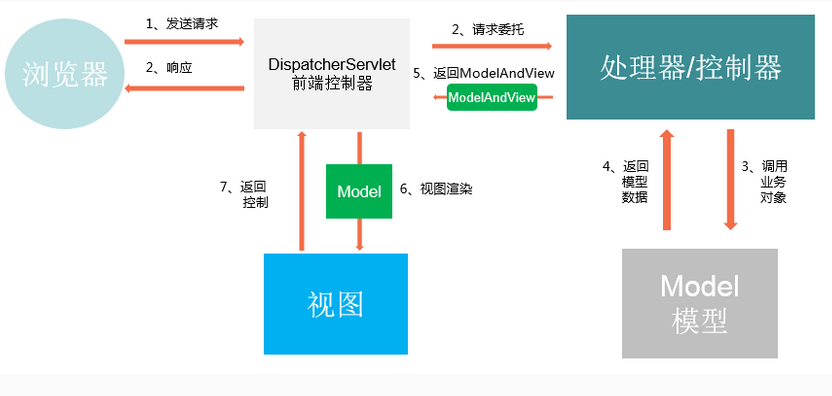

# 简介

* MVC是一种软件架构思想，将软件按照模型、视图、控制器来划分
* MVC是模型(Model)、视图(View)、控制器(Controller)的简写
* MVC主要作用是降低了视图与业务逻辑间的双向耦合
* Spring MVC框架围绕**DispatcherServlet**这个核心展开，DispatcherServlet的作用是截获请求并组织一系列组件共同完成请求的处理工作

## 常用组件

- DispatcherServlet：**前端控制器**，不需要工程师开发，由框架提供

  - 作用：统一处理请求和响应，整个流程控制的中心，由它调用其它组件处理用户的请求

- HandlerMapping：**处理器映射器**，不需要工程师开发，由框架提供

  - 作用：根据请求的url、method等信息查找Handler，即控制器方法

- Handler(Controller)：**处理器**，需要工程师开发

  - 作用：在DispatcherServlet的控制下Handler对具体的用户请求进行处理

- HandlerAdapter：**处理器适配器**，不需要工程师开发，由框架提供

  - 作用：通过HandlerAdapter对处理器（控制器方法）进行执行

- ViewResolver：**视图解析器**，不需要工程师开发，由框架提供

  - 作用：进行视图解析，得到相应的视图，例如：ThymeleafView、InternalResourceView、RedirectView

- View：**视图**

  * 作用：将模型数据通过页面展示给用户


>  **运行流程：**
>
>  * 用户通过浏览器向服务器发送请求，请求会被SpringMVC的前端控制器DispatcherServlet所拦截
>  * DispatcherServlet拦截到请求后，会调用HandlerMapping处理器映射器
>  * 处理器映射器根据请求的URL找到具体的处理器(Handler/Controller)，生成处理器对象及处理器拦截器一并返回给DispatcherServlet
>  * DispatcherServlet会通过返回信息选择合适的HandlerAdapter(处理器适配器)
>  * HandlerAdapter会调用并执行处理器(Handler)
>  * 处理器(Handler)执行完成后，会返回一个ModelAndView对象，该对象中包含视图名或包含模型与视图名
>  * HandlerAdapter将ModelAndView对象返回给DispatcherServlet
>  * DispatcherServlet会根据ModelAndView对象选择一个合适的ViewResolver(视图解析器)
>  * ViewResolver解析后，会像DispatcherServlet中返回一个具体的View(视图)
>  * DispatcherServlet对View进行渲染
>  * 视图渲染结果会返回给客户端浏览器显示



* **处理器映射器、处理器适配器、视图解析器**称为 SpringMVC 的三大组件

# 快速入门

* 在web.xml文件中配置DispacherServlet

  ```xml
  <!--配置SpringMVC的前端控制器，对浏览器发送的请求进行统一处理-->
  <servlet>
      <servlet-name>springmvc</servlet-name>
      <servlet-class>org.springframework.web.servlet.DispatcherServlet</servlet-class>
      <!--配置SpringMVC配置文件的位置和名称-->
      <init-param>
          <param-name>contextConfigLocation</param-name>
          <param-value>classpath:springmvc-servlet.xml</param-value>
      </init-param>
      <!--将前端控制器DispatcherServlet的初始化时间提前到服务器启动时-->
      <load-on-startup>1</load-on-startup>
  </servlet>
  
  <servlet-mapping>
      <servlet-name>springmvc</servlet-name>
      <!--/ 匹配所有的请求：(不包括jsp)-->
      <!--/* 匹配所有的请求：(包括jsp)-->
      <url-pattern>/</url-pattern>
  </servlet-mapping>
  ```

* 创建springmvc-servlet.xml配置文件

  ```xml
  <?xml version="1.0" encoding="utf-8" ?>
  <beans xmlns="http://www.springframework.org/schema/beans"
         xmlns:xsi="http://www.w3.org/2001/XMLSchema-instance"
         xsi:schemaLocation="http://www.springframework.org/schema/beans
         http://www.springframework.org/schema/beans/spring-beans.xsd">
  
      <!--处理器映射器-->
      <!--根据请求的url与spring容器中定义的处理器bean的id属性进行匹配-->
      <bean class="org.springframework.web.servlet.handler.BeanNameUrlHandlerMapping"/>
      <!--处理器适配器-->
      <!--处理一个Handler给ModelAndView-->
      <bean class="org.springframework.web.servlet.mvc.SimpleControllerHandlerAdapter"/>
  
      <!--视图解析器:DispatcherServlet给他的ModelAndView-->
      <bean class="org.springframework.web.servlet.view.InternalResourceViewResolver" id="internalResourceViewResolver">
          <!--前缀-->
          <property name="prefix" value="/WEB-INF/jsp/"/>
          <!--后缀-->
          <property name="suffix" value=".jsp"/>
      </bean>
  
      <!--Handler-->
      <bean id="/hello" class="com.demo.controller.HelloController"/>
  </beans>
  ```

* 创建Controller类

  ```java
  public class HelloController implements Controller {
      @Override
      public ModelAndView handleRequest(HttpServletRequest httpServletRequest, HttpServletResponse httpServletResponse) throws Exception {
          //ModelAndView 模型和视图
          ModelAndView mv=new ModelAndView();
  
          //封装对象，放在ModelAndView中
          mv.addObject("msg","HelloSpringMVC");
  
          //封装要跳转的视图，放在ModelAndView中
          mv.setViewName("hello");//  /WEB-INF/jsp/hello.jsp
  
          return mv;
      }
  }
  ```

# 注解开发

* 在web.xml文件中配置DispacherServlet

* 创建springmvc-servlet.xml配置文件

  ```xml
  <?xml version="1.0" encoding="utf-8" ?>
  <beans xmlns="http://www.springframework.org/schema/beans"
         xmlns:xsi="http://www.w3.org/2001/XMLSchema-instance"
         xmlns:context="http://www.springframework.org/schema/context"
         xmlns:mvc="http://www.springframework.org/schema/mvc"
         xsi:schemaLocation="http://www.springframework.org/schema/beans
         http://www.springframework.org/schema/beans/spring-beans.xsd
         http://www.springframework.org/schema/context
         http://www.springframework.org/schema/context/spring-context.xsd
         http://www.springframework.org/schema/mvc
         http://www.springframework.org/schema/mvc/spring-mvc.xsd">
  
      <!--自动扫描包，让指定包下的注解生效，由IOC统一管理-->
      <context:component-scan base-package="com"/>
      <!--让SpringMVC不处理静态资源-->
      <mvc:default-servlet-handler/>
      <!--自动装配处理器映射器和处理器适配器-->
      <mvc:annotation-driven/>
      <!--视图解析器-->
      <bean class="org.springframework.web.servlet.view.InternalResourceViewResolver" id="internalResourceViewResolver">
          <property name="prefix" value="/WEB-INF/jsp/"/>
          <property name="suffix" value=".jsp"/>
      </bean>
  
  </beans>
  ```

*  RequestMapping注解 
  * RequestMapping注解的作用是建立请求URL和处理方法之间的对应关系 
  * RequestMapping注解可以作用在方法和类上 
    * 作用在类上：第一级的访问目录 
    * 作用在方法上：第二级的访问目录 
  * RequestMapping的属性 
    * path：指定请求路径的url 
    * value：value属性和path属性是一样的 
    * mthod ：指定该方法的请求方式
    * params：指定限制请求参数的条件
    * headers：发送的请求中必须包含的请求头

# Restful风格

* HTTP 协议里面，四个表示操作方式的动词：GET、POST、PUT、DELETE。

* 它们分别对应四种基本操作：GET 用来获取资源，POST 用来新建资源，PUT 用来更新资源，DELETE 用来删除资源。

* REST 风格提倡 URL 地址使用统一的风格设计，从前到后各个单词使用斜杠分开，不使用问号键值对方式携带请求参数，而是将要发送给服务器的数据作为 URL 地址的一部分，以保证整体风格的一致性。

* | 操作     | 传统方式         | REST风格                |
  | -------- | ---------------- | ----------------------- |
  | 查询操作 | getUserById?id=1 | user/1-->get请求方式    |
  | 保存操作 | saveUser         | user-->post请求方式     |
  | 删除操作 | deleteUser?id=1  | user/1-->delete请求方式 |
  | 更新操作 | updateUser       | user-->put请求方式      |

## 实现

在方法参数前加上**@PathVariable**注解，让方法参数的值对应绑定到一个URL模板变量上

```java
@RequestMapping(value = "/add/{a}/{b}",method = RequestMethod.GET)
    public String test(@PathVariable int a,@PathVariable int b, Model model){
        int res=a+b;
        model.addAttribute("msg","结果为:"+res);
        return "hello";
    }
}
```

## **HiddenHttpMethodFilter**

> 由于浏览器只支持发送get和post方式的请求
>
> SpringMVC 提供了 **HiddenHttpMethodFilter** 帮助我们**将 POST 请求转换为 DELETE 或 PUT 请求**
>
> **HiddenHttpMethodFilter** 处理put和delete请求的条件：
>
> 1. 当前请求的请求方式必须为post
>
> 2. 当前请求必须传输请求参数_method
>
> 满足以上条件，**HiddenHttpMethodFilter** 过滤器就会将当前请求的请求方式转换为请求参数_method的值，因此请求参数\_method的值才是最终的请求方式

* 在web.xml中注册**HiddenHttpMethodFilter** 

  ```xml
  <filter>
      <filter-name>HiddenHttpMethodFilter</filter-name>
      <filter-class>org.springframework.web.filter.HiddenHttpMethodFilter</filter-class>
  </filter>
  <filter-mapping>
      <filter-name>HiddenHttpMethodFilter</filter-name>
      <url-pattern>/*</url-pattern>
  </filter-mapping>
  ```

* **注**

  * 目前为止，SpringMVC中提供了两个过滤器：CharacterEncodingFilter和HiddenHttpMethodFilter

  * 在web.xml中注册时，必须先注册CharacterEncodingFilter，再注册HiddenHttpMethodFilter
  * 原因：
    * 在 CharacterEncodingFilter 中通过 request.setCharacterEncoding(encoding) 方法设置字符集的
    * request.setCharacterEncoding(encoding) 方法要求前面不能有任何获取请求参数的操作

## 注解

* @GetMapping
* @PostMapping
* @PutMapping
* @DeleteMapping
* @PatchMapping
* **注解替代method = RequestMethod.GET**

# 请求参数的绑定

* 绑定流程
  * SpringMVC将ServletRequest对象传递给DataBinder
  * 将处理方法的入参对象传递给DataBinder
  * DataBinder调用ConversionService组件进行数据类型转换，数据格式化等工作，并将ServletRequest对象中的消息填充到参数对象中
  * 调用Validator组件对已经绑定了请求消息数据的参数对象进行数据合法性校验
  * 检验完成后会生成数据绑定结果BindingResult对象,SpringMVC会将BindingResult对象中的内容赋给处理方法的相应参数

*  绑定机制 
  * 表单提交的数据都是key=value格式的 
  * SpringMVC的参数绑定过程是把表单提交的请求参数，作为控制器中方法的参数进行绑定的
  * 要求：提交表单的name和参数的名称是相同的 
  * @RequestParam注解用于定义请求中的参数
* 支持的数据类型 
  * 基本数据类型和字符串类型 
  * 实体类型（JavaBean） 
  * 集合数据类型（List、map集合等）
*  基本数据类型和字符串类型
  * 提交表单的name和参数的名称是相同的 
  * 区分大小写  
*  实体类型（JavaBean）
  * 提交表单的name和JavaBean中的属性名称需要一致 
  * 如果一个JavaBean类中包含其他的引用类型，那么表单的name属性需要编写成：对象.属性 例如： address.name 

# 乱码问题

* 在web.xml中配置Spring提供的过滤器类

  ```xml
  <filter>
      <filter-name>characterEncodingFilter</filter-name>
      <filter-class>org.springframework.web.filter.CharacterEncodingFilter</filter-class>        
      <init-param>
          <param-name>encoding</param-name>
          <param-value>UTF-8</param-value>
      </init-param>
  </filter>
  <filter-mapping>
      <filter-name>characterEncodingFilter</filter-name>
      <url-pattern>/*</url-pattern>
  </filter-mapping>
  ```

* JSON乱码问题

  ```xml
  <mvc:annotation-driven>
      <mvc:message-converters register-defaults="true">
          <bean class="org.springframework.http.converter.StringHttpMessageConverter">
              <constructor-arg value="UTF-8" />
          </bean>
          <bean class="org.springframework.http.converter.json.MappingJackson2HttpMessageConverter">
              <property name="objectMapper">
                  <bean class="org.springframework.http.converter.json.Jackson2ObjectMapperFactoryBean">
                      <property name="failOnEmptyBeans" value="false" />
                  </bean>
              </property>
          </bean>
      </mvc:message-converters>
  </mvc:annotation-driven>
  ```

# 常用注解

* @RequestParam注解
  * 把请求中的指定名称的参数传递给控制器中的形参赋值
  * 属性 
    * value：请求参数中的名称 
    * required：请求参数中是否必须提供此参数，默认值是true，必须提供
    * defaultValue：不管required属性值为true或false，当value所指定的请求参数**没有传输或传输的值 为""**时，则使用默认值为形参赋值
* @RequestBody注解
  * 作用：用于将请求体中的数据绑定到方法的形参中，该注解用在方法的形参上（注意：get方法不可以）
* @ResponseBody
  * 作用：用于直接返回return对象，该注解用在方法上
* @PathVariable注解
  * 作用：拥有绑定url中的占位符的
  * 属性 
    * value：指定url中的占位符名称
* @RequestHeader注解 
  * 作用：获取指定请求头的值
  *  属性 
    * value：请求头的名称
*  @CookieValue注解 
  * 作用：用于获取指定cookie的名称的值 
  *  属性 
    *  value：cookie的名称 
*  @ModelAttribute注解 
  * 作用 
    * 出现在方法上：表示当前方法会在控制器方法执行前线执行。 
    * 出现在参数上：获取指定的数据给参数赋值。 
  * 应用场景 
    * 当提交表单数据不是完整的实体数据时，保证没有提交的字段使用数据库原来的数据
* @SessionAttributes注解 
  * 作用：用于多次执行控制器方法间的参数共享 
  * 属性 
    *  value：指定存入属性的名称 

# 结果视图

* SpringMVC中的视图是View接口，视图的作用渲染数据，将模型Model中的数据展示给用户
* SpringMVC视图的种类很多，默认有转发视图和重定向视图
* 若使用的视图技术为Thymeleaf，在SpringMVC的配置文件中配置了Thymeleaf的视图解析器，由此视图解析器解析之后所得到的是ThymeleafView

## ThymeleafView

* 当控制器方法中所设置的视图名称没有任何前缀时，此时的视图名称会被SpringMVC配置文件中所配置的视图解析器解析，视图名称拼接视图前缀和视图后缀所得到的最终路径，会通过转发的方式实现跳转

## 转发视图

> SpringMVC中默认的转发视图是InternalResourceView
>
> 当控制器方法中所设置的视图名称以"forward:"为前缀时，创建InternalResourceView视图，此时的视图名称不会被SpringMVC配置文件中所配置的视图解析器解析，而是会将前缀"forward:"去掉，剩余部分作为最终路径通过转发的方式实现跳转

* 转发

  ```java
   return "forward:/user/findAll";
  ```

## 重定向视图

> SpringMVC中默认的重定向视图是RedirectView
>
> 当控制器方法中所设置的视图名称以"redirect:"为前缀时，创建RedirectView视图，此时的视图名称不会被SpringMVC配置文件中所配置的视图解析器解析，而是会将前缀"redirect:"去掉，剩余部分作为最终路径通过重定向的方式实现跳转

* 重定向

  ```
   return "redirect:/add.jsp";

# SSM

* 导入jar包依赖

  ```xml
  <dependencies>
      <dependency>
          <groupId>org.springframework</groupId>
          <artifactId>spring-webmvc</artifactId>
          <version>5.2.4.RELEASE</version>
      </dependency>
      <dependency>
          <groupId>org.springframework</groupId>
          <artifactId>spring-jdbc</artifactId>
          <version>5.2.2.RELEASE</version>
      </dependency>
      <dependency>
          <groupId>org.mybatis</groupId>
          <artifactId>mybatis</artifactId>
          <version>3.5.2</version>
      </dependency>
      <dependency>
          <groupId>org.mybatis</groupId>
          <artifactId>mybatis-spring</artifactId>
          <version>2.0.2</version>
      </dependency>
      <dependency>
          <groupId>junit</groupId>
          <artifactId>junit</artifactId>
          <version>4.13</version>
      </dependency>
      <dependency>
          <groupId>mysql</groupId>
          <artifactId>mysql-connector-java</artifactId>
          <version>5.1.6</version>
      </dependency>
      <dependency>
          <groupId>com.mchange</groupId>
          <artifactId>c3p0</artifactId>
          <version>0.9.5.2</version>
      </dependency>
      <dependency>
          <groupId>javax.servlet</groupId>
          <artifactId>javax.servlet-api</artifactId>
          <version>3.1.0</version>
      </dependency>
      <dependency>
          <groupId>javax.servlet.jsp</groupId>
          <artifactId>jsp-api</artifactId>
          <version>2.2</version>
      </dependency>
      <dependency>
          <groupId>javax.servlet</groupId>
          <artifactId>jstl</artifactId>
          <version>1.2</version>
      </dependency>
      <dependency>
          <groupId>org.projectlombok</groupId>
          <artifactId>lombok</artifactId>
          <version>1.18.10</version>
      </dependency>
  </dependencies>
  ```

* web.xml配置

  ```xml
  <?xml version="1.0" encoding="UTF-8"?>
  <web-app xmlns="http://xmlns.jcp.org/xml/ns/javaee"
           xmlns:xsi="http://www.w3.org/2001/XMLSchema-instance"
           xsi:schemaLocation="http://xmlns.jcp.org/xml/ns/javaee http://xmlns.jcp.org/xml/ns/javaee/web-app_4_0.xsd"
           version="4.0">
  
      <servlet>
          <servlet-name>SpringMVC</servlet-name>
          <servlet-class>org.springframework.web.servlet.DispatcherServlet</servlet-class>
          <init-param>
              <param-name>contextConfigLocation</param-name>
              <param-value>classpath:applicationContext.xml</param-value>
          </init-param>
          <load-on-startup>1</load-on-startup>
      </servlet>
      <servlet-mapping>
          <servlet-name>SpringMVC</servlet-name>
          <url-pattern>/</url-pattern>
      </servlet-mapping>
  
      <!--配置乱码过滤-->
      <filter>
          <filter-name>characterEncodingFilter</filter-name>
          <filter-class>org.springframework.web.filter.CharacterEncodingFilter</filter-class>
          <!-- 指定字符集 -->
          <init-param>
              <param-name>encoding</param-name>
              <param-value>UTF-8</param-value>
          </init-param>
      </filter>
      <filter-mapping>
          <filter-name>characterEncodingFilter</filter-name>
          <url-pattern>/*</url-pattern>
      </filter-mapping>
  
      <session-config>
          <session-timeout>15</session-timeout>
      </session-config>
  
  </web-app>
  ```

* applicationContext.xml配置

  ```xml
  <?xml version="1.0" encoding="utf-8" ?>
  <beans xmlns="http://www.springframework.org/schema/beans"
         xmlns:xsi="http://www.w3.org/2001/XMLSchema-instance"
         xmlns:context="http://www.springframework.org/schema/context"
         xmlns:mvc="http://www.springframework.org/schema/mvc"
         xsi:schemaLocation="http://www.springframework.org/schema/beans
         http://www.springframework.org/schema/beans/spring-beans.xsd
         http://www.springframework.org/schema/context
         http://www.springframework.org/schema/context/spring-context.xsd
         http://www.springframework.org/schema/mvc
         http://www.springframework.org/schema/mvc/spring-mvc.xsd">
  
      <!--关联数据库配置文件-->
      <context:property-placeholder location="classpath:database.properties"/>
  
      <!--c3p0 连接池-->
      <bean id="datasource" class="com.mchange.v2.c3p0.ComboPooledDataSource">
          <property name="driverClass" value="${jdbc.driver}"/>
          <property name="jdbcUrl" value="${jdbc.url}"/>
          <property name="user" value="${jdbc.username}"/>
          <property name="password" value="${jdbc.password}"/>
      </bean>
  
      <!--sqlSessionFactory-->
      <bean id="sqlSessionFactory" class="org.mybatis.spring.SqlSessionFactoryBean">
          <!--获取数据源-->
          <property name="dataSource" ref="datasource"/>
          <!--绑定MyBatis映射文件-->
          <property name="mapperLocations" value="classpath:com/demo/dao/BooksMapper.xml"/>
          <!--别名-->
          <property name="typeAliasesPackage" value="com.demo.pojo"/>
          <!--日志-->
          <property name="configuration">
              <bean class="org.apache.ibatis.session.Configuration">
                  <property name="logImpl" value="org.apache.ibatis.logging.stdout.StdOutImpl"/>
              </bean>
          </property>
      </bean>
  
      <!--配置dao接口扫描包，动态的实现了Dao接口可以注入到Spring容器中-->
      <bean class="org.mybatis.spring.mapper.MapperScannerConfigurer">
          <property name="sqlSessionFactoryBeanName" value="sqlSessionFactory"/>
          <property name="basePackage" value="com.demo.dao"/>
      </bean>
  
  
      <!--扫描service下的包-->
      <context:component-scan base-package="com.demo.service"/>
      <!--将所有的业务类，注入到spring-->
      <bean id="booksServiceImpl" class="com.demo.service.BooksServiceImpl">
          <property name="booksMapper" ref="booksMapper"/>
      </bean>
  
      <!--声明式事务-->
      <bean id="dataSourceTransactionManager" class="org.springframework.jdbc.datasource.DataSourceTransactionManager">
          <!--注入数据源-->
          <property name="dataSource" ref="datasource"/>
      </bean>
  
  
      <!--让SpringMVC不处理静态资源-->
      <mvc:default-servlet-handler/>
      <!--自动装配处理器映射器和处理器适配器-->
      <mvc:annotation-driven/>
      <!--自动扫描包，让指定包下的注解生效，由IOC统一管理-->
      <context:component-scan base-package="com.demo.controller"/>
      <!--视图解析器-->
      <bean class="org.springframework.web.servlet.view.InternalResourceViewResolver" id="internalResourceViewResolver">
          <property name="prefix" value="/WEB-INF/jsp/"/>
          <property name="suffix" value=".jsp"/>
      </bean>
  </beans>
  ```

* database.properties 数据源配置

  ```properties
  jdbc.driver=com.mysql.jdbc.Driver
  jdbc.url=jdbc:mysql:///ssmbuild
  jdbc.username=root
  jdbc.password=root
  ```

## json乱码解决

```xml
<mvc:annotation-driven>
    <mvc:message-converters register-defaults="true">
        <bean class="org.springframework.http.converter.StringHttpMessageConverter">
            <constructor-arg value="UTF-8"/>
        </bean>
        <bean class="org.springframework.http.converter.json.MappingJackson2HttpMessageConverter">
            <property name="objectMapper">
                <bean class="org.springframework.http.converter.json.Jackson2ObjectMapperFactoryBean">
                    <property name="failOnEmptyBeans" value="false"/>
                </bean>
            </property>
        </bean>
    </mvc:message-converters>
</mvc:annotation-driven>
```

# 拦截器

* SpringMVC框架中的拦截器用于对处理器进行预处理和后处理的技术。 
* 可以定义拦截器链，连接器链就是将拦截器按着一定的顺序结成一条链，在访问被拦截的方法时，拦截器链 中的拦截器会按着定义的顺序执行。 
* 拦截器和过滤器的功能比较类似，有区别 
  * 过滤器是Servlet规范的一部分，任何框架都可以使用过滤器技术。 
  * 拦截器是SpringMVC框架独有的。 
  * 过滤器配置了/*，可以拦截任何资源。 
  * 拦截器只会对控制器中的方法进行拦截。 
  * 拦截器也是AOP思想的一种实现方式 
  * 想要自定义拦截器，需要实现HandlerInterceptor接口

## 步骤

* **创建类，实现HandlerInterceptor接口，重写需要的方法**
  
  *  **preHandle**方法是controller方法执行前拦截的方法 
    * 可以使用request或者response跳转到指定的页面 
    * return true放行，执行下一个拦截器，如果没有拦截器，执行controller中的方法。 
    * return false不放行，不会执行controller中的方法。 
  * **postHandle**是controller方法执行后执行的方法，在跳转视图执行前。 
    * 可以使用request或者response跳转到指定的页面 
    * 如果指定了跳转的页面，**那么controller方法跳转的页面将不会显示。** 
  *  **afterCompletion**该方法在整个请求完成，既视图渲染结束之后执行，可通过此方法实现一些资源清理，记录日志信息等工作
  
* 在applicationContext.xml中配置拦截器

  ```xml
   <!-- 配置拦截器 -->    
  <mvc:interceptors>        
      <mvc:interceptor>            
          <!-- 哪些方法进行拦截 -->  
          <!--/** 表示拦截这个请求下面的所有请求-->
          <mvc:mapping path="/**"/>            
          <!-- 哪些方法不进行拦截 -->             
  		<mvc:exclude-mapping path=""/>           
          <!-- 注册拦截器对象 -->            
          <bean class="com.demo.config.MyInterceptor"/>        
      </mvc:interceptor>    
  </mvc:interceptors>
  ```

## 多个拦截器的执行顺序

* 若每个拦截器的preHandle()都返回true；此时多个拦截器的执行顺序和拦截器在SpringMVC的配置文件的配置顺序有关：preHandle()会按照配置的顺序执行，而postHandle()和afterComplation()会按照配置的反序执行

* **若某个拦截器的preHandle()返回了false；preHandle()返回false和它之前的拦截器的preHandle()都会执行，postHandle()都不执行，返回false的拦截器之前的拦截器的afterComplation()会执行**

# 异常处理器

## 基于配置的异常处理

* SpringMVC提供了一个处理控制器方法执行过程中所出现的异常的接口：HandlerExceptionResolver

* HandlerExceptionResolver接口的实现类有：DefaultHandlerExceptionResolver和SimpleMappingExceptionResolver

* SpringMVC提供了自定义的异常处理器SimpleMappingExceptionResolver，使用方式：

  ```xml
  <bean class="org.springframework.web.servlet.handler.SimpleMappingExceptionResolver">
      <property name="exceptionMappings">
          <props>
          	<!--
          		properties的键表示处理器方法执行过程中出现的异常
          		properties的值表示若出现指定异常时，设置一个新的视图名称，跳转到指定页面
          	-->
              <prop key="java.lang.ArithmeticException">error</prop>
          </props>
      </property>
      <!--
      	exceptionAttribute属性设置一个属性名，将出现的异常信息在请求域中进行共享
      -->
      <property name="exceptionAttribute" value="ex"></property>
  </bean>
  ```

## 基于注解的异常处理

```java
//@ControllerAdvice将当前类标识为异常处理的组件
@ControllerAdvice
public class ExceptionController {

    //@ExceptionHandler用于设置所标识方法处理的异常
    @ExceptionHandler(ArithmeticException.class)
    //ex表示当前请求处理中出现的异常对象
    public String handleArithmeticException(Exception ex, Model model){
        model.addAttribute("ex", ex);
        return "error";
    }

}
```

# 文件上下传

* 导入依赖jar包

  ```xml
  <dependency>            
      <groupId>commons-fileupload</groupId>            
      <artifactId>commons-fileupload</artifactId>            
      <version>1.3.1</version>        
  </dependency>        
  ```

* 在applicationContext.xml中配置文件上传

  ```xml
  <!--文件上传配置-->
  <bean id="multipartResolver" class="org.springframework.web.multipart.commons.CommonsMultipartResolver">
      <!--请求的编码格式，必须和jsp的pageEncoding属性一致，以便正确读取表单的内容，默认为ISO-8859-1-->
      <property name="defaultEncoding" value="UTF-8"/>
      <!--上传文件大小上限，单位为字节(10485760=1M)-->
      <property name="maxUploadSize" value="10485760"/>
      <property name="maxInMemorySize" value="40960"/>
  </bean>
  ```

* 编写jsp上传页面

  ```jsp
  <%@ page contentType="text/html;charset=UTF-8" language="java" %>
  <html>
  <head>
      <title>Title</title>
  </head>
  <body>
  <h3>文件上传</h3>
  <form action="${pageContext.request.contextPath}/upload" method="post" enctype="multipart/form-data">
      选择文件：<input type="file" name="file"/><br/>
      <input type="submit" value="上传文件"/></form>
  </body>
  </html>
  ```

* 编写上传Java代码

  ```java
  @RestController
  public class FileController {
  
      @RequestMapping("/upload")
      public String upload(@RequestParam("file")MultipartFile file, HttpServletRequest request) throws IOException {
          //上传路径保存设置
          String path = request.getServletContext().getRealPath("/upload");
          File realPath=new File(path);
          if (!realPath.exists()){
              realPath.mkdir();
          }
          //文件上传地址
          System.out.println("上传文件保存地址:"+realPath);
          //通过CommonsMultipartFile的方法直接写文件
          file.transferTo(new File(realPath+"/"+file.getOriginalFilename()));
          return "redirect:/upload.jsp";
      }
      
      @RequestMapping("/download")
      public String downloads(HttpServletRequest request,HttpServletResponse response) throws IOException{
          //要下载的图片地址
          String path = request.getServletContext().getRealPath("/upload");
          String fileName="1.jpg";
  
          //设置response响应头
          response.reset();//设置页面不缓存，清空buffer
          response.setCharacterEncoding("UTF-8");//字符编码
          response.setContentType("multipart/form-data");//二进制传输数据
          //设置响应头
          response.setHeader("Content-Disposition","attachment;fileName="+ URLEncoder.encode(fileName,"UTF-8"));
  
          File file=new File(path,fileName);
          //读取文件
          InputStream is=new FileInputStream(file);
          //写出文件
          OutputStream os=response.getOutputStream();
  
          byte[] buff=new byte[1024];
          int len=0;
          while ((len=is.read(buff))!=-1){
              os.write(buff,0,len);
              os.flush();
          }
          os.close();
          is.close();
          return "OK";
      }
  }
  ```

# 注解配置SpringMVC

> 使用配置类和注解代替web.xml和SpringMVC配置文件的功能

## 1. 创建初始类，代替web.xml

> 在Servlet3.0环境中，容器会在类路径中查找实现javax.servlet.ServletContainerInitializer接口的类，如果找到的话就用它来配置Servlet容器。
> Spring提供了这个接口的实现，名为SpringServletContainerInitializer，这个类反过来又会查找实现WebApplicationInitializer的类并将配置的任务交给它们来完成。Spring3.2引入了一个便利的WebApplicationInitializer基础实现，名为AbstractAnnotationConfigDispatcherServletInitializer，当我们的类扩展了AbstractAnnotationConfigDispatcherServletInitializer并将其部署到Servlet3.0容器的时候，容器会自动发现它，并用它来配置Servlet上下文

```java
/**
 * Author:   lxs
 * Date:     2021/8/16 9:21
 * Description: web工程的初始化类，用来代替web.xml
 */
public class WebInit extends AbstractAnnotationConfigDispatcherServletInitializer {
    /**
     * 指定spring的配置类
     */
    @Override
    protected Class<?>[] getRootConfigClasses() {
        return new Class[]{SpringConfig.class};
    }

    /**
     * 指定springMVC的配置类
     */
    @Override
    protected Class<?>[] getServletConfigClasses() {
        return new Class[]{WebConfig.class};
    }

    /**
     * 指定DispatcherServlet的映射路径
     */
    @Override
    protected String[] getServletMappings() {
        return new String[]{"/"};
    }

    /**
     * 配置过滤器
     */
    @Override
    protected Filter[] getServletFilters() {
        //配置编码
        CharacterEncodingFilter characterEncodingFilter = new CharacterEncodingFilter();
        characterEncodingFilter.setEncoding("UTF-8");
        characterEncodingFilter.setForceResponseEncoding(true);

        HiddenHttpMethodFilter hiddenHttpMethodFilter = new HiddenHttpMethodFilter();
        return new Filter[]{characterEncodingFilter, hiddenHttpMethodFilter};
    }
}
```

## 2、创建SpringConfig配置类，代替spring的配置文件

```java
@Configuration
public class SpringConfig {
	//ssm整合之后，spring的配置信息写在此类中
}
```

## 3、创建WebConfig配置类，代替SpringMVC的配置文件

```java
/**
 * Author:   lxs
 * Date:     2021/8/16 9:28
 * Description: web配置类，用来代替springMVC.xml
 */
@Configuration//将当前类标识为一个配置类
@ComponentScan("com.demo")//组件扫描
@EnableWebMvc//开启mvc注解驱动
public class WebConfig implements WebMvcConfigurer {

    /**
     * 配置生成模板解析器
     */
    @Bean
    public ITemplateResolver templateResolver() {
        WebApplicationContext webApplicationContext = ContextLoader.getCurrentWebApplicationContext();
        // ServletContextTemplateResolver需要一个ServletContext作为构造参数，可通过WebApplicationContext 的方法获得
        ServletContextTemplateResolver templateResolver = new ServletContextTemplateResolver(
                webApplicationContext.getServletContext());
        templateResolver.setPrefix("/WEB-INF/templates/");
        templateResolver.setSuffix(".html");
        templateResolver.setCharacterEncoding("UTF-8");
        templateResolver.setTemplateMode(TemplateMode.HTML);
        return templateResolver;
    }

    /**
     * 生成模板引擎并为模板引擎注入模板解析器
     */
    @Bean
    public SpringTemplateEngine templateEngine(ITemplateResolver templateResolver) {
        SpringTemplateEngine templateEngine = new SpringTemplateEngine();
        templateEngine.setTemplateResolver(templateResolver);
        return templateEngine;
    }

    /**
     * 生成视图解析器并未解析器注入模板引擎
     */
    @Bean
    public ViewResolver viewResolver(SpringTemplateEngine templateEngine) {
        ThymeleafViewResolver viewResolver = new ThymeleafViewResolver();
        viewResolver.setCharacterEncoding("UTF-8");
        viewResolver.setTemplateEngine(templateEngine);
        return viewResolver;
    }

    /**
     * 配置处理静态资源
     */
    @Override
    public void configureDefaultServletHandling(DefaultServletHandlerConfigurer configurer) {
        configurer.enable();
    }

    /**
     * 配置拦截器
     */
    @Override
    public void addInterceptors(InterceptorRegistry registry) {
        MyInterceptor myInterceptor = new MyInterceptor();
        registry.addInterceptor(myInterceptor).
                addPathPatterns("/**").//添加所拦截的路径
                excludePathPatterns("/test");//排除不需要拦截的路径
    }

    /**
     * 配置异常处理
     */
    @Override
    public void configureHandlerExceptionResolvers(List<HandlerExceptionResolver> resolvers) {
        SimpleMappingExceptionResolver simpleMappingExceptionResolver = new SimpleMappingExceptionResolver();
        Properties properties = new Properties();
        properties.setProperty("java.lang.ArithmeticException", "error");
        simpleMappingExceptionResolver.setExceptionMappings(properties);
        //exceptionAttribute属性设置一个属性名，将出现的异常信息在请求域中进行共享
        simpleMappingExceptionResolver.setExceptionAttribute("ex");

        resolvers.add(simpleMappingExceptionResolver);
    }

}
```

